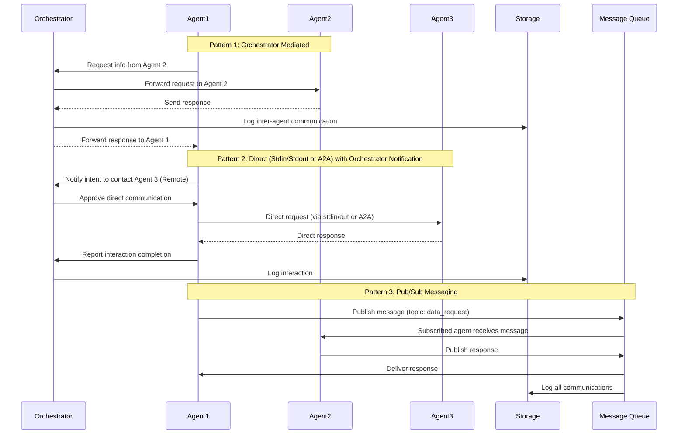

```mermaid
sequenceDiagram
    participant Orch as Orchestrator
    participant Agent1
    participant Agent2
    participant Agent3
    participant Stor as Storage
    participant MQ as Message Queue

    %% --- Pattern 1: Orchestrator Mediated Communication ---
    Note over Agent1,Agent2: Pattern 1: Orchestrator Mediated
    Agent1->>Orch: Request info from Agent 2
    Orch->>Agent2: Forward request to Agent 2
    Agent2-->>Orch: Send response
    Orch->>Stor: Log inter-agent communication
    Orch-->>Agent1: Forward response to Agent 1

    %% --- Pattern 2: Direct via Stdin/out or A2A with Notification to Orchestrator ---
    Note over Agent1,Agent3: Pattern 2: Direct (Stdin/Stdout or A2A) with Orchestrator Notification
    Agent1->>Orch: Notify intent to contact Agent 3 (Remote)
    Orch->>Agent1: Approve direct communication
    Agent1->>Agent3: Direct request (via stdin/out or A2A)
    Agent3-->>Agent1: Direct response
    Agent1->>Orch: Report interaction completion
    Orch->>Stor: Log interaction

    %% --- Pattern 3: Pub/Sub Communication ---
    Note over Agent1,MQ: Pattern 3: Pub/Sub Messaging
    Agent1->>MQ: Publish message (topic: data_request)
    MQ->>Agent2: Subscribed agent receives message
    Agent2->>MQ: Publish response
    MQ->>Agent1: Deliver response
    MQ->>Stor: Log all communications
```
