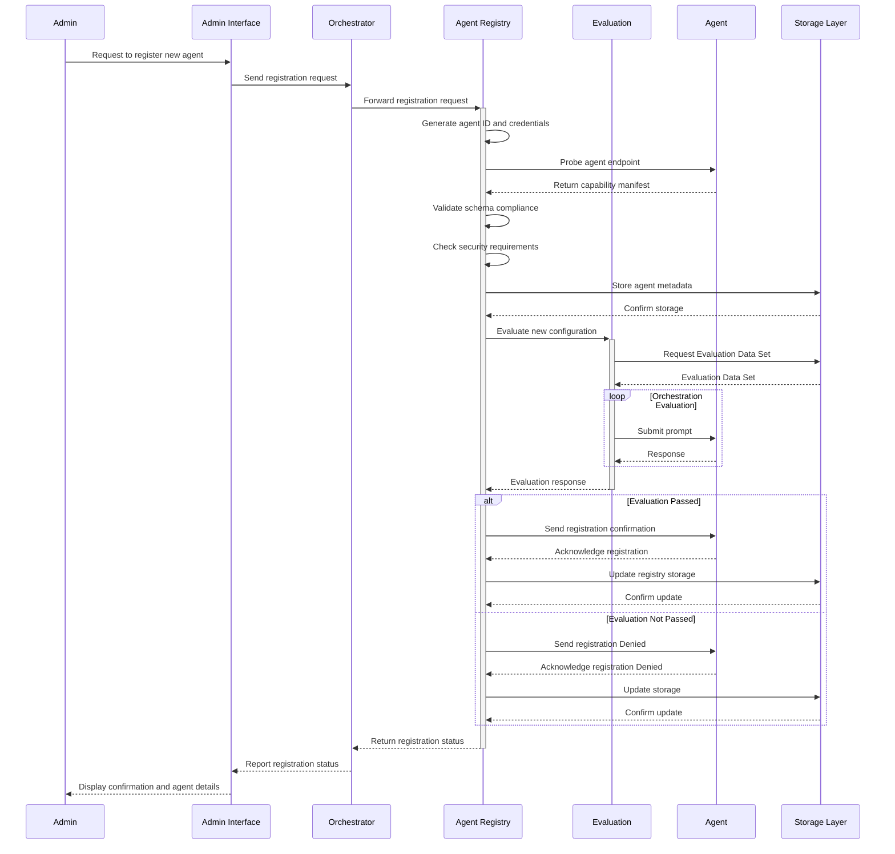

```mermaid
sequenceDiagram
    participant Admin as Admin
    participant AdminApp as Admin Interface
    participant Orch as Orchestrator
    participant AgReg as Agent Registry
    participant ValM as Evaluation
    participant Agent3 as Agent
    participant StorL as Storage Layer
    
    Admin->>AdminApp: Request to register new agent
    AdminApp->>Orch: Send registration request
    Orch->>+AgReg: Forward registration request
    AgReg->>AgReg: Generate agent ID and credentials
    AgReg->>Agent3: Probe agent endpoint
    Agent3-->>AgReg: Return capability manifest
    AgReg->>AgReg: Validate schema compliance
    AgReg->>AgReg: Check security requirements
    AgReg->>StorL: Store agent metadata
    StorL-->>AgReg: Confirm storage
    AgReg->>+ValM: Evaluate new configuration
    ValM->>StorL: Request Evaluation Data Set
    StorL-->>ValM: Evaluation Data Set
    loop Orchestration Evaluation
        ValM->>Agent3: Submit prompt
        Agent3-->>ValM: Response
    end
    ValM-->>-AgReg: Evaluation response

    alt Evaluation Passed
        AgReg->>Agent3: Send registration confirmation
        Agent3-->>AgReg: Acknowledge registration
        AgReg->>StorL: Update registry storage
        StorL-->>AgReg: Confirm update
    else Evaluation Not Passed
        AgReg->>Agent3: Send registration Denied
        Agent3-->>AgReg: Acknowledge registration Denied
        AgReg->>StorL: Update storage
        StorL-->>AgReg: Confirm update
    end
    AgReg-->>-Orch: Return registration status
    Orch-->>AdminApp: Report registration status
    AdminApp-->>Admin: Display confirmation and agent details
```
