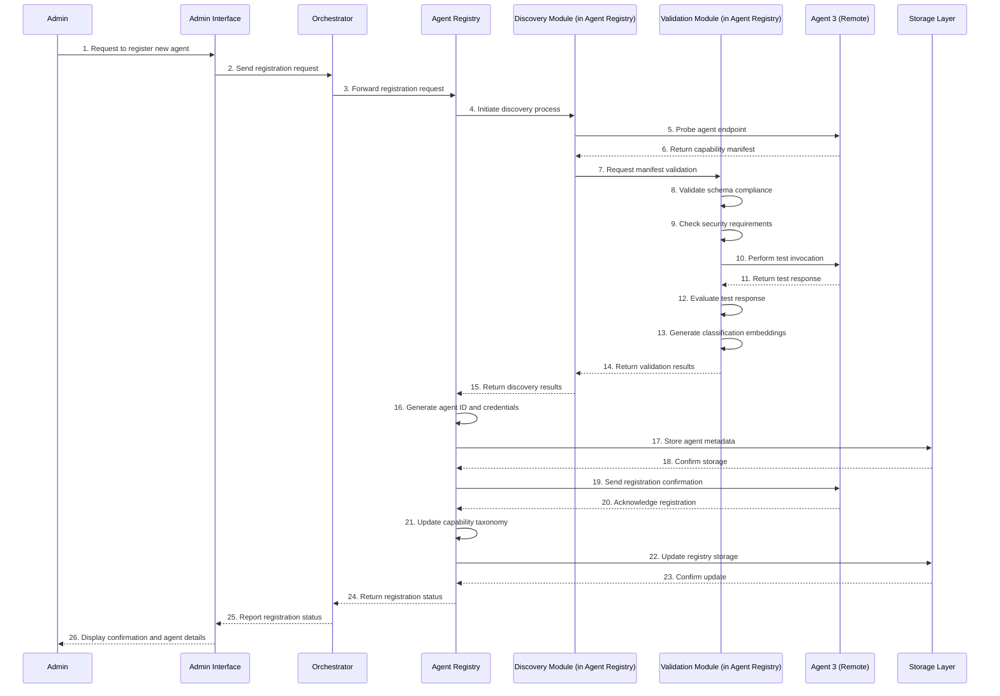

```mermaid
sequenceDiagram
    participant Admin as Admin
    participant AdminApp as Admin Interface
    participant Orch as Orchestrator
    participant AgReg as Agent Registry
    participant DiscM as Discovery Module (in Agent Registry)
    participant ValM as Validation Module (in Agent Registry)
    participant Agent3 as Agent 3 (Remote)
    participant StorL as Storage Layer
    
    Admin->>AdminApp: 1. Request to register new agent
    AdminApp->>Orch: 2. Send registration request
    Orch->>AgReg: 3. Forward registration request
    AgReg->>DiscM: 4. Initiate discovery process
    
    DiscM->>Agent3: 5. Probe agent endpoint
    Agent3-->>DiscM: 6. Return capability manifest
    
    DiscM->>ValM: 7. Request manifest validation
    ValM->>ValM: 8. Validate schema compliance
    ValM->>ValM: 9. Check security requirements
    ValM->>Agent3: 10. Perform test invocation
    Agent3-->>ValM: 11. Return test response
    ValM->>ValM: 12. Evaluate test response
    ValM->>ValM: 13. Generate classification embeddings
    
    ValM-->>DiscM: 14. Return validation results
    DiscM-->>AgReg: 15. Return discovery results
    
    AgReg->>AgReg: 16. Generate agent ID and credentials
    AgReg->>StorL: 17. Store agent metadata
    StorL-->>AgReg: 18. Confirm storage
    
    AgReg->>Agent3: 19. Send registration confirmation
    Agent3-->>AgReg: 20. Acknowledge registration
    
    AgReg->>AgReg: 21. Update capability taxonomy
    AgReg->>StorL: 22. Update registry storage
    StorL-->>AgReg: 23. Confirm update
    
    AgReg-->>Orch: 24. Return registration status
    Orch-->>AdminApp: 25. Report registration status
    AdminApp-->>Admin: 26. Display confirmation and agent details
```
