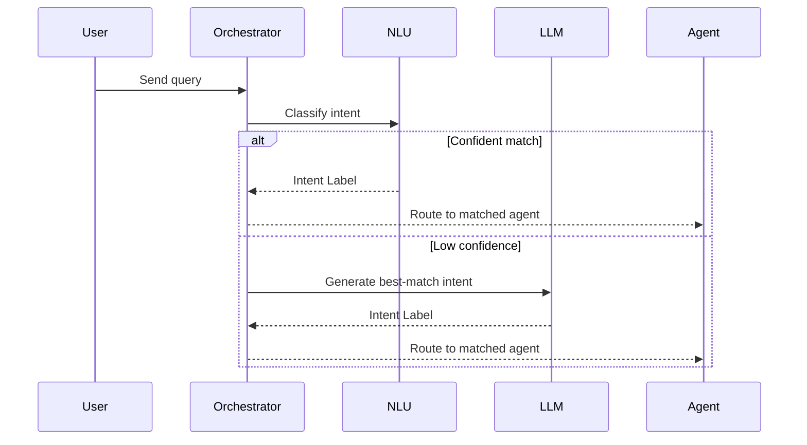
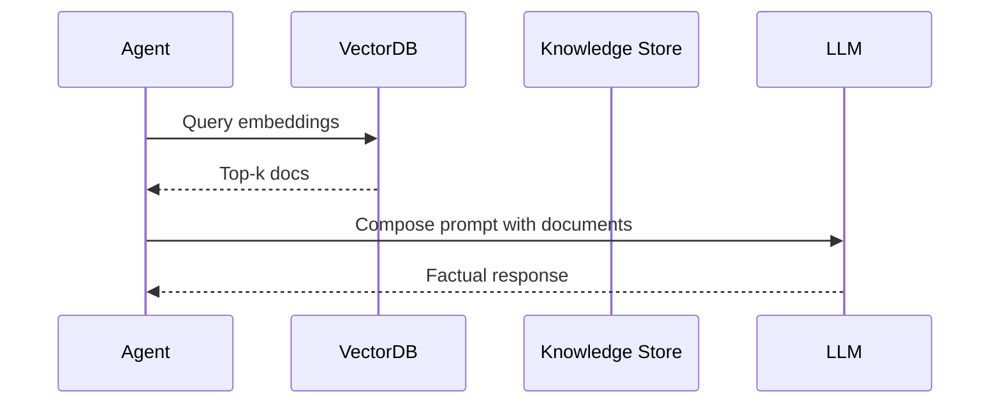
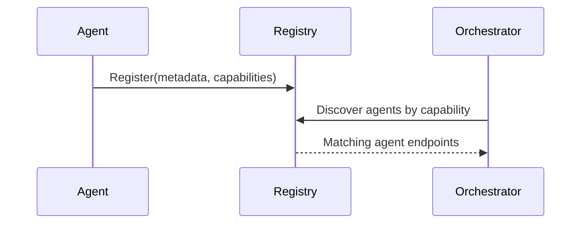
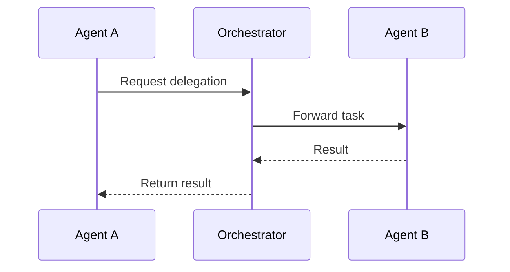
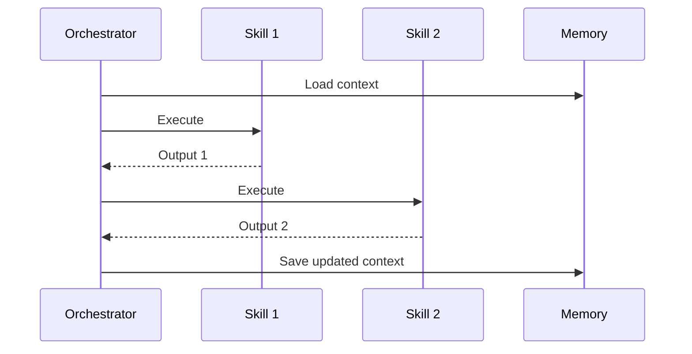

# Architecture Patterns Companion

This companion document provides diagrammatic representations of core patterns
described in the Multi-Agent Reference Architecture. Each sequence or component
diagram illustrates how patterns operate in practice.

---

## 1. Semantic Router with LLM Fallback

---

## 2. RAG Pipeline with Vector DB

---

## 3. Agent Registry and Discovery

---

## 4. Agent-to-Agent Communication

---

## 5. Orchestration with Skill Chaining

---

More diagrams will be added as additional patterns are implemented or refined. For feedback or contributions, visit the project repo or contact the maintainers.
