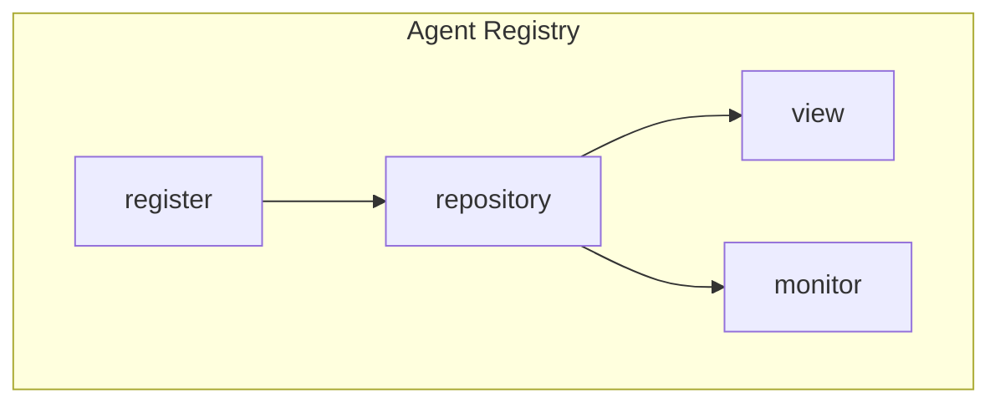
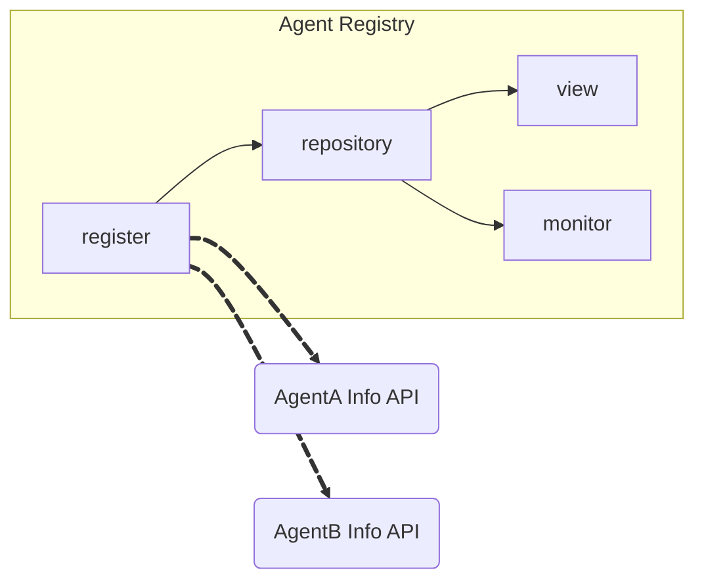
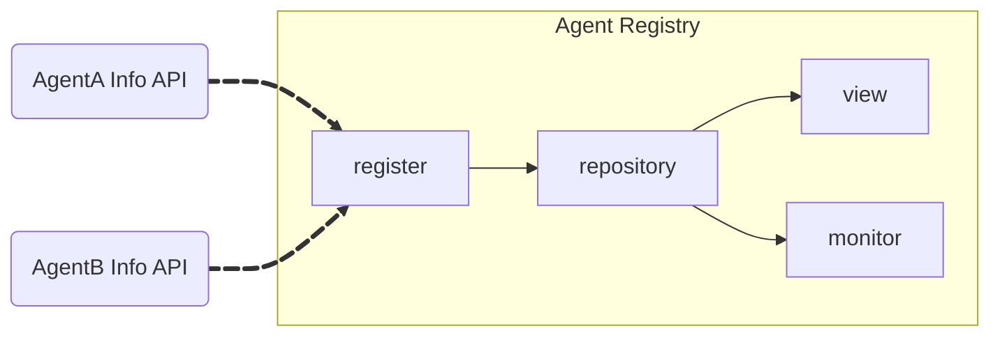
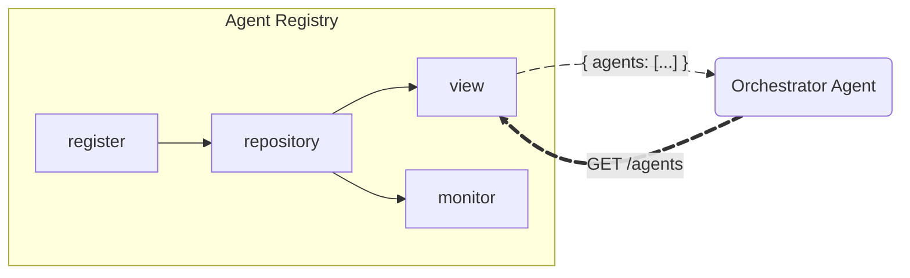
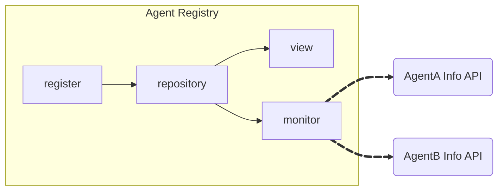

# Agent Registry

Agent Registry is the component that contains the information regarding
available agents in the multi-agent system.

Depending on the architecture of the multi-agent system (monolithic or
distributed), Agent Registries can be centralized, or distributed per agent or
agent group.

The primary goal of an agent registry is to provide an information repository
for the agents in the system to know how to communicate with one another. In
most cases though, in an Orchestrator-based multi-agent architecture, the
registry enables the Orchestrator Agent to query which agents are best to carry
the immediate tasks at hand.

## Core Components

### Register Component (Discovery)

A register mechanism is necessary to input Agent information into the
repository. There are several ways to implement this Register mechanism

#### Registry-Initiated Agent Register

In a scenario where the Agent is available, and has a way to get the Agent
Information, the register mechanism can make a request to the target agent URL
to get the Agent Information. In order to implement this mechanism, the register
mechanism needs to know where and how to request the different Agent Info
endpoints

For a detailed sequence diagram of this process, see
[Dynamic Agent Registry (Service Mesh for Agents) Diagram](../reference-architecture/Patterns.md#2-dynamic-agent-registry-service-mesh-for-agents)

#### Agent-Initiated Self Register

Alternatively, the register mechanism can be an API endpoint, where the Agents
can register "themselves" into the registry. In order to implement this
mechanism, the register mechanism needs to provide an endpoint where the Agents
can reach to provide their Agent Information.

### Repository Component (Storage)

We need a storage mechanism that houses all the available Agent Information.

The actual storage can be flexible, but it's important to consider that the
Agent Information needs to be easily listed, and it could potentially be
queriable.

### View Component

The View Component lists all the available agents or in more advanced cases,
provides filtering capabilities

### Monitor Component

In an enterprise scenario, it's important to ensure that the agents registered
in the Agent Register are up and running, and that the Agent Information are up
to date. So often it is necessary to have a monitoring mechanism to regularly
call the registered agents for uptime and information

## Data: Agent Information

The information stored in the Agent Repository (so far referred in this
documentation as "Agent Information") is used for two purposes:

- For the maintainers/developers of the system (humans) to see the agents are
  available
- For the Agents to determine what's the best agent(s) to interact with to
  complete the task

### For Human Consumption

In order to form a more robust Agent Catalog more information might be needed
for catagorization or classification (such as `tags` or `owners` in the metadata
of the
[ACP Agent Detail Spec](https://agentcommunicationprotocol.dev/core-concepts/agent-detail#schema-metadata)).

### For Agent Consumption

At a very minimum, two pieces of information are needed to describe an agent:

- `name`: the name of the agent that should convey an idea of the purpose of the
  agent. (For example, "TravelBookingAgent" is better than "Bob")
- `description`: A detailed description of what the bot can do.

Additional information such as the expected input and output and communication
mechanism are also helpful for the consuming agent to achieve effective
communication

Furthermore, since the Agent Information is used by Agents to communicate with
other Agents, additional information is needed to inform the consuming (i.e.
Orchestorator) Agent **how** to communicate with the registered Agent. Such as
`url` and `authentication` properties in the A2A Agent Card.

For more information on current standarizations of Agent Information from the
community:

- [A2A Agent Card Specification](https://google.github.io/A2A/specification/#55-agentcard-object-structure)
- [ACP Agent Detail Specification](https://agentcommunicationprotocol.dev/core-concepts/agent-detail)

## Evaluation of Registering Agent

In Enterprise Multi-Agent Scenarios, there needs to be processes and policies
in-place to ensure that by adding agents to the registry will not degrade the
system's behavior.

During the registration process, it's recommended to contain a validation step
to evaluate the validity of the agent being registered.

See
[the Dynamic Agent Registry (Service Mesh for Agents) Diagram](../reference-architecture/Patterns.md#2-dynamic-agent-registry-service-mesh-for-agents)
for a detailed walkthrough.

## Additional Examples and Resources

- [Google's Public A2A Agent Registry](https://a2astore.co/)
- [ACP Documentation on Agent Registry](https://agentcommunicationprotocol.dev/core-concepts/agent-discovery#registry-based-discovery)
