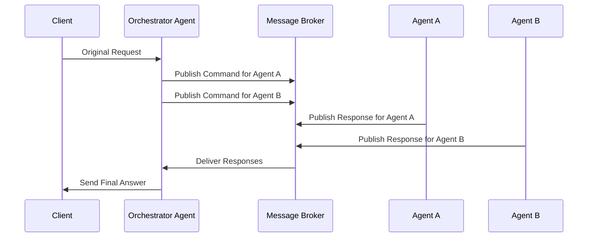
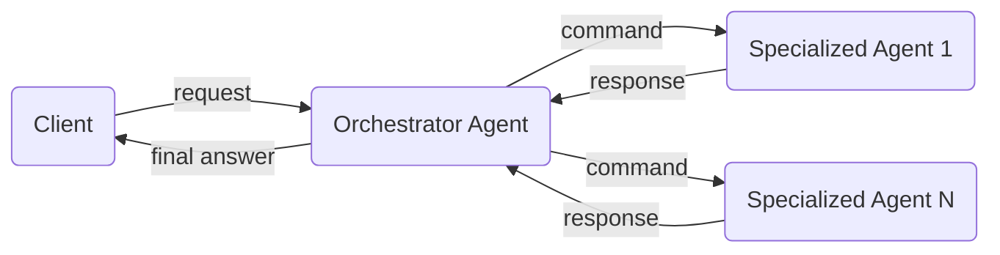
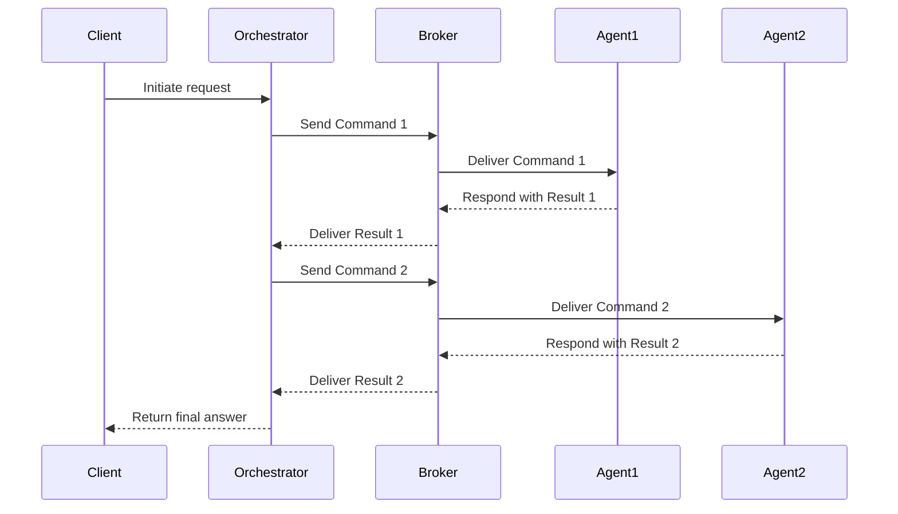

# Message-Driven Communication in Multi-Agent Systems

_Last updated: 2025-06-30_

In a message-driven model, agents interact asynchronously by exchanging discrete
messages—such as commands, events, or responses—via a broker or event bus. This
architecture promotes loose coupling, scalability, and resilience, especially in
distributed environments.

---

## Orchestration

1. The client initiates the multi-agent workflow by sending a request—or
   publishing a message to a broker or event hub—to the orchestrator.
2. The orchestrator decomposes the request into subtasks and issues _command
   messages_ to appropriate specialized agents.
3. Each specialized agent processes its command independently and publishes a
   response message, typically to a reply-to queue or topic indicated by the
   orchestrator. Responses include results or status, and often carry a
   correlation ID to link them to the original request. This asynchronous flow
   allows the orchestrator to aggregate and correlate responses from multiple
   agents efficiently.
4. The orchestrator collects specialized agent responses, synthesizes the final
   output, and sends it to the client.

### Key Characteristics

- **Asynchronous & Decoupled**: Client and orchestrator operate independently in
  time; message delivery is decoupled from direct request-response lifecycles.
- **Scalability**: Message queues/brokers can act as a buffer to absorb sudden
  traffic spikes by temporarily holding messages until the consumer
  (orchestrator) is ready to process them, balance load, and support horizontal
  scaling across agents.
- **Resiliency**: Built-in retries, dead-letter queues, and durable message
  storage provide resilience against transient network issues and agent
  failures, ensuring reliable delivery and fault tolerance.

### Tradeoffs

- **Broker management overhead**: While brokers help smooth workload spikes,
  scaling to very high message volumes demands careful planning, provisioning,
  and ongoing management to maintain system performance and reliability.
- **Fault Tolerance**: Partial results and error handling require protocol
  discipline. To handle this reliably, the system must:

  - Define clear message contracts that specify how success, failure, and
    retries are communicated.
  - Track correlation IDs and message state to know which tasks have completed
    and which have failed or are pending.
  - Implement idempotent handlers, so retries don't cause duplicate processing
    or side effects.
  - Use dead-letter queues or similar mechanisms to capture and inspect failed
    messages for debugging or reprocessing.
  - Apply consistent error-handling strategies, such as retries, compensation
    actions, or fallback logic, to avoid data inconsistency.

- **Latency**: While throughput can be high under ideal conditions, the
  asynchronous nature of message-driven systems makes it harder to guarantee low
  latency under certain conditions, such as:

  - Queue delays: Messages may sit in a queue waiting to be picked up if agents
    are under-provisioned, busy, or scaling up. Even if the message is sent
    instantly, it may not be processed right away.
  - Batch processing: Some systems intentionally process messages in batches to
    improve throughput or efficiency, but this adds wait time as messages are
    held until the batch fills or a timeout is reached.
  - Retries and backoff: Failed messages may be retried with exponential backoff
    or delay intervals, extending overall processing time for those messages.
  - Broker throughput limits: Brokers can become bottlenecks when handling large
    volumes, leading to increased end-to-end latency.
  - Async dependencies: When multiple services rely on one another through
    messaging, delays can cascade across the system, compounding latency even if
    individual services are fast.

- **Workflow Management Complexity**: Message-driven systems introduce
  architectural complexity in several key areas such as:

  - **Message correlation**: Given a workflow is broken into asynchronous steps,
    the orchestrator must track which responses belong to which specialized
    agent using correlation IDs. Managing these IDs consistently across services
    adds cognitive and implementation overhead.
  - **Idempotency**: To prevent unintended side effects from duplicate message
    delivery (which can happen in at-least-once delivery models), agents must
    ensure that processing the same message multiple times leads to the same
    result. This often requires state checks, deduplication logic, or idempotent
    storage operations.
  - **Reprocessing and retries**: Supporting reprocessing—whether for recovery,
    auditing, or data correction—requires careful handling to avoid data
    corruption or logic errors. Agents must distinguish between new and replayed
    messages and handle them appropriately.

- **Observability**: Achieving end-to-end visibility of logs, traces and metrics
  requires careful discipline across all agents:

  - **Correlation IDs** must be consistently generated and propagated with each
    message so that actions across distributed services can be tied back to the
    same workflow or request.
  - **Trace context propagation** is essential for distributed tracing tools
    (compliant to standardized formats such as OpenTelemetry) to stitch together
    spans from multiple services into a coherent timeline.
  - **Observability tooling** must be integrated into all agents and message
    handlers, including retries, dead-letter handling, and asynchronous
    workflows.

- **Messages ordering**: When the orchestrator dispatches tasks to multiple
  specialized agents, their responses may arrive in any order. Relying on
  arrival time to infer sequencing (e.g., "this agent's message came last") is
  unreliable and fragile. To ensure correctness when order matters, the system
  should rely on explicit sequencing strategies, such as:

  - **Task dependency chains** (e.g. directed graph), where agents are triggered
    only after prior steps complete.
  - **Sequence numbers or stage metadata** attached to messages for reordering
    incoming messages.
  - **Per-agent or per-key partitioning** to preserve local order without
    blocking the entire workflow.

## Communication Patterns

### Parallel Fan-Out

The orchestrator fans out commands to multiple agents, then waits for all
responses (within a timeout) before synthesizing the result.

#### Key Characteristics

- **High concurrency and parallelism**: Enables simultaneous execution of
  independent agent tasks, maximizing throughput for suitable workloads.
- **Aggregated response handling**: The orchestrator collects and synthesizes
  results from multiple agents, supporting flexible aggregation logic (e.g.,
  voting, merging, or best-effort completion).
- **Loose coupling between agents**: Agents do not need to know about each other
  or coordinate directly, reducing interdependencies and simplifying agent
  logic.
- **Flexible timeout and fallback strategies**: The orchestrator can define
  custom policies for how long to wait and what to do if some agents do not
  respond in time.

#### Tradeoffs

- **Risk of partial or inconsistent results**: If some agents fail or are slow,
  the orchestrator may need to proceed with incomplete data, which can affect
  the quality or reliability of the final output.
- **Increased orchestrator complexity**: Aggregating, correlating, and
  synthesizing multiple asynchronous responses requires careful design,
  especially as the number of agents grows.
- **Potential for resource contention and downstream bottlenecks**: Large-scale
  fan-out can stress shared infrastructure or external dependencies, requiring
  proactive scaling and monitoring.
- **No guarantee of response order**: The orchestrator must be robust to
  out-of-order arrivals and design aggregation logic accordingly.

> Typical use cases: data aggregation, consensus, distributed analysis.

### Chained Task Sequencing

The orchestrator performs a sequence of commands, where the output of each step
is used as input for the next. This enables tasks that require intermediate
context, validation, or enrichment before the next operation.

#### Key Characteristics

- **Stepwise processing with data dependencies**: Each agent's output can be
  validated, transformed, or enriched before passing to the next step,
  supporting complex workflows.
- **Deterministic execution order**: Tasks are performed in a strict sequence,
  ensuring that each step receives the required context from previous results.
- **Fine-grained error handling and validation**: The orchestrator can inspect
  and handle errors or validation failures at each stage before proceeding.
- **Supports conditional branching**: The orchestrator can make decisions at
  each step, enabling dynamic workflows based on intermediate results.

#### Tradeoffs

- **Increased end-to-end latency**: Sequential execution means each step must
  wait for the previous one to complete, which can increase total processing
  time compared to parallel patterns.
- **Potential bottlenecks at slowest step**: The slowest agent or operation
  determines the overall workflow speed, as each subsequent step must wait for
  the previous one to finish. This means that even if most agents are fast, a
  single slow or overloaded agent can delay the entire sequence. Bottlenecks can
  arise from resource constraints, external dependencies, or complex processing
  logic in any step. To mitigate this, monitor step-level performance, optimize
  the slowest stages, and consider parallelizing independent sub-steps where
  possible. Additionally, design for timeouts, retries, or fallback paths to
  prevent indefinite blocking if a step becomes unresponsive.
- **Orchestrator complexity**: Managing state, error handling, and conditional
  logic across multiple steps increases orchestrator implementation complexity.
- **Reduced fault isolation**: Failures in early steps can block the entire
  workflow, requiring robust error handling and compensation strategies.

> Typical use cases: multi-stage data processing, validation pipelines,
> enrichment chains, workflows with strict task dependencies.

## Recommendations

### Message Design

- **Use clear message contracts**: Define explicit schemas for commands, events,
  and responses to ensure consistency across agents.
- **Include correlation IDs**: Always attach unique identifiers to track message
  flows across the distributed system.
- **Design for idempotency**: Ensure that processing the same message multiple
  times produces the same result.
- **Implement structured error reporting**: Use consistent error formats that
  include error codes, descriptions, and recovery suggestions.

### Broker and Infrastructure

- **Choose the right broker**: Select message brokers based on your throughput,
  latency, and durability requirements (e.g.
  [Choose between Azure messaging services](https://learn.microsoft.com/en-us/azure/service-bus-messaging/compare-messaging-services)).
- **Plan for scaling**: Design your broker topology to handle peak loads and
  implement auto-scaling where possible.
- **Monitor broker health**: Track queue depths, processing rates, and error
  rates to identify bottlenecks early.
- **Implement dead letter queues**: Configure mechanisms to capture and analyze
  failed messages for debugging and recovery.

### Agent Design

- **Keep agents focused**: Design each agent around a single, well-defined
  responsibility to maintain loose coupling.
- **Implement circuit breakers**: Protect against cascading failures by
  implementing circuit breaker patterns in agent communication.
- **Use asynchronous processing**: Design agents to handle messages
  asynchronously to improve system responsiveness.
- **Plan for graceful degradation**: Implement fallback mechanisms when
  dependent agents are unavailable.

### Orchestration Best Practices

- **Minimize orchestrator complexity**: Keep orchestration logic simple and push
  complex business logic into specialized agents.
- **Implement timeout strategies**: Define appropriate timeout values for
  different types of operations and implement fallback behaviors.
- **Use event sourcing when appropriate**: For complex workflows, consider event
  sourcing to maintain an audit trail and enable replay capabilities.
- **Design for observability**: Implement comprehensive logging, metrics, and
  tracing to monitor system health and troubleshoot issues.

## References

- [Choose between Azure messaging services](https://learn.microsoft.com/en-us/azure/service-bus-messaging/compare-messaging-services)
- [A Distributed State of Mind: Event-Driven Multi-Agent Systems](https://www.confluent.io/blog/event-driven-multi-agent-systems)

---

{{ #include ../../components/discuss-button.hbs }}
