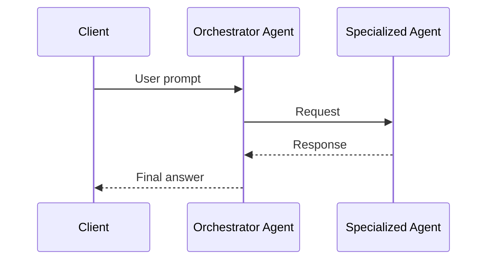
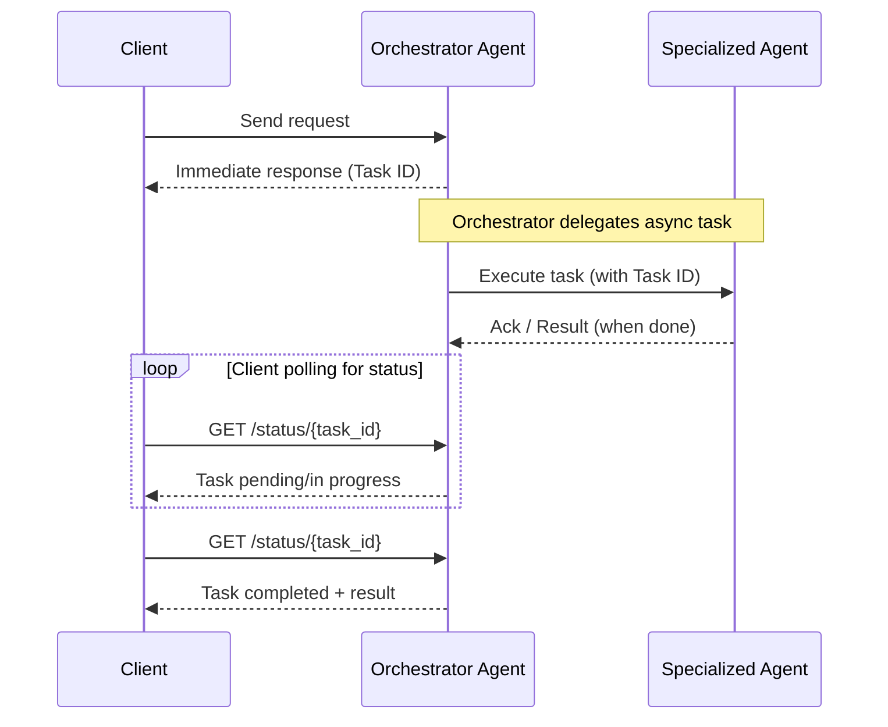

# Request-driven agents communication

A request-based approach revolves around **synchronous or asynchronous message
exchange** between agents, where one agent—often an orchestrator—initiates a
request to another agent, waits for a response, and then proceeds to the next
step in the workflow.

This pattern is commonly used in multi-agent systems and is implemented through
protocols such as HTTP REST for stateless interactions, gRPC for low-latecy
communication, Server-Sent Events (SSE) for unidirectional server push
mechanisms over HTTP, or other RPC mechanisms. While these protocols differ in
capabilities and performance characteristics, they all share the fundamental
trait of being initiated by the client agent and typically bound to a response
lifecycle.

This topic covers:

- [Synchronous Request-Reply](#synchronous-request-reply)
- [Asynchronous Request-Reply](#asynchronous-request-reply)
- [Summary table](#summary-table)
- [Recommendations](#recommendations)
- [References](#references)

## Synchronous Request-Reply

## Key characteristics

- **Direct Feedback**: Results or errors are delivered immediately in the same
  session.
- **Straightforward observability**: Tracing and debugging form linear,
  easy-to-follow flows.
- **Blocking operation**: The client waits for a response, pausing its workflow
  until the agent response completes.

## Tradeoffs

- **Temporal coupling**: Both client and agents must be available and responsive
  at the same time.
- **Scalability**: Each request consumes resources until completion,
  constraining throughput under high concurrency.
- **Latency Sensitivity**: Downstream slowness or outages have immediate
  upstream impact.
- Availability Risk: Agent outages or delays directly affect the client.
- **Challenges with long-running tasks**: Increased risk of timing out and
  overloading system resources.

## Streaming

Streaming synchronous responses (e.g., HTTP-based or RPC-based streaming
mechanisms) allow incremental results to be sent before the full operation
completes. This is valuable when early feedback matters—such as for streaming AI
outputs or partial search results—by reducing time-to-first-response, supporting
progress updates, and improving perceived responsiveness.

However, streaming adds architectural complexity. Clients must be capable of
handling partial data, managing persistent connections, and responding to errors
mid-stream. It's essential to validate that the client environment supports
streaming protocols before adopting this pattern, as not all clients (e.g.,
conversational channels or proxies) handle streaming reliably.

## Asynchronous Request-Reply

### Key Characteristics

- **Non-blocking Interaction**: The client sends a request to trigger a
  long-running process and receives an immediate acknowledgment, usually
  containing a reference ID. The actual result is delivered later, allowing the
  client to continue without waiting.

- **Loose Temporal Coupling**: The client and agent do not need to be available
  at the same time. Agents process requests as resources allow, promoting
  flexibility and decoupling.

- **Deferred or Event-Based Responses**: Results are delivered through
  asynchronous channels such as message queues, polling endpoints, webhooks, or
  event streams.

- **Well-Suited for Event-Driven Architectures**: This pattern aligns naturally
  with event-driven systems, where message brokers and event buses help decouple
  producers from consumers.

- **Scalable and Resilient**: By introducing buffers (e.g., queues), the system
  can absorb load spikes and recover from downstream slowdowns, enhancing
  throughput and fault tolerance.

### Tradeoffs

- **Increased Complexity**: Requires message delivery management, idempotency,
  retries, correlation IDs, and robust failure handling.
- **Eventual Consistency**: State across agents may temporarily diverge.
- **Observability Challenges**: Understanding workflow state requires
  distributed tracing and correlation.
- **Out-of-order/Duplicate Processing**: Logic required for reordering, retries,
  and deduplication.
- **Delayed Feedback**: Results not immediate; may require explicit progress or
  completion notifications.

## Summary table

| **Aspect**           | **Synchronous**         | **Asynchronous**            |
| -------------------- | ----------------------- | --------------------------- |
| **Responsiveness**   | Immediate, blocking     | Deferred, non-blocking      |
| **Scalability**      | Limited by concurrency  | High (with good design)     |
| **Complexity**       | Low to medium           | Medium to high              |
| **Best Fit**         | Short-lived tasks, APIs | Long-running, batch, events |
| **Failure Handling** | Simple                  | Requires robustness         |

## Recommendations

Begin with the simplest communication pattern that effectively serves your use
case—typically either synchronous or asynchronous request-reply without
streaming responses. These approaches are easier to implement, debug, and
observe, making them ideal during early development or when validating your core
business logic.

Avoid starting with streaming unless there's a clear, validated need—such as
delivering incremental results, real-time progress updates, or when a
single-response model creates a noticeable bottleneck for users or agents.

If and when you adopt streaming architectures, invest early in observability and
robust error handling. Streaming systems tend to introduce added complexity as
they scale, and without strong visibility, diagnosing issues becomes
significantly harder.

This incremental approach aligns with agile principles: build for current needs,
collect feedback, and evolve your system only as new requirements emerge.

## References

- [Asynchronous Request-Reply pattern](https://learn.microsoft.com/en-us/azure/architecture/patterns/async-request-reply)
