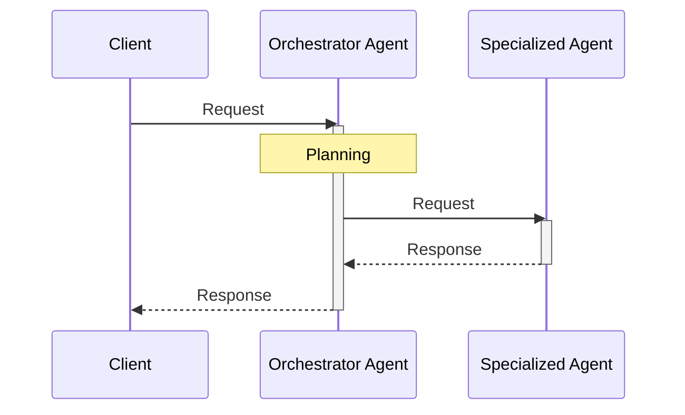
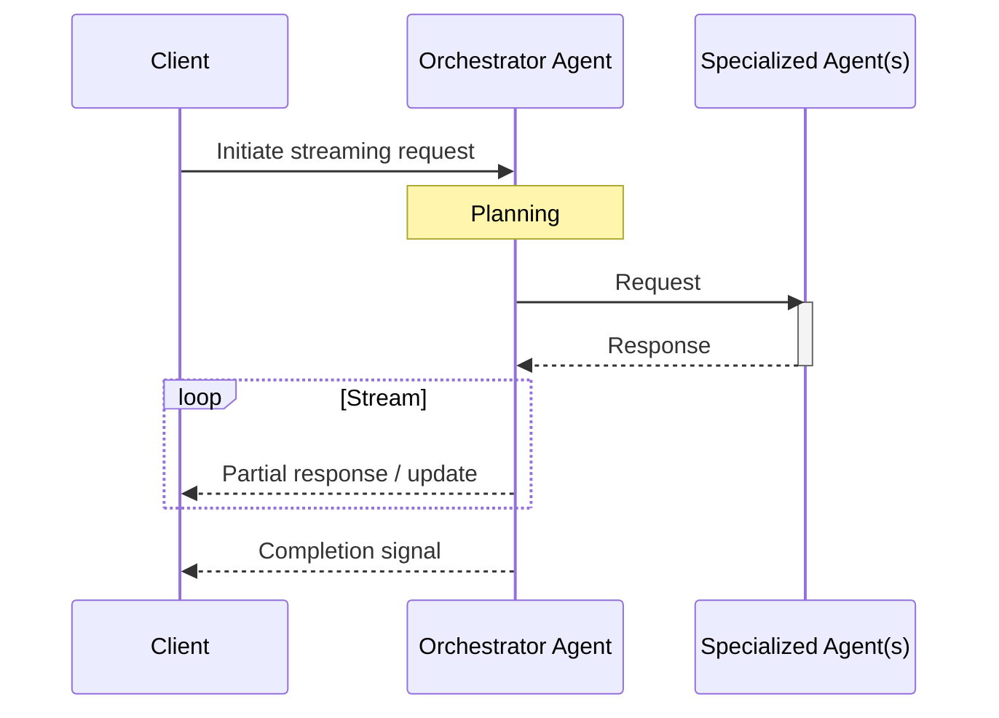
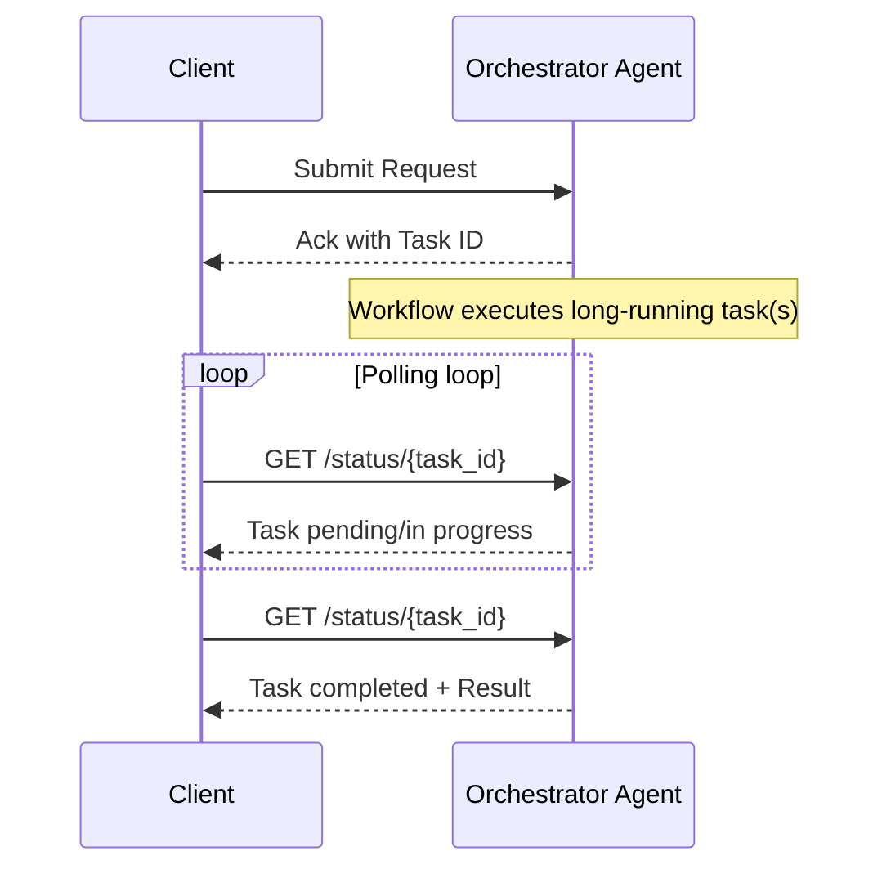
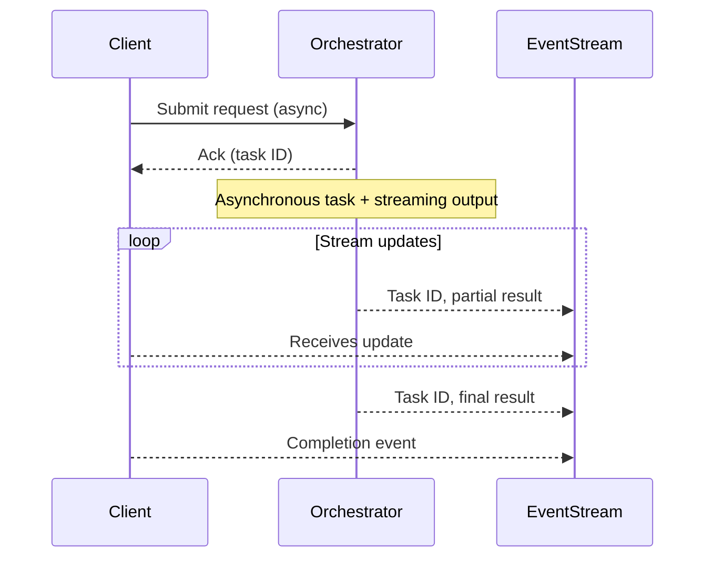

# Request-Driven Communication in Multi-Agent Systems

In a request-driven model, all interactions—between clients, orchestrators, and
expert agents—are initiated by explicit requests. A central orchestrator
receives the client's request, plans the workflow, and delegates tasks to
specialized agents. Each agent processes its task independently and returns
results to the orchestrator, which compiles and returns the final output.

---

## Non-Streaming vs Streaming Interactions

Most client-to-agent communication falls into two categories:

- **Non-Streaming (Single-Response):** The client sends a request to the
  orchestrator that initiates the multi-agent workflow, and waits for a single,
  complete response—well suited for short-lived or atomic tasks where only the
  final result matters.
  - Advantages: Simplicity, straightforward error handling and easier
    observability.
  - Limitations: Not ideal for long-running or incremental workloads; client is
    blocked until task completes.
- **Streaming (Incremental Response):** Results or updates are sent
  incrementally during processing (e.g., via server-sent events, gRPC streaming,
  or websockets). This enables real-time progress feedback or delivery of large
  outputs as they are generated, common in LLM-driven use cases
  - Advantages: Immediate progress visibility, lower perceived latency for
    users, supports scalable delivery to multiple consumers.
  - Limitations: More complex protocol handling, error management, and
    observability; potential network compatibility issues.

### Streaming recommendation

In practice, for multi-agent architectures, it's most effective to only stream
responses from the orchestrator agent to the end client—not between the
orchestrator and internal expert agents use the following reasons:

- **Workflow Control**: The orchestrator is responsible for the workflow's
  consistency and correctness. If expert agents stream content directly, the
  orchestrator cannot guarantee ordering, error handling, or workflow structure.
- **Error Handling**: Streaming across multiple hops makes error recovery more
  complex—if an expert agent fails or returns incomplete data, the orchestrator
  must reconcile fragmented streams, resulting in fragile and error-prone logic.
- **Increased Complexity**: Maintaining streaming protocols, session state, and
  message ordering across all agent-to-agent boundaries increases architectural
  complexity and operational risk.
- **Observability & Traceability**: When multiple agents stream data
  independently, it becomes challenging to trace events, maintain version
  control, and audit workflows in a predictable sequence.
- **Value vs. Effort**: Direct streaming between agents rarely delivers end-user
  value that justifies the development and maintenance overhead. The
  orchestrator is the only agent with enough context to assemble, filter, and
  sequence partial results before presenting them to users.

## Communication Patterns

### 1. Synchronous Request-Reply

#### Non-streaming

##### Key characteristics

- **Direct Feedback**: Results or errors are delivered immediately in the same
  session.
- **Straightforward observability**: Tracing and debugging form linear,
  easy-to-follow flows.
- **Blocking operation**: The client waits for a response, pausing its workflow
  until the agent response completes.

##### Tradeoffs

- **Temporal coupling**: Both client and agents must be available and responsive
  at the same time.
- **Scalability**: Each request consumes resources until completion,
  constraining throughput under high concurrency.
- **Latency Sensitivity**: Downstream slowness or outages have immediate
  upstream impact.
- Availability Risk: Agent outages or delays directly affect the client.
- **Challenges with long-running tasks**: Increased risk of timing out and
  overloading system resources.

#### Server-Streaming

Common streaming connection patterns:

- **Server-Sent Events (SSE)**: The orchestrator agent streams incremental
  updates to the client over a single HTTP connection using the
  `text/event-stream` format—well-suited for browsers and lightweight consumers.

- **HTTP Chunked Responses**: The server delivers result fragments as they
  become available via HTTP chunked transfer encoding, keeping the connection
  open for the duration of the task.

##### Key Characteristics

- **Non-blocking workflow**: The client submits a request to initiate a
  potentially long-running process and receives prompt acknowledgment
  (containing a unique task ID). The workflow executes independently, freeing
  the client from waiting for completion.

  > While the overall pattern is asynchronous, the initial request is typically
  > a synchronous HTTP exchange to obtain the reference/task ID.

- **Deferred response via polling**: The client periodically polls a status
  endpoint (using the task ID) to check for task progress or retrieval of the
  final result.
- **Temporal decoupling**: The client and orchestrator do not need to maintain a
  persistent connection or block on each other—the client can reconnect and
  resume polling as needed.

##### Tradeoffs

- **Client/Transport Support**: Not all clients (e.g., legacy proxies, web
  clients) handle open or long-lived connections or all protocols (gRPC, SSE,
  etc.).
- **Error Handling Complexity**: Client must handle mid-stream errors, partial
  or interrupted streams, and implement reconnection logic to continue receiving
  updates without data loss or duplication.
- **Potential Networking Restrictions**: Firewalls, proxies, or load balancers
  may block or prematurely terminate long-lived HTTP connections; mobile or
  low-bandwidth networks can disrupt streams; TLS termination proxies might
  interfere with HTTPS streaming.

---

### 2. Asynchronous Request-Reply

#### Non-streaming

##### Key Characteristics

- **Non-blocking Interaction**: The client sends a request to trigger a
  long-running process and receives an immediate acknowledgment, usually
  containing a reference ID. The actual result is delivered later, allowing the
  client to continue without waiting.

  > While the overall pattern is asynchronous, the initial request often
  > involves a brief synchronous exchange to initiate processing and retrieve a
  > task reference.

- **Deferred Responses**: Results are delivered through asynchronous polling
  endpoint channel.
- **Temporal Decoupling**: The client and orchestrator do not need to block
  while waiting for each other. However, polling requires the client to remain
  available or reconnect periodically.

##### Tradeoffs

- **Increased Complexity**: Requires mechanisms for reliable delivery,
  idempotency (the ability of a given operation to always produce the same
  result), correlation IDs, and robust failure handling on both client and
  coordinator sides.

- **Management Overhead**: Polling introduces additional load on the
  orchestrator and may result in inefficient resource usage if polling intervals
  aren't well-tuned.

- **Eventual Consistency**: State about long-running tasks may briefly diverge
  between client expectations and orchestrator status, especially under failures
  or network partitions.

- **Observability Challenges**: To accurately view workflow progress,
  distributed tracing and proper correlation of request/response cycles (e.g.,
  using trace or context IDs) is essential.

- **Duplicate/Out-of-Order Processing**: Clients may issue redundant requests or
  receive delayed/out-of-order responses, requiring deduplication and
  idempotency strategies.

- **Delayed Feedback**: Clients must rely on repeated polling for updates rather
  than receiving instantaneous notifications—potentially increasing perceived
  latency.

> Event-driven alternatives (such as webhooks or message queues) will be covered
> in [Event-driven Communication](./Event-Driven-Communication.md).

#### Server-Streaming

Similar to non-streaming approach, the client sends a request to trigger a
long-running process and receives an immediate acknowledgment, usually
containing a reference ID. The client then opens a special streaming connection
referencing the Task ID to receive updates as the task progresses.

Streamed messages can include a TaskID or similar identifier to help the client
associate updates with the correct ongoing request.

##### Key Characteristics

- **Truly Decoupled Streaming**: Neither client nor agent is blocked; updates
  are pushed as they become available using HTTP-based streaming mechanisms such
  as Server-Sent Events (SSE) or chunked transfer encoding.
- **High Scalability**: Well-suited for distributed, high-throughput
  systems—whether using lightweight server-push methods like SSE or message
  brokers.

##### Tradeoffs

- **Higher Complexity**: Requires robust handling for message ordering,
  deduplication, replay, and idempotency across distributed systems.
- **Potentially “Lost” Events**: Ensuring reliable delivery (e.g.,
  at-least-once, at-most-once, exactly-once) demands careful design of brokers
  and consumers, especially with transient connections like SSE.
- **Stream-to-Task Correlation**: All result messages must include correlation
  metadata such as `TaskID`, `RequestID`, or similar to allow downstream
  processing to track and associate updates correctly.

## Summary Table

| **Aspect**           | **Synchronous (Non-Streaming)** | **Synchronous Streaming**               | **Asynchronous (Non-Streaming)**          | **Asynchronous Streaming**                               |
| -------------------- | ------------------------------- | --------------------------------------- | ----------------------------------------- | -------------------------------------------------------- |
| **Responsiveness**   | Immediate, single response      | Immediate start, incremental results    | Deferred response                         | Deferred start, incremental/partial results              |
| **Scalability**      | Low (client blocking)           | Low–Medium [1]               | High[2]                        | Very High                                                |
| **Complexity**       | Low                             | Medium (connection mgmt, reconnections) | High (queues, retries, correlation)       | Very High (ordering, replay, deduplication, idempotency) |
| **Best Fit**         | Short tasks, APIs, low latency  | Progress bars, live updates, partials   | Batch jobs, background tasks, events      | Long-running tasks with feedback, event workflows        |
| **Failure Handling** | Simple                          | Medium (stream errors, reconnects)      | Advanced (timeouts, retries, idempotency) | Complex (stream replay, correlation IDs, lost messages)  |

---

[1] Partial results are flushed and transferred as they are produced.
This means the server can free memory sooner, and the client can process each
chunk without needing to buffer everything until the end.

[2] Enables time decoupling between the client and orchestrator.
Leverages background jobs, improving scalability, fault tolerance, and
supporting offline processing.

---

## Recommendations

- **Start Simple**: Start with the simplest communication pattern that
  effectively serves your use case—typically synchronous or asynchronous
  request-reply without streaming. These approaches are easier to implement,
  debug, and observe, making them ideal during early development or when
  validating your core business logic.

- **Adopt Streaming Incrementally**: Introduce streaming only when clearly
  justified—such as when delivering incremental results, providing real-time
  feedback, or handling large outputs that would otherwise block or degrade
  performance. Avoid starting with streaming unless it solves a proven
  bottleneck.

- **Use Standards-Based Protocols**: Favor open and emerging protocols to
  future-proof your architecture and benefit from built-in security, governance,
  and interoperability.

  > Examples include [Agent-to-Agent Protocol (A2A)](https://a2aprotocol.ai/),
  > [Agent Network Protocol (ANP)](https://agent-network-protocol.com/), and
  > [Agent Communication Protocol (ACP)](https://agentcommunicationprotocol.dev/introduction/welcome),
  > which are particularly suited for structured request-based communication
  > between agents.

- **Prioritize observability for async and streaming**: Asynchronous and
  streaming systems introduce additional operational complexity. Invest early in
  tracing, correlation IDs, error handling, and monitoring tools to maintain
  visibility and quickly resolve issues.

- **Iterate based on real feedback**: Let actual production signals and user
  experience guide your evolution from simple to more complex communication
  patterns. This iterative, feedback-driven approach helps avoid premature
  optimization and aligns well with agile development principles.

## References

- [Asynchronous Request-Reply pattern](https://learn.microsoft.com/en-us/azure/architecture/patterns/async-request-reply)
- [A Survey of Agent Interoperability Protocols: Model Context Protocol (MCP), Agent Communication Protocol (ACP), Agent-to-Agent Protocol (A2A), and Agent Network Protocol (ANP)](https://arxiv.org/html/2505.02279v1)

---

<a class="github-button" href="https://github.com/microsoft/multi-agent-reference-architecture/discussions/new?category=q-a&body=Source: [Design Options](https://github.com/microsoft/multi-agent-reference-architecture/blob/main/docs/design-options/Design-Options.md)" data-icon="octicon-comment-discussion" target="_blank" data-size="large" aria-label="Discuss buttons/github-buttons on GitHub">Discuss
this page</a>

