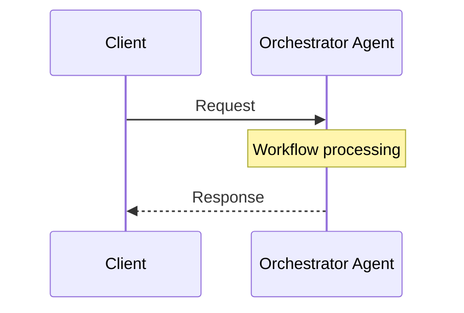
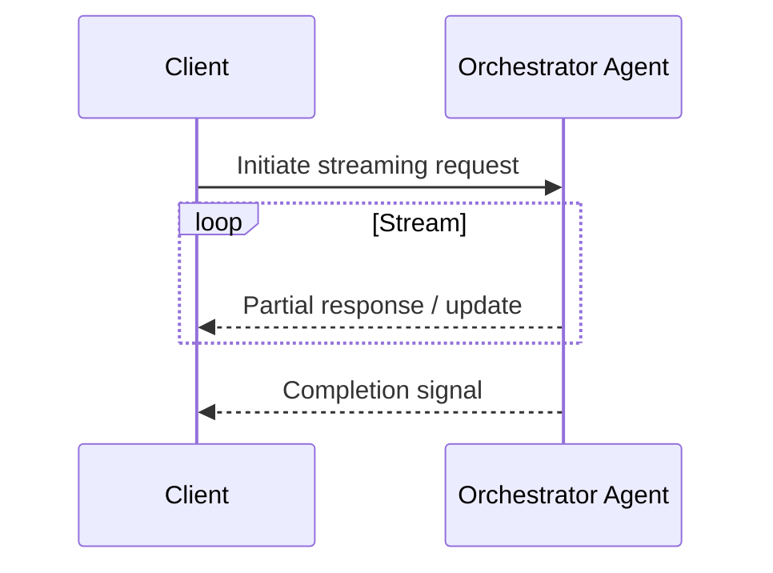
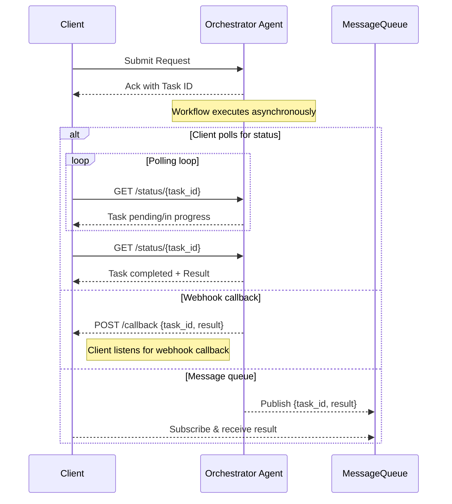
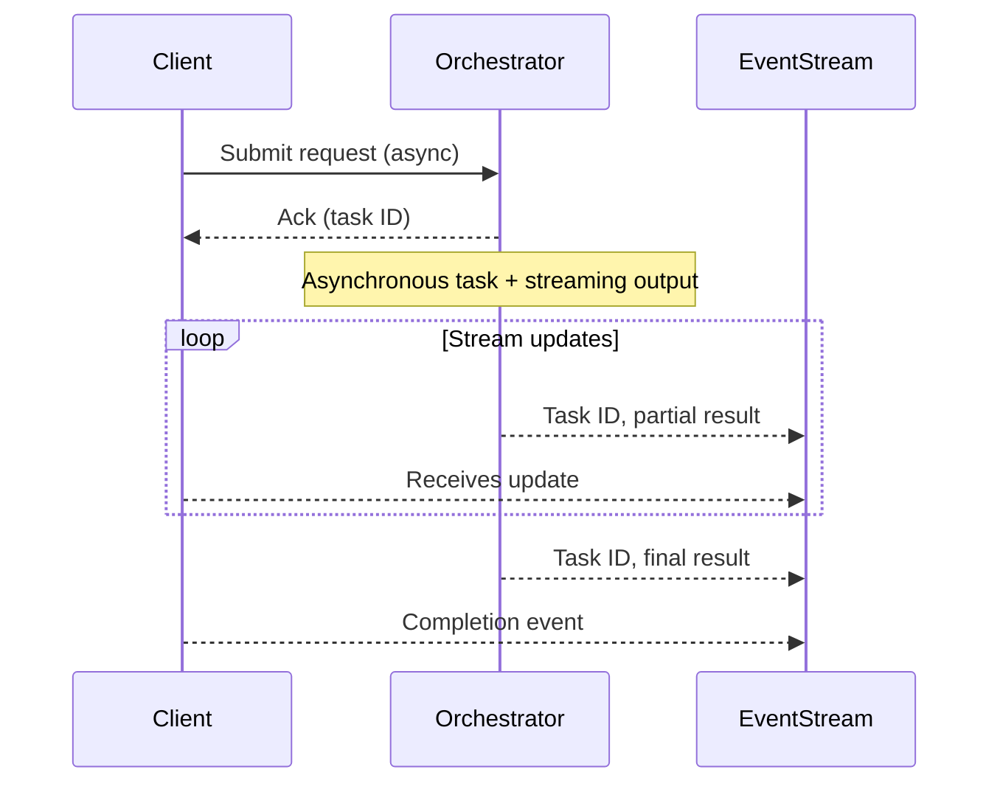

# Request-driven Agents Communication

<!-- markdownlint-disable MD013 -->

In a request-driven architecture, a client triggers the multi-agent workflow by
sending a request to a designated workflow initiator—most often an orchestrator
agent. The orchestrator coordinates the processing, delegates tasks to
specialized agents as needed, and ultimately compiles and returns a response to
the client.

This interaction is commonly implemented using widely adopted protocols such as
HTTP (the foundation for inter-agent communication), gRPC (offering efficient
low-latency or streaming capabilities built on top of HTTP/2), or other remote
procedure call (RPC) mechanisms. This foundational pattern enables modularity,
clear control flow, and interoperability across a variety of systems and agent
implementations.

## Table of Content

- [Non-Streaming vs Streaming Interactions](#non-streaming-vs-streaming-interactions)
- [Communication Patterns](#communication-patterns)
  - [Synchronous Request-Reply](#1-synchronous-request-reply)
    - [Non-streaming](#non-streaming)
    - [Server-Streaming](#server-streaming)
  - [Asynchronous Request-Reply](#2-asynchronous-request-reply)
    - [Non-streaming](non-streaming-1)
    - [Server-Streaming](#server-streaming-1)
- [Summary table](#summary-table)
- [Recommendations](#recommendations)
- [References](#references)

---

## Non-Streaming vs Streaming Interactions

Most agent-to-agent communication falls into two categories:

- **Non-Streaming (Single-Response):** The client sends a request and waits for
  a single, complete response. This is the traditional request-reply pattern,
  well suited for short-lived or atomic tasks where only the final result is
  relevant.
  - Advantages: Simplicity, straightforward error handling and observability.
  - Limitations: Not ideal for long-running or incremental workloads; client
    blocked until task completes.
- **Streaming (Incremental Response):** The agent returns results incrementally
  as processing progresses—either in a single connection/session (e.g.,
  gRPC/server-sent events) or via event-driven channels (e.g., message brokers).
  Useful for large outputs (e.g., LLM token generation), real-time status
  updates, or tasks where progress feedback matters.
  - Advantages: Immediate visibility into progress, lower perceived latency,
    scalable delivery to multiple consumers.
  - Limitations: More complex protocol handling, error management, and
    observability; potential network compatibility issues.

> Multi-agent systems often take advantage of both models, selecting the
> appropriate pattern per agent interaction based on task characteristics,
> performance requirements, and client needs.

## Communication Patterns

### 1. Synchronous Request-Reply

#### Non-streaming

##### Key characteristics

- **Direct Feedback**: Results or errors are delivered immediately in the same
  session.
- **Straightforward observability**: Tracing and debugging form linear,
  easy-to-follow flows.
- **Blocking operation**: The client waits for a response, pausing its workflow
  until the agent response completes.

##### Tradeoffs

- **Temporal coupling**: Both client and agents must be available and responsive
  at the same time.
- **Scalability**: Each request consumes resources until completion,
  constraining throughput under high concurrency.
- **Latency Sensitivity**: Downstream slowness or outages have immediate
  upstream impact.
- Availability Risk: Agent outages or delays directly affect the client.
- **Challenges with long-running tasks**: Increased risk of timing out and
  overloading system resources.

#### Server-Streaming

##### Key Characteristics

- **Incremental Feedback**: Client receives results “as they arrive,” not just
  after full completion.
- **Reduced Time-to-First-Byte**: Users or downstream agents see progress early.
- **Single Connection Lifecycle**: The client maintains one "open" connection
  for the full exchange.

##### Tradeoffs

- **Client/Transport Support**: Not all clients (e.g., legacy proxies, web
  clients) handle open or long-lived connections or all protocols (gRPC, SSE,
  etc.).
- **Error Handling Complexity**: Client must handle mid-stream errors, parti
- **Potential Networking Restrictions**: Firewalls, proxies, or load balancers
  may block or prematurely terminate long-lived HTTP connections; mobile or
  low-bandwidth networks can disrupt streams; TLS termination proxies might
  interfere with HTTPS streaming.

---

### 2. Asynchronous Request-Reply

#### Non-streaming

##### Key Characteristics

- **Non-blocking Interaction**: The client sends a request to trigger a
  long-running process and receives an immediate acknowledgment, usually
  containing a reference ID. The actual result is delivered later, allowing the
  client to continue without waiting.

  > While the overall pattern is asynchronous, the initial request often
  > involves a brief synchronous exchange to initiate processing and retrieve a
  > task reference.

- **Deferred or Event-Based Responses**: Results are delivered through
  asynchronous channels such as message queues, polling endpoints, webhooks, or
  event streams.

- **Temporal Decoupling (Varying Degrees)**: The client and server (agent) do
  not need to block while waiting for each other. The degree of temporal
  decoupling depends on the transport mechanism:

  - Message queues offer true loose temporal coupling, allowing agents to be
    offline and process messages when ready.
  - Webhooks provide partial decoupling — the receiver must be online but does
    not need to poll.
  - Event streams and polling require the client to remain available or
    reconnect periodically.

- **Well-Suited for Event-Driven Architectures**: This pattern aligns naturally
  with event-driven systems, where message brokers and event buses help decouple
  producers from consumers.

- **Scalable and Resilient**: By introducing buffers (e.g., queues), the system
  can absorb load spikes and recover from downstream slowdowns, enhancing
  throughput and fault tolerance.

##### Tradeoffs

- **Increased Complexity**: Requires message delivery management, idempotency,
  retries, correlation IDs, and robust failure handling.
- **Eventual Consistency**: State across agents may temporarily diverge.
- **Observability Challenges**: Understanding workflow state requires
  distributed tracing and correlation.
- **Out-of-order/Duplicate Processing**: Logic required for reordering, retries,
  and deduplication.
- **Delayed Feedback**: Results not immediate; may require explicit progress or
  completion notifications.

#### Server-Streaming

Common patterns:

- **Chunked Notifications**: Each result chunk is published to a message broker
  or event stream.
- **Webhook Callbacks**: Each result or progress update triggers a webhook POST
  to the client’s endpoint.
- **Server-Sent Events (SSE)**: The server pushes updates to the client over an
  HTTP connection using `text/event-stream`, suitable for browsers and
  lightweight consumers.
- **Multiplexed Task Updates**: Each stream message is tagged with a `TaskID` or
  similar identifier to correlate updates across parallel or multi-step
  processes.

##### Key Characteristics

- **Truly Decoupled Streaming**: Neither client nor agent is blocked; updates
  are pushed as they become available, often over event-driven channels or
  HTTP-based push (e.g., SSE).
- **Multi-Client / Fanout Ready**: Multiple consumers or subscribers can
  independently receive incremental outputs via publish-subscribe models or
  stream replication.
- **High Scalability**: Well-suited for distributed, high-throughput
  systems—whether using message brokers or lightweight server-push methods like
  SSE.

##### Tradeoffs

- **Higher Complexity**: Requires robust handling for message ordering,
  deduplication, replay, and idempotency across distributed systems.
- **Potentially “Lost” Events**: Ensuring reliable delivery (e.g.,
  at-least-once, at-most-once, exactly-once) demands careful design of brokers
  and consumers, especially with transient connections like SSE.
- **Stream-to-Task Correlation**: All result messages must include correlation
  metadata such as `TaskID`, `RequestID`, or similar to allow downstream
  processing to track and associate updates correctly.

## Summary Table

| **Aspect**           | **Synchronous (Non-Streaming)** | **Synchronous Streaming**               | **Asynchronous (Non-Streaming)**          | **Asynchronous Streaming**                                 |
| -------------------- | ------------------------------- | --------------------------------------- | ----------------------------------------- | ---------------------------------------------------------- |
| **Responsiveness**   | Immediate, single response      | Immediate start, incremental results    | Deferred response                         | Deferred start, incremental/partial results                |
| **Scalability**      | Low (client blocking)           | Low–Medium [1]               | High[2]                        | Very High[3]                                    |
| **Complexity**       | Low                             | Medium (connection mgmt, reconnections) | High (queues, retries, correlation)       | Very High (ordering, replay, deduplication, idempotency)   |
| **Best Fit**         | Short tasks, APIs, low latency  | Progress bars, live updates, partials   | Batch jobs, background tasks, events      | Long-running tasks with feedback, pub/sub, event workflows |
| **Failure Handling** | Simple                          | Medium (stream errors, reconnects)      | Advanced (timeouts, retries, idempotency) | Complex (stream replay, correlation IDs, lost messages)    |

---

[1] Partial results are flushed and transferred as they are produced.
This means the server can free memory sooner, and the client can process each
chunk without needing to buffer everything until the end.

[2] Enables time decoupling between producers and consumers.
Leverages message queues or background jobs, improving scalability, fault
tolerance, and supporting offline processing.

[3] Enables real-time delivery and fan-out. With pub/sub or
event-streaming infrastructure, supports high-throughput, loosely coupled
systems with multiple concurrent consumers—ideal for event-driven architectures.

---

## Recommendations

- **Start Simple**: Start with the simplest communication pattern that
  effectively serves your use case—typically synchronous or asynchronous
  request-reply without streaming. These approaches are easier to implement,
  debug, and observe, making them ideal during early development or when
  validating your core business logic.

- **Adopt Streaming Incrementally**: Introduce streaming only when clearly
  justified—such as when delivering incremental results, providing real-time
  feedback, or handling large outputs that would otherwise block or degrade
  performance. Avoid starting with streaming unless it solves a proven
  bottleneck.

- **Use Standards-Based Protocols**: Favor open and emerging protocols to
  future-proof your architecture and benefit from built-in security, governance,
  and interoperability.

  > Examples include [Agent-to-Agent Protocol (A2A)](https://a2aprotocol.ai/),
  > [Agent Network Protocol (ANP)](https://agent-network-protocol.com/), and
  > [Agent Communication Protocol (ACP)](https://agentcommunicationprotocol.dev/introduction/welcome),
  > which are particularly suited for structured request-based communication
  > between agents.

- **Prioritize observability for async and streaming**: Asynchronous and
  streaming systems introduce additional operational complexity. Invest early in
  tracing, correlation IDs, error handling, and monitoring tools to maintain
  visibility and quickly resolve issues.

- **Iterate based on real feedback**: Let actual production signals and user
  experience guide your evolution from simple to more complex communication
  patterns. This iterative, feedback-driven approach helps avoid premature
  optimization and aligns well with agile development principles.

## References

- [Asynchronous Request-Reply pattern](https://learn.microsoft.com/en-us/azure/architecture/patterns/async-request-reply)
- [A Survey of Agent Interoperability Protocols: Model Context Protocol (MCP), Agent Communication Protocol (ACP), Agent-to-Agent Protocol (A2A), and Agent Network Protocol (ANP)](https://arxiv.org/html/2505.02279v1)
