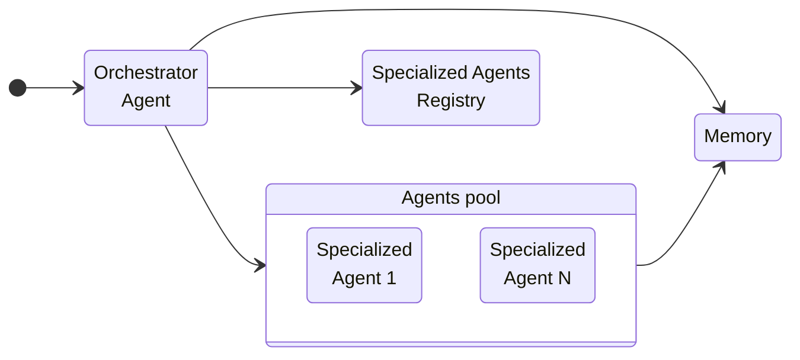

# Building Blocks

## Core components

- `Orchestrator agent` acts as the central coordinator within the multi-agent
  workflow. It receives incoming requests—whether from users or external
  services—and formulates a high-level plan composed of individual tasks. These
  tasks are then delegated to appropriate specialized agents, each responsible
  for a specific function. Once the specialized agents complete their tasks and
  return their results, the orchestrator aggregates and synthesizes their
  outputs into a coherent final response.

  > Although direct communication between specialized agents might seem
  > convenient at first, it's recommended to route all communication through the
  > orchestrator to maintain clarity and control. Avoid direct agent-to-agent
  > messaging unless necessary; if agents are tightly coupled, group them into a
  > single composite agent exposed to the orchestrator as one unit.

- `Specialized agents` are domain-focused experts within the multi-agent system.
  Each one is responsible for a distinct area of expertise—for example, one
  agent might be responsible for finding flights, another for booking hotels,
  another for planning activities, and another for estimating the total cost.
  These agents can range in complexity: some may be simple wrappers around a
  language model, while others may coordinate their own sub-agents to complete
  more detailed tasks. For instance, a "Hotel Booking Agent" might internally
  manage sub-agents for comparing prices, checking availability, and reading
  reviews—working together to deliver the best lodging option.

  > A specialized agent is not the same as a task or a tool. While an agent may
  > use multiple tools or perform several steps to achieve a complex goal, it's
  > a common mistake to treat tiny, granular tasks—like "call an API" or "parse
  > a response"—as standalone agents. This creates unnecessary fragmentation and
  > complexity. Instead, agents should be structured around meaningful, cohesive
  > capabilities—not isolated tool calls.

- `Agents registry` serves as a centralized data service and source of truth for
  managing all specialized agents available in the system for the orchestrator.
  It functions like a dynamic directory—cataloging each agent's identity,
  capabilities, operational status, version, and metadata tags. This registry
  enables efficient discovery and auditability.

> Additional reference of orchestration patterns:
> [Semantic Kernel: Multi-agent Orchestration](https://devblogs.microsoft.com/semantic-kernel/semantic-kernel-multi-agent-orchestration/)
