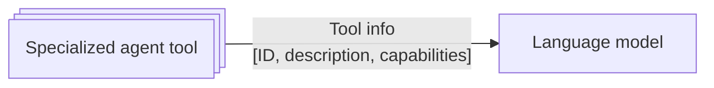

# Specialized Agents Context for Orchestration

_Last updated: 2025-07-01_

Effective orchestration requires the language model to be aware of available
specialized agents, their capabilities, and how to invoke them. Below are common
patterns for exposing this information, along with their key characteristics and
tradeoffs.

## Context Injection Patterns

### 1. Static Tools

Pre-load the language model with a static number of tools representing the
specialized agents, including their descriptions and capabilities.

**Key characteristics:**

- **Fast inference**: All specialized agents info is immediately available to
  the language model.
- **Predictable**: The set of agents and their capabilities are fixed at
  runtime.
- **Simplicity**: No need for dynamic lookups or external dependencies.

**Tradeoffs:**

- **Orchestration effectiveness**: Large number of specialized agent tools may
  affect the language model's ability to select the appropriate ones to solve
  the problem. For instance, the
  [OpenAI Function Calling Guide](https://platform.openai.com/docs/guides/function-calling?api-mode=chat)
  suggests between 10-20 tools per request.
- **Scalability**: Large number of specialized agent tools may exceed model
  context limits.
- Adding or removing agents requires a new orchestration agent deployment.

---

{{ #include ../../components/discuss-button.hbs }}
