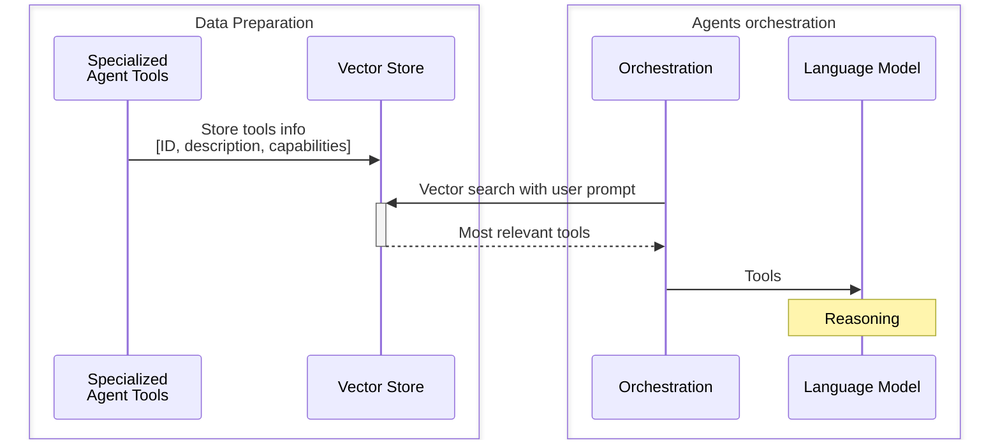
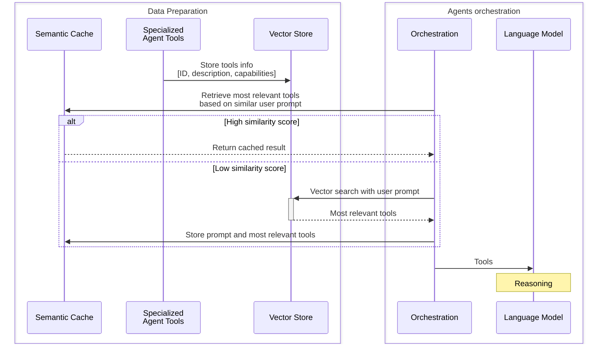

# Specialized Agents Context for Orchestration

_Last updated: 2025-07-07_

Effective orchestration requires the language model to be aware of available
specialized agents, their capabilities, and how to invoke them. Below are common
patterns for exposing this information, along with their key characteristics and
tradeoffs.

## Context Injection Patterns

### 1. Static Tools

Pre-load the language model with a static number of tools representing the
specialized agents, including their descriptions and capabilities.

**Key characteristics**

- **Fast inference**: All specialized agents info is immediately available to
  the language model.
- **Predictable**: The set of agents and their capabilities are fixed at
  runtime.
- **Simplicity**: No need for dynamic lookups or external dependencies.

**Tradeoffs**

- **Orchestration effectiveness**: Large number of specialized agent tools may
  affect the language model's ability to select the appropriate ones to solve
  the problem. For instance, the
  [OpenAI Function Calling Guide](https://platform.openai.com/docs/guides/function-calling?api-mode=chat)
  suggests between 10-20 tools per request.
- **Scalability**: Large number of specialized agent tools may exceed model
  context limits.
- Adding or removing agents requires a new orchestration agent deployment.

---

### 2. Vector Similarity Search over Static Tools

Store specialized agent tools information in an in-memory or external vector
database. When orchestration is needed, perform a vector search using the user
prompt to retrieve the most relevant agents.

> Modern vector stores such as Azure AI Search offers additional features on top
> of traditional vector search to improve search relevance scores. For more
> info, see
> [semantic ranking](https://learn.microsoft.com/en-us/azure/search/semantic-search-overview).

**Key characteristics**

- **Optimized context**: Only the most relevant specialized agents are
  considered as context for the language model, reducing AI costs and improving
  the language model's ability to efficiently select agents.
- **Scalability**: Supports large numbers of specialized agent tools without
  overloading the language model context. logic.

**Tradeoffs**

- **Operational overhead**: Vector search requires an additional overhead of
  provisioning, scaling, updating and monitoring the database, selecting the
  Approximate Nearest Neighbor (ANN) algorithm, selecting embedding models and
  formats, as well as tuning data and queries for better precision and
  performance over time.
- **Data retrieval mismatch**: Vector search introduces potential risks of
  _false positives_, retrieving irrelevant yet semantically close specialized
  agent tools in vector space (typically not harmful to the model’s reasoning in
  small numbers but increasing token usage), and _false negatives_, where
  relevant tools are missed due to content quality issues.

Optionally, a
[semantic cache](https://learn.microsoft.com/en-us/azure/cosmos-db/gen-ai/semantic-cache)
can use prior user prompts and their corresponding most relevant tools to
address similar user prompts without the need of executing vector search queries
on every request.

**Key Characteristics**

- **Reduced Latency**: By utilizing cached data for similar user prompts, the
  need for executing vector search queries for every request is minimized,
  leading to faster response times.
- **Cost Efficiency**: Avoids repeated database querying for similar prompts,
  reducing operational costs.

**Tradeoffs**

- **Data consistency management**: Managing cache consistency can be
  challenging, as updates to the vector database may not immediately reflect in
  the cache. Using a time-to-live (TTL) for cached items helps to minimize this
  risk.
- **Storage Overhead**: Maintaining a semantic cache requires additional storage
  resources, which can grow with the number of cached items. Using a
  time-to-live (TTL) for cached items helps to avoid it to grow to enormous
  size.
- **Potential for Staleness**: Cached results might become outdated if the
  underlying agent tools' information changes, leading to irrelevant or
  incorrect results.

---

## References

- [Semantic Kernel Decisions: Context-based function selection](https://github.com/markwallace-microsoft/semantic-kernel/blob/main/docs/decisions/0072-context-based-function-selection.md)
- [Semantic Kernel: Multi-agent Orchestration](https://devblogs.microsoft.com/semantic-kernel/semantic-kernel-multi-agent-orchestration/)
- [Semantic ranking in Azure AI Search](https://learn.microsoft.com/en-us/azure/search/semantic-search-overview)
- [Introduction to semantic cache](https://learn.microsoft.com/en-us/azure/cosmos-db/gen-ai/semantic-cache)

{{ #include ../../components/discuss-button.hbs }}
