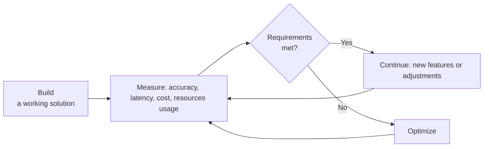

# The Iterative Optimization Loop

_Last updated: 2025-07-03_

Premature optimization can lead to unnecessary complexity and wasted effort.
Instead, it's recommended to follow an iterative approach to context
optimization:

1. **Get it right:** Start with a simple, correct solution that meets the
   functional requirements.
2. **Test it right:** Measure performance and cost using real data and
   scenarios.
3. **Analyze:** Evaluate whether the results meet your requirements.
4. **Optimize:** If not, make targeted improvements, prioritizing the changes
   that are likely to have the greatest impact.
5. **Repeat:** Re-measure and continue the loop as needed.

This process ensures that optimizations are both necessary and effective.

## Preventing optimization overload

Avoid attempting several optimizations at the same time. While it may seem
efficient, making many changes at once can increase cognitive load, obscure the
impact of individual improvements, and make troubleshooting more difficult.

Focusing on one or a few targeted optimizations at a time allows you to clearly
measure their effects, reduces the risk of introducing new issues, and helps
maintain a clear understanding of the system’s behavior. This disciplined,
incremental approach not only streamlines the optimization process but also
makes it easier to roll back changes if needed and ensures that each adjustment
is truly beneficial.

---

{{ #include ../../components/discuss-button.hbs }}
