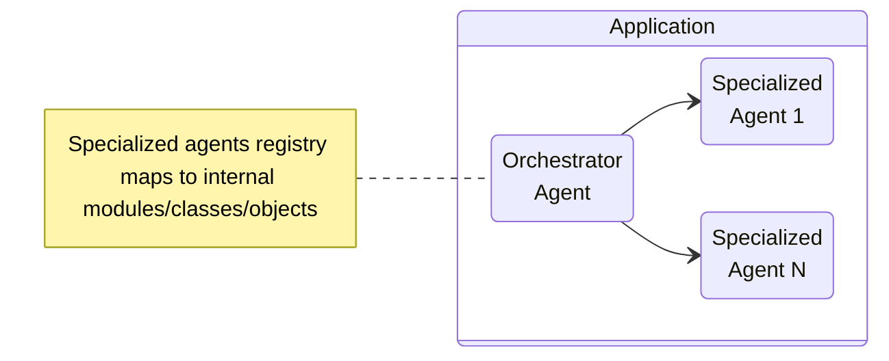

# Agents as a Modular Monolith

In the modular monolith design, all components—the orchestrator and each
specialized agent—reside within a single codebase and are deployed as one
application. While they are logically decoupled as independent modules or
libraries, physically these agents share a process space, a datastore, and often
common infrastructure like caching and logging.

## Key Characteristics

- **Simplicity of Operation**: With a single codebase, deployment artifact, and
  process to manage, this architecture radically lowers operational complexity
  compared to distributed systems.
- **Shared Infrastructure**: Agents can efficiently share memory, storage,
  logging, tracing, and context—enabling extremely low-latency communication
  patterns and reduced duplication of concerns.
- **Unified Governance**: Policy enforcement (such as agent registration and AI
  safety controls) and versioning are inherently centralized, simplifying
  traceability and compliance.
- **Ease of Observability**: Cross-module instrumentation and debugging are
  straightforward; correlation of traces and logs is seamless as everything runs
  together.

## Trade-Offs

### Advantages

- **Rapid Iteration**: Teams can develop, test, and deploy updates quickly, as
  changes to any agent or the orchestrator are integrated together and can be
  validated as a cohesive whole.
- **Lower Overhead**: No network-induced failure modes or communication latency
  between agents; debugging tools and traceability are easier to implement and
  use.
- **Centralized Security**: Security controls such as authentication,
  authorization, and firewalling are easier to enforce in a centrally managed
  process.

### Disadvantages

- **Scalability Constraints**: The entire application must scale together. If
  one agent or workflow becomes a performance bottleneck, you cannot scale or
  optimize it independently. Memory or compute spikes from one agent can degrade
  service for all.
- **Deployment Coupling**: Any change—no matter how minor—requires a full
  deployment cycle for the whole system. This can slow down delivery if multiple
  teams work in parallel or have divergent release cadences.
- **Limited Technology Flexibility**: All agents must use the same language,
  framework, and underlying platforms; integrating agents built in other stacks
  (or by external teams) is challenging.
- **Additional engineering discipline required**: Without strict code
  discipline, teams may inadvertently introduce dependencies between modules,
  increasing coupling and reducing long-term maintainability.

## Onion (Layered) Architecture Within a Modular Monolith

The **Onion Architecture** (also known as Layered Architecture) is a powerful
structural pattern that can be applied _within the modular monolith_. While the
monolith organizes code into independent business or domain modules (such as
specialized agents or orchestrators), onion architecture further enforces
**separation of technical concerns within each module** by defining clear,
nested layers:

- **Orchestration Layer** – Handles workflow and high-level coordination.
- **Specialized Agent Layer** – Implements the core agent-specific business
  logic.
- **AI Layer** – Interfaces with language models and related AI components,
  providing a unified API for all AI tasks.
- **Knowledge Layer** – Interfaces with AI models, vector stores, files, web
  data, data analytics platforms, and more.
- **Storage Layer** – Manages persistence, data retrieval, and caching.
- **Integration Layer** – Connects the system to external APIs and services.

Each layer has **bounded responsibilities** and interacts through well-defined
APIs, with strict rules: outer layers depend only on the inner ones, never the
other way around.

## Modular Monolith as a Migration Path

One of the strongest arguments for starting with a modular monolith is its role
as a stepping stone to microservices. By building clear, well-factored module
boundaries, explicit interfaces, and decoupled business logic, you make future
extraction of agents (or even the orchestrator) into standalone services far
simpler.

**Recommended practices for a future-proof monolith:**

- **Encapsulate agent logic** in independent modules with well-defined
  interfaces.
- **Avoid direct cross-module calls** beyond published interfaces, even inside a
  single codebase.
- **Enforce dependency direction** (e.g., orchestrator knows about agents, not
  vice versa).
- **Isolate state and configuration** per agent, simulating what a future
  service boundary would require.
- **Log and trace** with per-agent identifiers to facilitate distributed tracing
  down the line.

This discipline makes your code stronger, easier to evolve, and prepares you for
a future where modules might become services.

Teams that start with a modular monolith can later extract complex agents into
separate microservices with minimal effort. This approach lets you adopt
microservices only when your product's scale or your team's needs truly justify
it.

## When Is a Modular Monolith Best?

- Early to mid-stage multi-agent systems, or those unlikely to face massive
  horizontal scaling pressures.
- Organizations with a single team, or closely collaborating teams, who can work
  efficiently inside a single codebase.
- Use cases where low-latency coordination and shared state are essential, but
  team autonomy and independent deployments are not the top concerns.

---

## References

- [Monolith First by Martin Fowler](https://martinfowler.com/bliki/MonolithFirst.html)
- [Microservices for Greenfield?](https://samnewman.io/blog/2015/04/07/microservices-for-greenfield/)  
- [The Onion Architecture](https://jeffreypalermo.com/2008/07/the-onion-architecture-part-1/)
