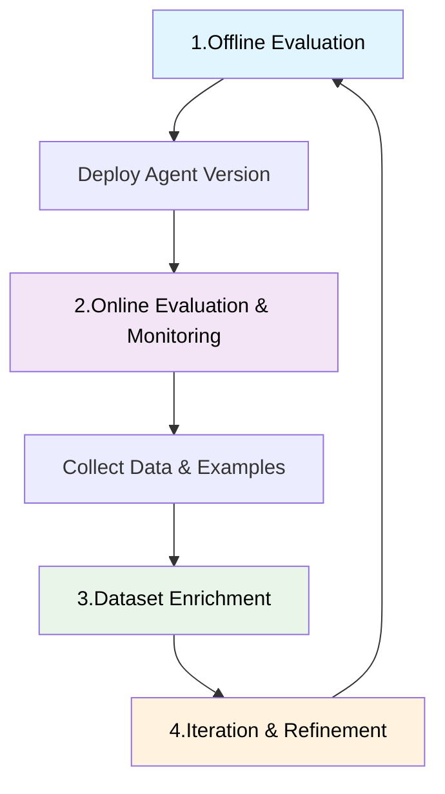

# Evaluation

_Last updated: 2025-10-21_

While **[observability](../observability/Observability.md)** provides the
instrumentation to collect metrics and traces, evaluation analyzes that data to
determine how well agents are performing against defined success criteria and
business requirements.

## Multi-agent evaluation challenges

Multi-agent systems introduce evaluation complexities like:

- **Path optimization**: Agents may reach correct solutions through inefficient
  routes, making it difficult to assess optimal performance
- **Error propagation**: Upstream failures can cascade through agent
  interactions, obscuring the root cause of downstream issues
- **Emergent behavior**: Collective agent interactions produce behaviors that
  cannot be predicted from individual agent analysis
- **Non-deterministic outputs**: The same input may produce different valid
  responses, complicating traditional success metrics

## Evaluation types and methodologies

### Code-based evaluation

This approach uses deterministic and programmatic criteria (like unit testing)
to validate system behavior, for example:

| Evaluation Type                | Purpose                                            | Example                                                                  |
| ------------------------------ | -------------------------------------------------- | ------------------------------------------------------------------------ |
| **API Response Validation**    | Ensures endpoint responses match expected results. | A `POST /agent/start` call should return HTTP 200 and include `task_id`. |
| **Output Format Verification** | Validates structure and data types of responses.   | An agent’s reply must include `action`, `result`, and `status` fields.   |
| **Performance Benchmarking**   | Measures response times and resource usage.        | The agent must respond within 500ms under 100 requests per second.       |
| **Security Compliance Checks** | Verifies adherence to security standards.          | Ensure tokens aren’t logged and sensitive headers are encrypted.         |

### LLM-as-a-judge evaluation

Unlike code-based evaluation, which uses deterministic rules, this method
leverages Large Language Models (LLMs) to assess the semantic, stylistic, and
contextual quality of responses—dimensions that are difficult or impossible to
capture with hard-coded assertions.

| Evaluation Aspect             | Purpose                                                           | Example                                                                   |
| ----------------------------- | ----------------------------------------------------------------- | ------------------------------------------------------------------------- |
| **Relevance Scoring**         | Measures how well the response answers the input.                 | An agent asked to summarize an article should produce a coherent summary. |
| **Tone and Style Evaluation** | Assesses whether the response aligns with expected tone or voice. | A customer support agent should respond politely and professionally.      |
| **Bias Detection**            | Identifies implicit or explicit bias in output.                   | Flag responses that reinforce gender stereotypes or political bias.       |
| **Hallucination Detection**   | Flags statements that are factually incorrect.                    | Detect when an agent invents citations or misrepresents known facts.      |

## Evaluation phases

### Offline evaluation

Pre-deployment testing using curated datasets and controlled environments:

- Benchmark dataset comparison with expected input/output pairs
- Regression testing against historical performance baselines
- Edge case validation using synthetic scenarios
- Load testing for scalability assessment

> Maintain comprehensive test datasets that evolve with your system. Regular
> updates with new edge cases and failure examples ensure evaluation relevance.

### Online evaluation

Production monitoring with real user interactions:

- Real-time performance tracking
- User satisfaction measurement
- Anomaly detection and alerting
- Continuous feedback collection

### Evaluation feedback loop

Adopt an iterative loop that blends offline analysis, live monitoring, and
data-driven refinement:

## Critical evaluation areas

### High-risk operations

Systems that modify databases, trigger external actions, or handle sensitive
data require enhanced evaluation rigor:

- **Accuracy validation**: Verify correctness of all data modifications
- **Authorization checks**: Ensure proper access control enforcement
- **Audit trails**: Maintain comprehensive logs of all system changes
- **Rollback testing**: Validate recovery mechanisms for failed operations

### Security and compliance

- **Access control**: Validate authentication and authorization between agents
- **Data protection**: Test privacy preservation and data handling protocols
- **Adversarial resilience**: Assess system behavior under attack scenarios
- **Regulatory compliance**: Verify adherence to industry standards and
  regulations

> Don't select metrics simply because they're available in your toolbox. Choose
> evaluation strategies that align with your specific use case and business
> requirements.

## Evaluation strategies by system component

### Orchestrator agent evaluation

- **Intent resolution**: Validate correct routing and task decomposition
  decisions
- **Plan optimization**: Assess efficiency of generated execution plans
- **Response synthesis**: Evaluate quality of final output aggregation
- **Error handling**: Test recovery mechanisms when specialized agents fail

### Specialized agents evaluation

- **Task completion**: Measure accuracy and completeness of domain-specific
  outputs
- **Tool call**: [Validate correct function/tool calling and API interactions](../evaluation/ToolCall.md)
- **Response quality**: Assess output relevance, accuracy, and formatting
- **Boundary handling**: Test behavior at capability limits and edge cases

### Registry evaluation

- **Discovery accuracy**: Verify correct agent selection for given capabilities
- **Metadata integrity**: Validate agent descriptions and capability mappings
- **Performance tracking**: Monitor agent availability and response times
- **Version management**: Test compatibility across different agent versions

For reference:

- [Agent Evaluation in 2025: Complete Guide](https://orq.ai/blog/agent-evaluation)
- [AI Agent Observability and Evaluation](https://huggingface.co/learn/agents-course/bonus-unit2/what-is-agent-observability-and-evaluation)
- [LLM Evaluation](https://langfuse.com/docs/scores/overview)
- [Evaluating Multi-Agent Systems](https://arize.com/docs/phoenix/learn/evaluating-multi-agent-systems)

---

{{ #include ../../components/discuss-button.hbs }}
