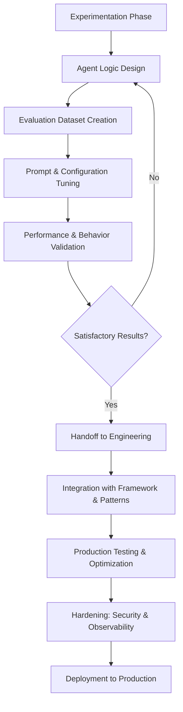
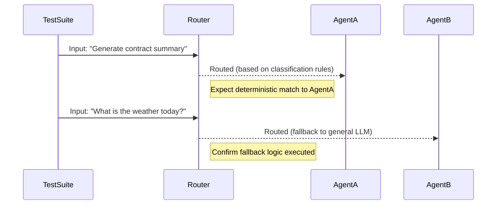

# Experimentation to Productization

_Last updated: 2025-05-29_

This document outlines the process of transitioning an agent from
experimentation to production. It defines the key steps required to ensure that
an agent is reliable, performant, secure, and observable in real-world
deployments.

## Overview

Agents are typically developed and tested in controlled environments during the
experimentation phase. At this stage, the focus is on solving a particular
problem, designing the agent's logic, and iterating over data preparation,
prompt strategies, and configuration parameters.

Experimentation often begins with a Data Science team, using tools such as
Jupyter Notebooks or SaaS platforms like
[Azure AI Foundry Playground](https://learn.microsoft.com/en-us/azure/ai-foundry/concepts/concept-playgrounds).
The goal is to identify the most effective orchestration or configuration
strategy aligned with business objectives. Evaluation data and test suites are
also created to assess performance.

Once results are satisfactory, the Software Engineering team takes over to
productize the agent using enterprise-level tools and patterns. This includes
refactoring the agent if necessary, ensuring compatibility with frameworks, and
aligning with organizational standards.

## Flow Diagram

## Key Stages

1. **Testing**

   - Conduct unit, integration, and end-to-end tests.
   - Prioritize real-world scenarios through automated pipelines.
   - Leverage test suites created during experimentation.
   - **Ensure deterministic tests for routing and decision-making logic** in
     multi-agent systems, enabling predictable outcomes and traceability during
     orchestration.
   - Use synthetic inputs and golden outputs to validate routing logic over
     time.

2. **Documentation**

   - Provide API references, usage guides, and examples.
   - Include onboarding instructions for integration teams.
   - Ensure reproducibility of the configuration and behavior.

3. **Performance Optimization**

   - Profile the agent to identify performance bottlenecks.
   - Optimize latency-critical paths and consider parallelism.
   - Validate load characteristics using stress tests.

4. **Security**

   - Enforce secure data handling and access controls.
   - Apply encryption in transit and at rest.
   - Use RBAC and policy-based execution controls.

   Refer to the [Security Guide](../security/Security.md) for more details.

5. **Monitoring and Observability**

   - Instrument agents with logging, metrics, and tracing.
   - Capture operational health and user interactions.
   - Integrate with enterprise observability platforms.

   Refer to the [Observability on Agents](../observability/Observability.md)
   guide for more details.

## Deterministic Routing Validation Example

## Integration with DevOps and DataOps

As with any production-grade system, agents should be subject to continuous
validation and improvement. See the
[DevOps and DataOps on Agents Lifecycle](./docs/governance/DevOps-and-DataOps-on-agents-lifecycle.md)
guide for CI/CD integration strategies, data drift monitoring, and ongoing model
evaluation pipelines.

This includes automated retraining triggers, performance benchmarking, and model
governance integration.

## Common Pitfalls to Avoid

- Lack of reproducibility from experimentation to production.
- Overfitting to sandbox or evaluation data.
- Insufficient governance checkpoints (e.g., security assessments, RAI reviews).
- Poor observability and incident response readiness.

## Governance and Testing Recommendations

- Define clear **gates**: including Responsible AI reviews, security audits, and
  performance benchmarks.
- Apply advanced testing strategies: chaos testing, synthetic queries, and eval
  frameworks with regression baselines.

## Conclusion

By following these structured steps, developers and teams can confidently
transition agents from prototype to production in a secure, observable, and
scalable way. This structured process reduces risk, improves maintainability,
and enables faster time-to-market.

As organizational maturity increases, these transitions become more streamlined
and automated—empowering continuous innovation and unlocking the full potential
of agent-based systems in real-world deployments.

---

<a class="github-button" href="https://github.com/microsoft/multi-agent-reference-architecture/discussions/new?category=q-a&body=Source: [Experimentation To Productization](https://github.com/microsoft/multi-agent-reference-architecture/blob/main/docs/governance/Experimentation-To-Productization.md)" data-icon="octicon-comment-discussion" target="_blank" data-size="large" aria-label="Discuss buttons/github-buttons on GitHub">Discuss this page</a>

