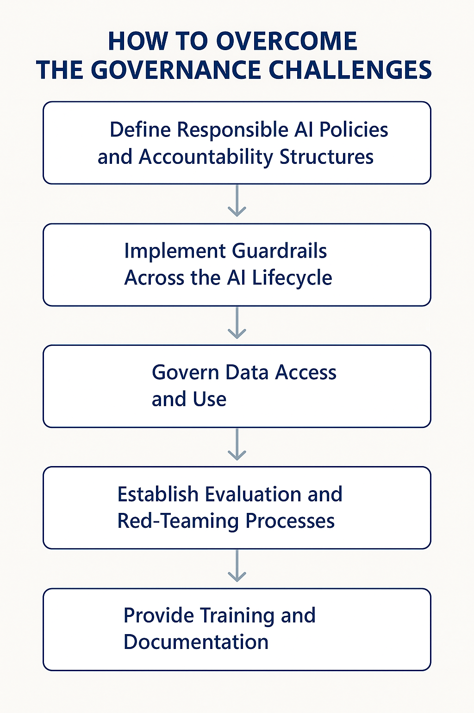

# Governance

_Last updated: 2025-05-13_

One of the key aspects of adopting any new technology in an enterprise
environment is governance. This becomes even more critical with the adoption of
Generative AI (GenAI). While GenAI represents a powerful and transformative
technology, its value does not emerge in isolation. On its own, it is just a
sophisticated engine — without access to high-quality, governed data, its
potential remains untapped.

This becomes especially evident when comparing deterministic systems to
AI-driven solutions. Traditional (deterministic) applications are rule-based,
predictable, and typically operate within predefined inputs and outputs. Their
governance often revolves around access control, compliance, and auditability of
code and workflows. However, multi-agent systems powered by GenAI introduce
additional governance concerns:

- Data provenance and usage policies: AI agents must access data responsibly and
  in alignment with enterprise policies.

- Output accountability: As agents act autonomously or semi-autonomously,
  ensuring traceability and responsibility for generated outputs is essential.

- Operational boundaries: It’s critical to define the scope of what agents are
  allowed to do, particularly in dynamic orchestration settings.

- Model oversight: The lifecycle of the models used (training, fine-tuning,
  evaluation) must be managed under clear governance to avoid misuse or drift.

Without strong governance in place, organizations risk uncontrolled automation,
data exposure, hallucinated outputs, and non-compliance with regulations.
Establishing a governance framework early ensures responsible innovation,
maintains trust, and paves the way for enterprise-scale adoption of GenAI and
multi-agent architectures.

## How to overcome the governance challenges

To govern GenAI-powered multi-agent systems effectively, enterprises must
establish a clear and actionable Responsible AI (RAI) framework. A governance
plan should not only align with ethical and regulatory standards but also enable
scalable innovation without compromising security, compliance, or trust.

One strong reference is the
[Microsoft Responsible AI Standard (v2)](https://cdn-dynmedia-1.microsoft.com/is/content/microsoftcorp/microsoft/final/en-us/microsoft-brand/documents/Microsoft-Responsible-AI-Standard-General-Requirements.pdf?culture=en-us&country=us),
which outlines foundational practices to ensure that AI systems are built
responsibly. Building on these principles, organizations can create a governance
roadmap as follows:

<!-- markdownlint-disable MD033 -->

    

<!-- markdownlint-disable MD033 -->

### Define Responsible AI Policies and Accountability Structures

- Adopt RAI principles such as fairness, reliability, privacy, inclusiveness,
  transparency, and accountability.

- Establish a cross-functional governance committee with representation from
  legal, compliance, IT, security, and AI teams.

- Define clear roles and responsibilities for model development, approval,
  deployment, and monitoring.

### Implement Guardrails Across the AI Lifecycle

- Use tools like
  [Azure AI Content Safety](https://learn.microsoft.com/en-us/azure/ai-services/content-safety/overview)
  and
  [Prompt Shields](https://learn.microsoft.com/en-us/azure/ai-services/content-safety/concepts/jailbreak-detection)
  to detect and filter unsafe or policy-violating outputs.

- Monitor for model drift, prompt injection, or malicious orchestration in
  multi-agent systems using telemetry and evaluation pipelines.

- Ensure auditability of agent actions via structured logging, versioning, and
  traceable decision trees, check
  [Observability section](../observability/Observability.md).

### Govern Data Access and Use

- Classify data according to sensitivity and restrict agent access based on data
  governance policies.

- Apply role-based access control (RBAC) and monitor for unauthorized data
  usage.

- Use data loss prevention (DLP) techniques and encryption to reduce exposure
  risk.

### Establish Evaluation and Red-Teaming Processes

- [Continuously evaluate system behavior through human-in-the-loop feedback loops](https://learn.microsoft.com/en-us/azure/ai-foundry/how-to/online-evaluation).

- [Conduct adversarial testing (red-teaming) to identify failure modes in agent collaboration or unintended capabilities](https://learn.microsoft.com/en-us/azure/ai-foundry/concepts/ai-red-teaming-agent).

- Track hallucination rates and bias impacts using Azure AI Evaluation tools or
  similar frameworks.

### Provide Training and Documentation

- Train teams on your RAI framework and decision-making criteria.

- Document system design choices, model limitations, data sources, and intended
  uses.

- Ensure users and stakeholders understand system capabilities and boundaries,
  particularly in customer-facing scenarios.

---

{{ #include ../../components/discuss-button.hbs }}
