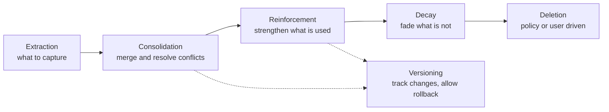
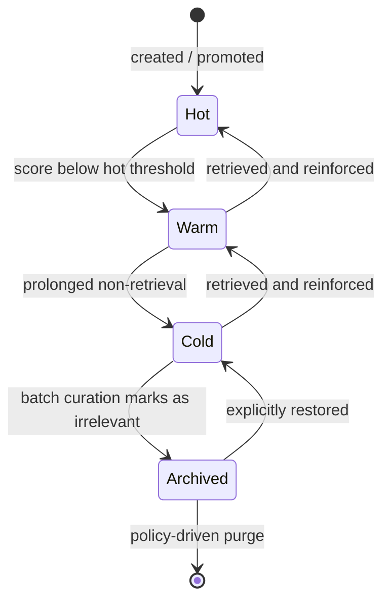
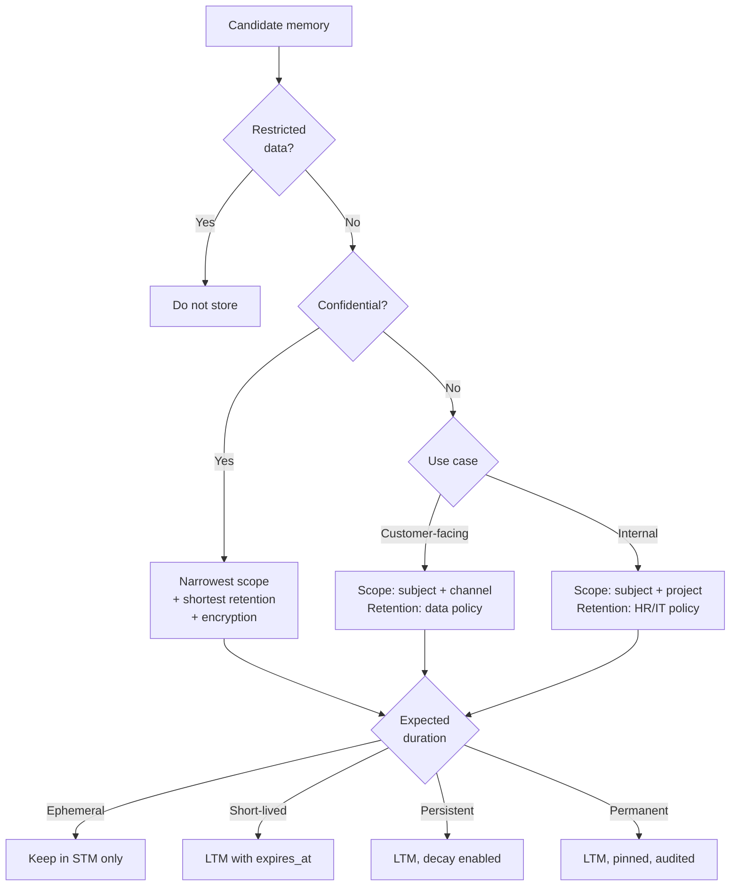

<!-- markdownlint-disable MD024 -->

# Long-term Memory

_Last updated: 2026-08-04_

Long-Term Memory (LTM) is what allows an agent to recognize a returning user,
recall a decision made three weeks ago, and avoid asking the same question
twice. Unlike [short-term memory](./Short-Term-Memory.md), which holds the raw
session and disappears with it, LTM holds a **compressed, distilled
representation** of what mattered, persisted across sessions, channels, and
agents.

LTM is not a transcript archive and it is not a knowledge base. It is a curated
set of durable statements about a subject — a customer, an employee, a project —
that the system actively recalls to make future interactions better.

This topic covers:

- [What qualifies as long-term memory](#what-qualifies-as-long-term-memory)
- [Long-term memory stores](#long-term-memory-stores)
- [Memory entry data model](#memory-entry-data-model)
- [Memory lifecycle](#memory-lifecycle)
- [Relevance scoring and decay](#relevance-scoring-and-decay)
- [Memory scope decision framework](#memory-scope-decision-framework)
- [Safety, privacy and governance](#safety-privacy-and-governance)
- [Security risks](#security-risks)
- [Operating memory at scale](#operating-memory-at-scale)
- [Adoption roadmap](#adoption-roadmap)

---

## What Qualifies as Long-Term Memory

### What to remember

- **Preferences and working style:** tone, format, language, preferred tools and
  channels.
- **Durable attributes:** role, team, account tier, recurring projects or
  topics.
- **Decisions and commitments:** what was agreed, what was promised, what was
  ruled out and why.
- **Entities and relationships:** systems, products, tickets, and people that
  keep reappearing.
- **Outcomes and resolution patterns:** what actually solved a recurring
  problem.

### What not to remember

- **Every conversation detail.** Raw history belongs in STM and in the archive,
  not in LTM.
- **Sensitive facts that were not explicitly offered for retention.** Health,
  financial, and personal details require explicit intent.
- **Business or transactional records** that already live in a system of record.
  Retrieve them; do not duplicate them into memory, where they will go stale.
- **Credentials, tokens, and secrets.** Never, under any policy.

### When to write

Two signals justify creating a memory:

- **Explicit intent** — the user asked the system to remember something
  ("remember that I prefer bullet points"). These memories carry the highest
  importance.
- **Repeated implicit signal** — the same preference or fact appears across
  multiple sessions with consistent phrasing and no contradiction.

A single incidental mention is usually noise. Requiring either explicit intent
or repetition is the cheapest defense against memory pollution.

---

## Long-Term Memory Stores

Each memory sub-type has a different shape, and therefore a different natural
storage strategy. See
[storage strategies](./Memory-Architecture-Patterns.md#storage-strategies) for
the full comparison.

| Sub-type       | What is stored                                      | Fitting storage                                                   |
| -------------- | --------------------------------------------------- | ----------------------------------------------------------------- |
| **Semantic**   | Structured profile of durable facts and preferences | Document or relational store, small and directly injectable       |
| **Episodic**   | Session summaries and events, timestamped           | Vector store with metadata filters for semantic recall            |
| **Procedural** | Learned workflows and resolution patterns           | Structured records, optionally a graph when steps relate entities |

Practical guidance:

- **Keep semantic memory small enough to inject wholesale.** If the profile no
  longer fits comfortably in the prompt, it needs consolidation, not a bigger
  budget.
- **Keep episodic memory searchable, not injected.** It grows without bound and
  should be reached through on-demand retrieval.
- **Introduce graph storage only when questions require traversal.** Entity
  relationships are a Phase 3 concern for most systems.

---

## Memory Entry Data Model

Every memory entry should carry enough metadata to be retrieved, ranked,
governed, decayed, audited, and deleted.

| Field               | Purpose                                                             |
| ------------------- | ------------------------------------------------------------------- |
| `memory_id`         | Unique identifier of the entry                                      |
| `subject_id`        | Who or what the memory is about (user, customer, project, team)     |
| `scope`             | Visibility boundary: session, global, project, channel, role, org   |
| `type`              | `semantic`, `episodic`, or `procedural`                             |
| `content`           | The statement itself, in a compact and self-contained form          |
| `embedding`         | Vector representation used for semantic retrieval                   |
| `source_session_id` | Provenance: the session the memory was extracted from               |
| `source_type`       | How it was created: explicit user request, extraction, or import    |
| `confidence`        | How certain the extraction is that the statement is true            |
| `importance`        | How much this memory matters, independent of how often it is used   |
| `retrieval_count`   | How many times the entry has been retrieved into working memory     |
| `last_retrieved_at` | Timestamp of the most recent retrieval — the input to decay         |
| `created_at`        | When the memory was first written                                   |
| `updated_at`        | When it was last modified or reinforced                             |
| `version`           | Monotonic version, enabling change tracking and rollback            |
| `tier`              | Lifecycle tier: `hot`, `warm`, `cold`, or `archived`                |
| `sensitivity`       | Classification: public, internal, confidential, restricted          |
| `expires_at`        | Hard expiration for policy-bound or short-lived memories            |
| `pinned`            | Whether the memory is exempt from decay (user-pinned or compliance) |

> `last_retrieved_at` and `retrieval_count` are not optional bookkeeping. They
> are the fields that make decay and relevance scoring possible, and they must
> be written back by the retrieval pipeline.

---

## Memory Lifecycle

A memory is not written once and kept forever. It moves through a lifecycle, and
each stage needs an owner in the architecture.



- **Extraction:** decide what in a session is durable. Runs asynchronously after
  a session ends, never on the inference critical path. See the
  [session end pipeline](./Memory-Pipelines.md#stm-session-end-pipeline).
- **Consolidation:** merge duplicates and resolve contradictions. A newer,
  higher-confidence statement should supersede an older one rather than coexist
  with it — two contradictory memories are worse than none.
- **Reinforcement:** every retrieval that proves useful increases confidence and
  resets the decay clock.
- **Decay:** memories that are never retrieved lose relevance over time. See
  [relevance scoring and decay](#relevance-scoring-and-decay).
- **Versioning:** keep the previous value when a memory changes. This supports
  rollback, explains behavior changes, and is often a compliance requirement.
- **Deletion:** user-initiated or policy-driven, and it must be genuinely
  effective — including in the vector index, the archive, and any derived
  summaries.

---

## Relevance Scoring and Decay

The most valuable memory is the one that keeps surfacing when the agent looks
for context. That behavior can be measured, and it should be, with an explicit
**score** attached to every entry.

### Scoring

In practice, teams start by combining **how often a memory has been retrieved**
with **how recently it was last accessed**, and then compose additional
variables into the same score. The most important addition is **explicit
importance**: a memory created because the user said _"I want you to remember
that I have three children"_ deserves far more weight than one incidentally
extracted from a transcript.

A workable starting formula:

```text
score = w_f · normalize(retrieval_count)
      + w_r · recency(last_retrieved_at)
      + w_i · importance
      + w_c · confidence
```

Where:

- `normalize(retrieval_count)` dampens raw counts (for example `log(1 + count)`)
  so a handful of very old, frequently used memories cannot dominate forever.
- `recency(last_retrieved_at)` is an exponential decay function of the time
  since the last access, with a half-life tuned per memory type — days for
  volatile operational context, months for stable profile facts.
- `importance` is highest for explicitly requested memories, moderate for
  repeated implicit signals, and lowest for single-mention extractions.
- `confidence` reflects the extraction and validation quality.

Tuning guidance:

- **Start with frequency and recency only**, and add importance and confidence
  once the pipeline is producing enough data to calibrate them.
- **Weight importance high enough that explicit user memories never decay out**
  of the store through simple disuse.
- **Score at write time and refresh on access**, storing the score so ranking
  does not require recomputation across the whole store.

The score is used in two places: to rank candidates during retrieval (see the
[reranker stage](./Memory-Pipelines.md#memory-retrieval-pipeline)) and to decide
which memories survive.

### Decay: use it or lose it

Decay follows a simple rule: **memories that nobody accesses fade over time, and
every access resets the counter.** This is precisely why `last_retrieved_at` and
`retrieval_count` must be updated by the retrieval pipeline — without that
write-back, there is no signal to decay against, and the store only ever grows.

Implementation notes:

- **Write back asynchronously.** Updating access metadata must not add latency
  to the read path; batch the updates or emit them as events.
- **Count real usage, not candidate generation.** Ideally, increment when a
  memory actually enters the assembled context, not merely when it appears in a
  candidate list.
- **Access frequency is the primary survival criterion.** When in doubt about
  whether a memory still matters, how often it is retrieved is the strongest
  available signal.

### Never delete directly — demote across tiers

What works best in practice is to **never hard-delete a memory as a decay
outcome**. Instead, demote it through tiers as its score drops, and let a batch
job walk the store, identify facts that are no longer relevant, and move them
down — only removing entries at the end of that journey.



| Tier         | Retrieval behavior                                     | Typical treatment                      |
| ------------ | ------------------------------------------------------ | -------------------------------------- |
| **Hot**      | Always eligible; semantic profile may be auto-injected | Indexed, low-latency store             |
| **Warm**     | Retrieved on demand only                               | Indexed, lower ranking priority        |
| **Cold**     | Retrieved only with explicit, targeted queries         | Cheaper storage, optionally de-indexed |
| **Archived** | Not retrieved; retained for audit and restoration      | Cold storage, purged by policy         |

Key properties of this model:

- **Demotion is reversible.** A retrieval promotes a memory back up a tier,
  which is exactly the reinforcement behavior you want: rarely used but still
  relevant facts recover instead of disappearing.
- **The batch job is a curation job.** It scans memories, evaluates scores,
  detects facts contradicted by newer entries, and demotes or expires them. It
  is also the natural place to run consolidation.
- **Deletion becomes deliberate.** Hard deletion is reserved for user-initiated
  removal, policy-driven purges, and clear violations (secrets, restricted
  data), not for ordinary aging.

### Exceptions to decay

- **User-pinned memories** — explicitly requested facts stay until the user
  removes them.
- **Compliance-mandated retention** — governed by policy, not by usage.
- **Legal hold** — decay and purge are suspended entirely.

---

## Memory Scope Decision Framework

Scope is the single most consequential decision in a memory design, and it is a
function of three dimensions:

```text
scope = f(use_case, duration, sensitivity)
```

### Dimension 1: use case type

|                 | Customer-facing agent                     | Internal employee agent              |
| --------------- | ----------------------------------------- | ------------------------------------ |
| **Scope**       | Per-customer and per-channel              | Per-employee and per-project or team |
| **Retention**   | Governed by data policy (GDPR, LGPD)      | Aligned with HR and IT policies      |
| **Content**     | Service history, preferences, open issues | Workflows, tools, past resolutions   |
| **Sensitivity** | High — PII and financial data             | Moderate — internal procedures       |

### Dimension 2: memory duration

- **Ephemeral:** single session only; appropriate for sensitive queries.
- **Short-lived:** hours to days; an active ticket or case.
- **Persistent:** weeks to months; the user profile.
- **Permanent:** compliance-mandated retention.

### Dimension 3: sensitivity classification

- **Public:** non-sensitive general preferences.
- **Internal:** business processes and workflows.
- **Confidential:** PII, financial, or health data — encrypted, tightly scoped,
  minimal retention.
- **Restricted:** credentials and access tokens — **never stored**, at any tier.

### Applying the framework



Decide the scope **at write time** and store it on the entry. Retrofitting scope
onto an existing memory store is expensive and rarely complete.

---

## Safety, Privacy and Governance

Memory changes the risk profile of an agentic system: data that used to vanish
with the session now persists, accumulates, and can resurface in unexpected
contexts.

### User control

- **Explicit opt-in or opt-out** for memory features.
- **Transparency:** users can see exactly what the agent remembers about them.
- **Editability:** users can add, correct, or delete individual memories.
- **Incognito or temporary mode** for sensitive interactions, where nothing is
  written.
- **Clear ownership:** in enterprise deployments memory typically belongs to the
  organization, not the individual — which also means a user who leaves the
  organization loses those memories. In consumer contexts, the memory belongs to
  the user. Whichever model applies, it must be explicit and communicated.

### Data protection

- **Encryption at rest and in transit** for all memory stores and indexes.
- **Regulatory compliance** (GDPR, LGPD, and sector-specific regimes) for any
  memory holding customer data, including the right to erasure.
- **Retention and deletion policies** defined per scope and sensitivity, and
  enforced by an automated job rather than by convention.
- **Never store credentials, tokens, or passwords**, and scan extraction output
  for them before writing.
- **Audit trail** for every memory access and modification: who, when, which
  entry, and why.
- **Memory must not feed model training.**

### Governance model

- **Admin controls** for enabling memory per team, per agent, and per channel.
- **Sensitive topic exclusion rules** that prevent extraction on defined
  categories.
- **Regular memory hygiene reviews** — sampling stored memories to check
  precision, scope correctness, and policy compliance.
- **Clear data ownership:** a named owner for the memory data of each scope.

See [Security](../security/Security.md) and
[Governance](../governance/Governance.md) for the broader controls this plugs
into.

---

## Security Risks

| Risk                            | What happens                                                                           | Mitigation                                                                                                            |
| ------------------------------- | -------------------------------------------------------------------------------------- | --------------------------------------------------------------------------------------------------------------------- |
| **Prompt injection via memory** | Malicious content in a conversation is stored and later re-injected as trusted context | Treat memory content as untrusted input; strip instruction-like content at extraction; validate on write              |
| **Memory poisoning**            | False facts are deliberately planted to alter future behavior                          | Require explicit intent or repetition; confidence thresholds; provenance on every entry; anomaly monitoring           |
| **Context collapse**            | Memories from one domain, customer, or channel surface in another                      | Hard scope boundaries enforced as query filters, not as ranking hints                                                 |
| **Hallucinated memories**       | Over-compressed summaries introduce details that never occurred                        | Preserve key details verbatim; validate extractions against the source; keep provenance so entries can be re-verified |
| **Silent data retention**       | Sensitive data persists past its policy window                                         | `expires_at` enforcement, automated purge jobs, hygiene reviews                                                       |

The unifying mitigation is **provenance**: every memory entry should be
traceable to the session, turn, and mechanism that produced it. Without
provenance, none of the above can be investigated after the fact.

---

## Operating Memory at Scale

### Infrastructure

- **Separate conversation storage from memory processing.** The transactional
  path that serves conversations and the analytical path that builds memory have
  different scaling and availability profiles.
- **Extract asynchronously.** Memory extraction must never block inference;
  drive it from session events (for example Azure Event Grid or Service Bus)
  into background workers.
- **Rate limit memory operations** per subject and per agent to contain runaway
  extraction cost.
- **Enforce memory size budgets** per user and per project, with consolidation
  triggered when a budget is exceeded.
- **Use a vector store with metadata filtering** so scope and sensitivity
  filters are applied inside the query, not after it. Azure examples: Azure AI
  Search or Azure Cosmos DB vector search.
- **Log memory updates in a relational store.** A simple, queryable activity log
  of memory writes, merges, demotions, and deletions is invaluable for auditing
  and debugging.

### Observability and quality

- Track **retrieval precision and recall** for memory queries.
- Monitor **token cost per query** with and without memory.
- Measure the **latency impact** of memory retrieval on end-to-end response
  time.
- Compare **user satisfaction with memory on versus off**.
- Watch for **fading memory**: a downward trend in retrieval precision as the
  store grows is a signal to tighten scoring, decay, and consolidation.

See [Observability](../observability/Observability.md) for instrumentation
practices.

### Cross-channel operation

- Maintain a **unified profile layer** shared across channels, so a subject is
  recognized consistently.
- Keep **episodic memory channel-scoped** by default to prevent leakage.
- Allow **channel-specific policies** for retention and extraction, since an
  asynchronous messaging conversation and an internal project session have very
  different lifecycles.

---

## Adoption Roadmap

Memory capability is best delivered in phases, each independently valuable.

### Phase 1 — Short-term memory (quick wins)

**Objective:** session continuity within conversations.

**Implementation:**

- Maintain a conversation window with a sliding buffer.
- Inject the existing customer or employee profile at session start.
- Summarize older turns to extend the effective context.
- Leverage CRM and profile data that is already mapped but underused — this
  requires no new infrastructure and delivers immediate personalization.

**Use cases:** maintaining context within a support ticket, multi-step IT
troubleshooting, preserving context in asynchronous channels.

**Expected outcome:** reduced repetition and faster resolution.

### Phase 2 — Cross-session long-term memory (core value)

**Objective:** remember the user across sessions.

**Implementation:**

- Build the fact extraction pipeline (preferences, decisions, history).
- Deploy a vector store for semantic retrieval.
- Create the structured user memory profile.
- Implement memory injection into the agent context with an explicit budget.
- Define memory scope per use case and per channel.

**Use cases:** returning customer recognition with history recall, persistent
project context for employees, proactive suggestions grounded in past
interactions.

**Expected outcome:** personalized, proactive experiences.

### Phase 3 — Intelligent memory at scale

**Objective:** adaptive, governed, enterprise-grade memory.

**Implementation:**

- Add a knowledge graph for entity relationships.
- Introduce importance-weighted storage and retrieval.
- Operate decay and lifecycle policies, including tier demotion.
- Enable cross-agent memory sharing where appropriate.
- Build analytics on memory patterns, coverage, and quality.

**Use cases:** complex multi-agent workflows, insight mining across the user
base, predictive assistance based on behavioral patterns.

**Expected outcome:** emergent knowledge graphs and insight mining on top of a
governed memory layer.

> Sequence matters more than speed. Phase 1 is achievable with existing
> infrastructure, while a full knowledge graph is a substantial investment.
> Start simple and let measured impact justify each subsequent phase.

---
