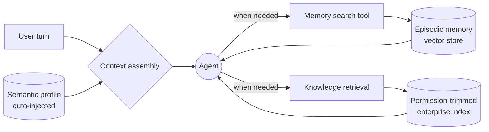

# Memory Architecture Patterns

_Last updated: 2026-08-04_

Before choosing a database or a framework, a memory architecture requires a
small number of explicit decisions. This section covers those decisions, the
storage and retrieval options available for each, and the trade-offs that
production systems consistently run into.

This topic covers:

- [The four decisions](#the-four-decisions)
- [Storage strategies](#storage-strategies)
- [Retrieval patterns](#retrieval-patterns)
- [Pattern archetypes](#pattern-archetypes)
- [Memory scoping](#memory-scoping)
- [Trade-offs](#trade-offs)
- [Token economics](#token-economics)
- [Metrics to track](#metrics-to-track)

---

## The Four Decisions

Every memory design answers these four questions, explicitly or by accident:

1. **What to remember.** Which signals from an interaction are durable enough to
   outlive the session, and which are noise.
2. **Where to store it.** The storage strategy for each memory sub-type.
3. **How to retrieve it.** Whether memory is pushed into every prompt or pulled
   on demand, and how candidates are ranked.
4. **Which boundaries share memory.** Which channels, agents, projects, and
   tenants share a global long-term memory, and which must stay isolated.

The last one is the most consequential and the hardest to reverse. See
[memory scoping](#memory-scoping) and the scope decision framework in
[Long-term memory](./Long-Term-Memory.md).

---

## Storage Strategies

| Strategy                | Mechanics                                                            | Best for                                    | Risk                                          |
| ----------------------- | -------------------------------------------------------------------- | ------------------------------------------- | --------------------------------------------- |
| **Vector store**        | Embed memory entries, retrieve by semantic similarity                | Open-ended recall, fuzzy matching           | No explicit structure or relationships        |
| **Knowledge graph**     | Model entities and explicit relationships between them               | Multi-hop reasoning, entity tracking        | Schema rigidity, higher setup and upkeep cost |
| **Hybrid vector+graph** | Vector for fuzzy recall, graph for relations, metadata for filtering | Production systems with entity-rich domains | Two systems to operate and keep consistent    |
| **Simple persistence**  | Files, key-value, or relational rows; often plain Markdown           | Small scopes, transparency, fast start      | Scalability limits, no semantic search        |

Notes on each:

- **Vector store.** The default for episodic memory and session summaries.
  Metadata filtering is as important as the vector itself: scope, owner,
  sensitivity, and tier must be filterable at query time, not post-filtered.
  Azure examples: Azure AI Search vector indexes, or the vector search
  capabilities of Azure Cosmos DB co-located with the conversation documents.
- **Knowledge graph.** Worth adding when questions require traversing
  relationships ("which tickets from this account touched the same subsystem").
  Usually introduced in a later phase, not at the start.
- **Hybrid.** The most successful production pattern: vectors handle recall, the
  graph handles relations, and metadata tags drive filtering and ranking.
- **Simple persistence.** Underrated. A structured profile in a relational table
  or a small Markdown file is transparent, cheap, auditable, and sufficient for
  semantic memory in many use cases.

> Storage strategy should be chosen per memory sub-type, not for memory as a
> whole. A very common and effective combination is a relational or document
> profile for semantic memory plus a vector index for episodic memory.

---

## Retrieval Patterns

| Pattern                         | How it works                                                               | Strengths                                            | Weaknesses                                        |
| ------------------------------- | -------------------------------------------------------------------------- | ---------------------------------------------------- | ------------------------------------------------- |
| **RAG over history**            | Chunk conversation history, embed, retrieve top-k                          | Standard approach for episodic memory                | Retrieval noise, chunking artifacts               |
| **Summarization buffer**        | Compress older turns into rolling summaries                                | Large token reduction, keeps continuity              | Lossy; compression can produce false details      |
| **Fact extraction + injection** | Extract durable facts, inject as a structured profile in the system prompt | Cheap, deterministic, always present                 | Lossy; unbounded growth if not curated            |
| **On-demand search**            | Agent calls a memory search tool only when it needs to                     | Lowest token overhead, higher precision, transparent | Misses context when the agent fails to trigger it |

These patterns compose. A typical production configuration injects an extracted
profile on every turn, keeps a summarization buffer for the active session, and
exposes an on-demand search tool for episodic recall.

---

## Pattern Archetypes

Publicly documented assistant and agent memory implementations converge on a
small set of archetypes. They are described here as neutral patterns, since the
underlying mechanics — not the products — are what transfers to your
architecture.

### Auto-Injected Layered Memory

Memory is always present. A set of layers is assembled into every request
without the agent asking for it: session metadata, explicitly saved facts,
lightweight summaries of recent conversations, and the current conversation
window. There is no retrieval step over raw history; summaries are pre-computed
asynchronously.

- **Pros:** seamless continuity, zero user effort, no dependence on the model
  deciding to look something up.
- **Cons:** higher token cost on every request, less user control, and a real
  risk of **context collapse**, where unrelated domains (work and personal, or
  two different customers' contexts) mix. Compressed summaries can also produce
  hallucinated memories.
- **Choose when:** continuity is the product, sessions are short, and the memory
  footprint per user is small and well curated.

### On-Demand Tool-Based Memory

Every conversation starts as a blank slate. Memory is activated only when the
agent explicitly calls a tool, typically one that searches past conversations
and one that lists recent sessions. The search runs over raw history rather than
pre-computed summaries, and the tool calls are visible to the user.

- **Pros:** low baseline token cost, high precision, strong transparency (the
  user sees exactly when memory was consulted), and natural scoping by project
  or workspace so memory banks do not collapse into each other.
- **Cons:** sacrifices automatic continuity — if the agent does not decide to
  search, relevant context is simply absent.
- **Choose when:** precision, auditability, and cost control matter more than
  effortless continuity; or when memory volume per user is large.

### Retrieval on Demand Over a Permission-Trimmed Index

Nothing organizational is memorized at all. The agent holds only an explicit,
small personal memory layer (preferences, working style, recurring topics), and
everything else is retrieved live from an index that respects role-based access
control and tenant boundaries.

- **Pros:** prevents data leakage, guarantees freshness, keeps the agent
  stateless with respect to enterprise data, and makes deletion requirements
  tractable.
- **Cons:** requires a mature, permission-aware index; recall quality depends
  entirely on that index.
- **Choose when:** the content already lives in governed enterprise systems.
  This is the recommended default for enterprise knowledge.

### Extract-and-Update Memory Layer

A dedicated memory service sits beside the agent. An incremental pipeline
extracts candidate facts from each exchange, decides whether to add, update,
merge, or delete existing entries, generates conversation summaries
asynchronously, and serves retrieval through vector search — optionally
augmented with a graph variant for relationships.

- **Pros:** strong accuracy-to-cost ratio, memory logic decoupled from the
  agent, reusable across agents and channels.
- **Cons:** an extra service to operate; extraction quality becomes a
  first-class concern requiring its own evaluation.
- **Choose when:** building production-grade, cost-sensitive deployments with
  multiple agents sharing a memory layer.

### Self-Managed Tiered Memory

Inspired by operating system virtual memory: the model has a limited "main
context" and an unlimited external store, and it manages the movement between
them itself through function calls. The agent decides what to page in and page
out.

- **Pros:** highly autonomous, adapts to unusual tasks without hand-tuned
  retrieval rules.
- **Cons:** unpredictable cost and latency, harder to audit, and memory quality
  depends on model behavior rather than on a deterministic pipeline.
- **Choose when:** building autonomous, long-running agents where no fixed
  retrieval policy can be defined up front.

### Recommendation

For enterprise multi-agent systems, a **hybrid** is the most reliable starting
point:

- **Auto-inject** a small, curated profile (semantic memory) — cheap, always
  useful.
- **Retrieve on demand** episodic memory through a memory search tool — precise
  and cost controlled.
- **Never memorize** governed enterprise content; retrieve it live through a
  permission-trimmed index.

---

## Memory Scoping

Scope defines who and what a memory is visible to. It must be an explicit
attribute of every memory entry, not an emergent property of where it was
stored.

| Scope                 | Boundary                                       | Typical content                           |
| --------------------- | ---------------------------------------------- | ----------------------------------------- |
| **Session**           | Current conversation only                      | Working state, transient decisions        |
| **Global**            | All conversations for a subject                | User profile, durable preferences         |
| **Project/Workspace** | A single domain or work item                   | Project decisions, domain-specific facts  |
| **Channel-specific**  | One interaction channel                        | Channel preferences, channel-only history |
| **Role-based**        | A class of subject (customer, employee, admin) | Policy defaults, role instructions        |

Two rules follow from this:

- **Isolating by scope prevents context collapse.** Separate memory banks per
  project or domain are the simplest mitigation for cross-domain leakage.
- **A unified profile can span channels while episodic memory stays
  channel-scoped.** Sharing durable preferences across channels is usually
  desirable; sharing raw conversation history across channels usually is not.

---

## Trade-Offs

### Auto-Inject vs On-Demand

|         | Auto-inject                                            | On-demand                                         |
| ------- | ------------------------------------------------------ | ------------------------------------------------- |
| **Pro** | Seamless, no user effort                               | Lower token cost, transparent, precise            |
| **Con** | Higher token cost, less control, context collapse risk | May miss context if the search is never triggered |

### Depth vs Breadth

- **Deep memory** keeps full episodic history: expensive and noisy.
- **Shallow memory** keeps extracted facts only: cheap but lossy.
- **Balance:** facts for the durable profile, episodic detail for active cases.

### Complexity vs Time-to-Value

Short-term memory delivers value almost immediately; a full knowledge graph does
not. Start simple, measure impact, and add sophistication where the measurements
justify it. See the phased roadmap in
[Long-term memory](./Long-Term-Memory.md#adoption-roadmap).

### The Fading Memory Problem

As the memory store grows, retrieval precision drops: the signal gets lost in
the noise, and the system appears to "forget" despite storing more than ever.
This is the single most common failure mode of long-lived memory.

Mitigations: importance weighting, access-frequency scoring, decay and tier
demotion, consolidation of duplicates, and active curation. These are detailed
in
[Relevance scoring and decay](./Long-Term-Memory.md#relevance-scoring-and-decay).

---

## Token Economics

Memory is a token budget decision as much as an accuracy decision.

| Approach             | Relative cost per query | Notes                                                                                               |
| -------------------- | ----------------------- | --------------------------------------------------------------------------------------------------- |
| **Full context**     | Highest                 | Sending the entire history; establishes the accuracy baseline but is unaffordable and slow at scale |
| **Summarization**    | Moderate                | Roughly a 43% token reduction while retaining most of the context                                   |
| **Fact extraction**  | Low                     | Around 2K tokens per query in published benchmarks                                                  |
| **On-demand search** | Lowest baseline         | Cost is only incurred when memory is actually consulted                                             |

Published benchmark comparisons of memory approaches — such as
[Mem0: Building Production-Ready AI Agents with Scalable Long-Term Memory](https://arxiv.org/abs/2504.19413),
which evaluates memory strategies on long-conversation benchmarks — consistently
report the same shape of result: extraction-based memory layers reach higher
accuracy than naive stored-summary memory at a fraction of the latency and token
cost of full-context, while graph-augmented variants trade some latency and
tokens for additional accuracy on relational questions.

> Fact extraction is not free: its cost is the sum of the input chunk being
> analyzed, the extraction instruction prompt, and the structured output tokens.
> Because it runs asynchronously, it does not sit on the inference critical
> path, but it does appear on the bill.

Define an explicit **memory token budget per agent type** and enforce it during
context assembly. See the budget allocation stage in
[Memory pipelines](./Memory-Pipelines.md#memory-retrieval-pipeline).

---

## Metrics to Track

- **Memory retrieval accuracy:** are the relevant facts actually surfaced?
- **Retrieval precision and recall:** how much of what is injected is used, and
  how much of what was needed was missed.
- **Context retention rate across sessions:** target above 90%.
- **Token cost per query**, measured with and without memory.
- **p95 latency** for memory retrieval plus inference.
- **Repetition reduction rate:** how often users have to re-explain themselves.
- **Resolution time improvement** for customer-facing scenarios.
- **Satisfaction delta:** A/B comparison of memory-on versus memory-off.
- **Fading memory detection:** is retrieval precision degrading as the store
  grows?

See [Observability](../observability/Observability.md) and
[Evaluation](../evaluation/Evaluation.md) for how to instrument and evaluate
these signals.

---
