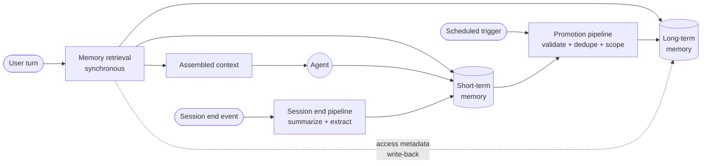
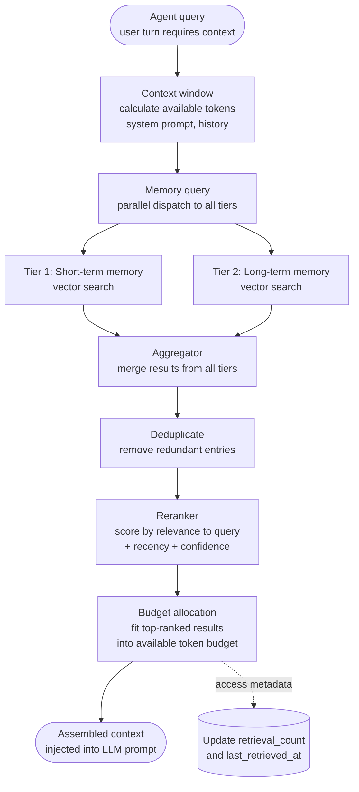
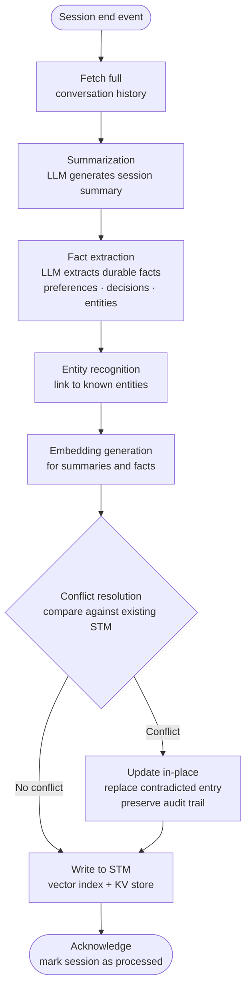
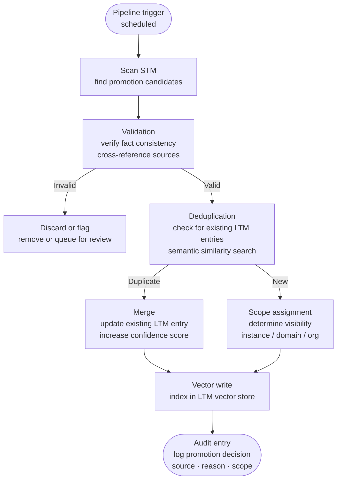

# Memory Pipelines

_Last updated: 2026-08-04_

Memory is not a database that agents read and write directly. It is a set of
pipelines: one on the read path that assembles context for an inference, and two
on the write path that turn raw conversations into durable, governed memory.

This topic covers:

- [How the pipelines connect](#how-the-pipelines-connect)
- [Memory retrieval pipeline](#memory-retrieval-pipeline)
- [STM session end pipeline](#stm-session-end-pipeline)
- [STM to LTM promotion pipeline](#stm-to-ltm-promotion-pipeline)

---

## How the Pipelines Connect

Three pipelines operate on different triggers and different timescales:

| Pipeline        | Trigger                  | Timescale                      | Path  |
| --------------- | ------------------------ | ------------------------------ | ----- |
| **Retrieval**   | Every user turn          | Synchronous, milliseconds      | Read  |
| **Session end** | Session close or timeout | Asynchronous, seconds          | Write |
| **Promotion**   | Scheduled batch          | Asynchronous, minutes to hours | Write |

Two properties keep this design safe:

- **Only the retrieval pipeline is on the critical path.** Summarization,
  extraction, and promotion run asynchronously and never add latency to a user
  turn.
- **The read path feeds the lifecycle.** Retrieval updates `retrieval_count` and
  `last_retrieved_at`, which is what makes
  [decay and reinforcement](./Long-Term-Memory.md#relevance-scoring-and-decay)
  possible.

---

## Memory Retrieval Pipeline

Runs on every turn that requires context. Its job is to produce the best
possible context that fits the available token budget.

### Stages

| Stage                 | Purpose              | Key logic                                                                                                   |
| --------------------- | -------------------- | ----------------------------------------------------------------------------------------------------------- |
| **Context window**    | Establish the budget | Subtract system prompt, injected profile, recent turns, and response headroom from the model context size   |
| **Memory query**      | Fetch candidates     | Dispatch the query to STM and LTM **in parallel**; apply scope and sensitivity as query filters             |
| **Aggregator**        | Merge tiers          | Combine candidate sets while preserving tier and provenance metadata                                        |
| **Deduplicate**       | Remove redundancy    | Drop near-identical entries — a fact restated in both tiers wastes budget                                   |
| **Reranker**          | Order by usefulness  | Combine semantic relevance to the query with recency, confidence, and the stored memory score               |
| **Budget allocation** | Fit the budget       | Fill the reserved retrieval budget with top-ranked entries; truncate rather than overflow                   |
| **Write-back**        | Feed the lifecycle   | Asynchronously increment `retrieval_count` and set `last_retrieved_at` for entries that entered the context |

### Design notes

- **Parallel dispatch is what makes multi-tier retrieval affordable.** Querying
  tiers sequentially multiplies latency for no accuracy gain.
- **Filter, do not post-filter.** Scope, tenant, and sensitivity must be applied
  inside the vector query. Post-filtering silently reduces recall and risks
  leaking entries into ranking traces.
- **Reranking is where the memory score earns its keep.** Pure vector similarity
  favors superficially similar text; adding recency, confidence, and access
  frequency favors what has actually proven useful.
- **Count usage, not candidacy.** Increment access metadata for entries that
  reach the assembled context, not for everything the search returned.
- **Fail open, degrade gracefully.** If a memory tier is unavailable, the turn
  should proceed with reduced context rather than fail.

---

## STM Session End Pipeline

Runs when a session ends, either explicitly or through an inactivity timeout. It
converts a raw conversation into structured, searchable short-term memory
entries that are ready for later promotion.

### How it works

1. **When a session ends, the full conversation history is fetched** from the
   STM store — the raw turns, not the trimmed context that was sent to the
   model.
2. **An LLM summarizes the session and extracts durable facts** — preferences,
   decisions, and entities. Extraction should return structured output with a
   confidence value per fact, so downstream stages can filter on it.
3. **Named entities are recognized and linked** to known entities in the system
   (customers, products, tickets, systems). This is what later enables
   relationship queries and, eventually, a knowledge graph.
4. **Vector embeddings are generated** for the summary and for each fact, so
   they become semantically searchable.
5. **Conflicts with existing STM entries are resolved** — either updating an
   entry in place, preserving the previous value as an audit trail, or writing a
   new entry when there is no contradiction.
6. **Data is written to STM** as a vector index entry plus a key-value record.
7. **The session is acknowledged** and marked as processed via
   `promotion_state`, which makes the pipeline idempotent and safe to retry.

> Consider logging every memory update in a relational database. A queryable
> activity trail of writes, in-place updates, and conflicts is what makes memory
> behavior explainable after the fact.

### Design notes

- **Never run this synchronously with the last user turn.** It is triggered by
  an event and processed by background workers.
- **Extraction is a quality-critical component and deserves evaluation.** Treat
  its prompts as versioned artifacts and measure precision of extracted facts.
  See [Evaluation](../evaluation/Evaluation.md).
- **Preserve the previous value on in-place updates.** Overwriting without
  history makes contradictions impossible to investigate.
- **Guard against injected instructions.** Content extracted from a conversation
  is untrusted input; strip instruction-like text before it becomes memory.

---

## STM to LTM Promotion Pipeline

Runs on a schedule. Its job is to decide which short-term facts have earned
durable, cross-session status — and to make sure that promoting them does not
create duplicates, contradictions, or scope violations.

### Stages

| Stage                | Purpose                       | Key logic                                                                                              |
| -------------------- | ----------------------------- | ------------------------------------------------------------------------------------------------------ |
| **Scan**             | Identify promotion candidates | Query STM for entries with `confidence >= threshold` **and** `age >= minimum_age`                      |
| **Validation**       | Verify factual consistency    | Cross-reference the fact against other STM and LTM entries; LLM-based consistency check                |
| **Deduplication**    | Prevent duplicate LTM entries | Semantic similarity search in LTM; if similarity exceeds the threshold, merge instead of creating      |
| **Scope assignment** | Determine sharing visibility  | Apply the memory policies of the originating instance configuration (instance / domain / organization) |
| **Vector write**     | Enable semantic search        | Index the entry in the LTM vector store together with its scope metadata                               |
| **Audit**            | Maintain a compliance trail   | Log the promotion decision with source session, pipeline version, and scope rationale                  |

### Design notes

- **The minimum age requirement is deliberate.** A fact stated once at the end
  of a session has not yet proven durable; waiting filters out transient
  statements and lets contradicting evidence arrive first.
- **Validation is what prevents memory poisoning.** Promotion is the point where
  a statement becomes trusted across sessions, so it is the right place to spend
  compute on verification.
- **Merging beats accumulating.** Repeated evidence for the same fact should
  raise its confidence and importance, not create a second entry — duplicate
  entries are a direct cause of the
  [fading memory problem](./Memory-Architecture-Patterns.md#the-fading-memory-problem).
- **Scope is assigned once, explicitly, at promotion time**, from the policy of
  the originating configuration. This is the enforcement point that prevents
  cross-domain leakage later.
- **Invalid candidates are flagged, not silently dropped**, when they concern
  sensitive scopes: a queue for human review is often a governance requirement.
- **Everything is audited.** Source, reason, and scope for every promotion make
  the memory store explainable and are typically mandatory for regulated
  workloads.

Promoted entries then enter the
[memory lifecycle](./Long-Term-Memory.md#memory-lifecycle), where retrieval
reinforces them and disuse gradually demotes them across tiers.

---

{{ #include ../../components/discuss-button.hbs }}
