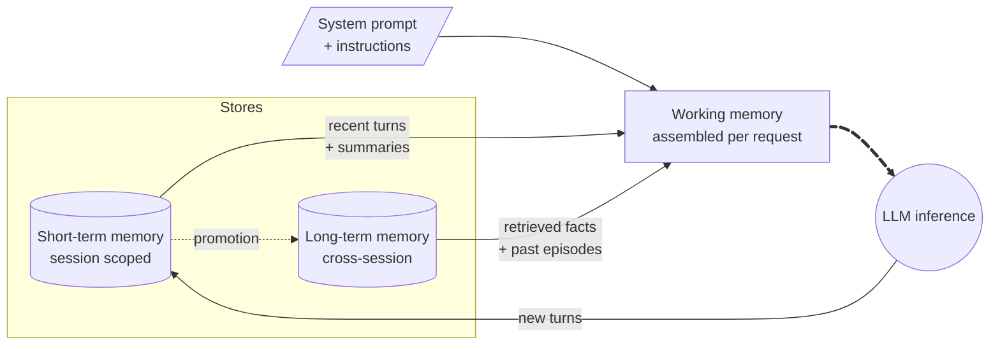

# Memory

_Last updated: 2026-08-04_

Memory is a foundational aspect of multi-agent systems, shaping how agents
understand context, make decisions, and collaborate effectively. Without memory,
every interaction starts from zero: users re-explain themselves, agents repeat
work already done, and the system is unable to build on what it learned before.

Memory is what turns a stateless request/response assistant into a system that
accumulates context over time. It is also one of the riskiest parts of the
architecture, because everything an agent remembers is data that must be scoped,
governed, secured, and eventually forgotten.

This chapter covers:

- [Memory types](#memory-types)
- [Memory sub-types](#memory-sub-types-cognitive-model)
- [Memory is not a knowledge base](#memory-is-not-a-knowledge-base)
- [Key principles](#key-principles)
- [Chapter map](#chapter-map)

---

## Memory Types

Three types of memory show up in almost every agentic architecture. They are
complementary, not alternatives.

- **Short-term Memory (STM):** Enables agents to maintain recent context within
  an active session (also known as conversation history), supporting coherent
  interaction and task coordination across agents. It is session-scoped,
  token-limited by the model context size, and is trimmed, summarized, or
  discarded as the session evolves.
- **Long-term Memory (LTM):** Provides persistence of information across
  sessions, allowing agents to recall knowledge, preferences, and outcomes over
  time to provide personalized experiences. It stores a compressed, distilled
  representation of what happened, not the raw transcript, and requires an
  extraction and retrieval pipeline to be useful.
- **Working Memory:** The context actually assembled for a single inference
  call. It is not a store, it is a _composition_: the system prompt, the
  relevant portion of STM, and the facts retrieved from LTM, all fitted into the
  available token budget.

A useful analogy: STM is what is happening in this conversation, LTM is what is
stored in your database, and working memory is what is open on your desk right
now.

> Working memory is the only thing the model ever sees. STM and LTM are design
> decisions about _what gets to be there_ and _at what cost_.

---

## Memory Sub-Types (Cognitive Model)

Within long-term memory, it helps to separate what is being remembered. Each
sub-type has different extraction logic, different storage needs, and different
retention rules.

| Sub-type       | What it holds                                      | Typical examples                                                               |
| -------------- | -------------------------------------------------- | ------------------------------------------------------------------------------ |
| **Semantic**   | Extracted facts and attributes                     | User prefers email communication; account tier; domain business rules          |
| **Episodic**   | Complete past interactions and events, timestamped | "On Jan 15 the user reported a billing issue"; a prior troubleshooting session |
| **Procedural** | Learned workflows and methods                      | Password reset follows a 3-step flow; escalation rules                         |

- **Semantic memory** is the cheapest and highest-signal form of memory. It is
  what usually gets injected directly into the system prompt as a compact
  profile.
- **Episodic memory** matters for multi-touch journeys, where a customer or
  employee interacts across days and channels. It is what allows an agent to
  respond correctly when someone says _"I was told it would be resolved by
  Friday"_, or when an employee needs context from a prior session handled by a
  different agent.
- **Procedural memory** only becomes a distinct concern when the procedure was
  never written down by anyone. If the workflow already exists as documentation,
  a runbook, or code, it belongs in a knowledge source or in a tool, not in
  memory.

---

## Memory Is Not a Knowledge Base

A frequent design mistake is to treat enterprise content as memory. Knowledge
sources such as document repositories, search indexes, and RAG corpora act as
long-term **recall**, not memory: they are authoritative, shared, permission
controlled, and change independently of any conversation.

A robust pattern is to keep enterprise content out of memory entirely and
retrieve it on demand through a permission-trimmed index. This approach:

- **Prevents data leakage**, because access control is evaluated at query time
  rather than frozen at the moment a memory was written.
- **Enables real-time freshness**, because the agent always sees the current
  version of the content.
- **Keeps the agent stateless** with respect to enterprise data, which
  dramatically simplifies compliance and deletion requirements.

Memory, in contrast, holds what is true about _this user, this session, and this
collaboration_ and would otherwise be lost: preferences, decisions, open issues,
and interaction history.

---

## Key Principles

The following principles apply regardless of the storage technology or the
agentic framework in use:

- **Not all memories are equal.** Memory needs importance weighting; a fact the
  user explicitly asked the agent to remember is worth far more than an
  incidental detail extracted from a transcript.
- **Reinforcement through repetition strengthens recall.** Facts that keep being
  retrieved and confirmed should become more prominent, not less.
- **Retrieval must be contextual.** Relevance to the current query, not raw
  recency, decides what enters working memory.
- **Memory decays.** Outdated or unused information should fade or expire rather
  than accumulate indefinitely.
- **User control and transparency are non-negotiable.** Users must be able to
  see, edit, and delete what the system remembers about them.
- **Memory scope must match use case boundaries.** A memory captured in one
  channel, project, or tenant should not silently surface in another.

---

## Chapter Map

Designing STM and LTM in multi-agent systems brings unique challenges around
synchronization, ownership, privacy, and data consistency. The following
sections outline key patterns and trade-offs for integrating effective memory
into your architecture.

- **[Memory architecture patterns](./Memory-Architecture-Patterns.md):** storage
  strategies, retrieval patterns, memory scoping, and the trade-offs between
  automatically injecting memory and retrieving it on demand.
- **[Short-term memory](./Short-Term-Memory.md):** session storage design
  approaches, context window management, and what happens when a session ends.
- **[Long-term memory](./Long-Term-Memory.md):** what to persist, how to score
  and decay it, scope decision framework, governance, and operating memory at
  scale.
- **[Memory pipelines](./Memory-Pipelines.md):** the retrieval, session-end, and
  promotion pipelines that connect the two tiers.

Memory is also the largest single input to context assembly. See
[Context Engineering](../context-engineering/Context-Engineering.md) for how the
assembled context is optimized once memory has produced it.

---
