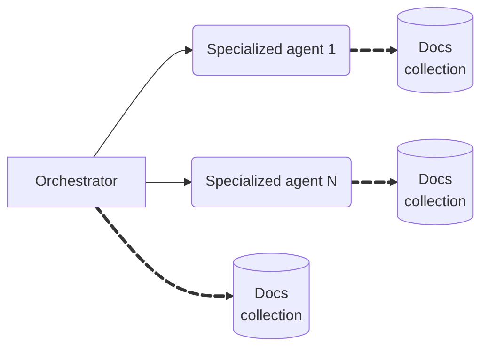
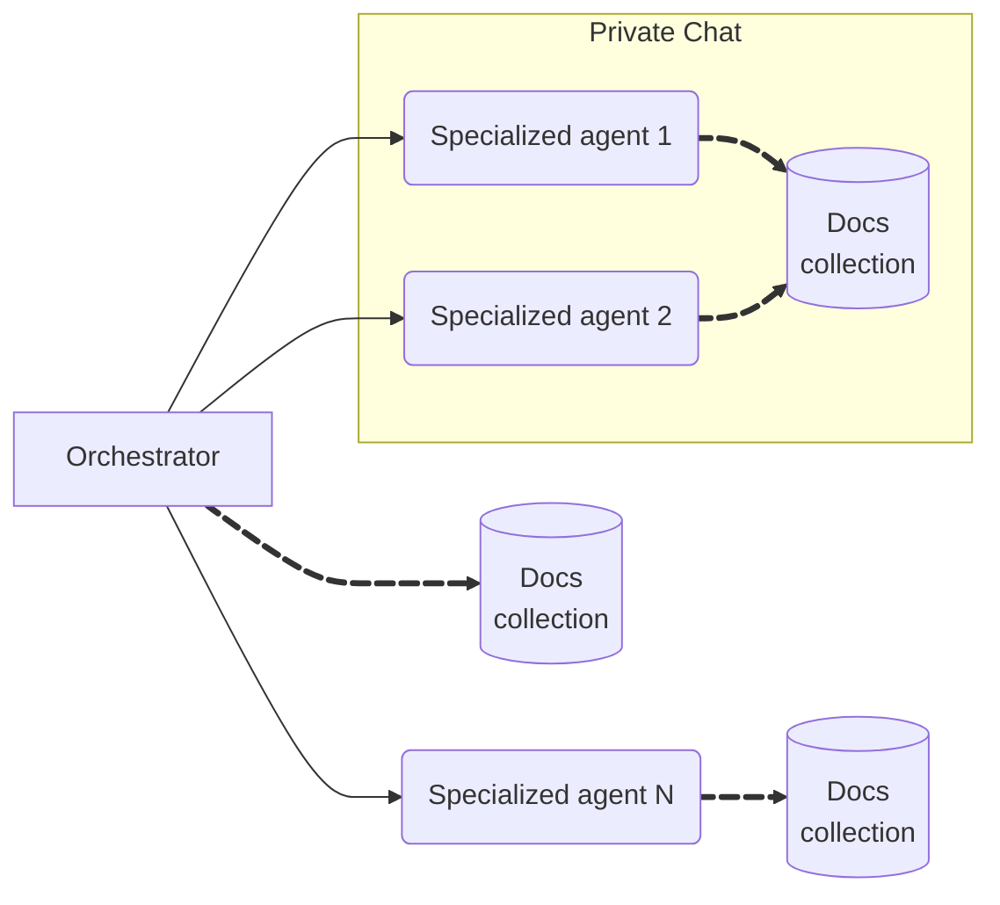

# Short-term Memory

When building the STM (Short-Term Memory) layer for a multi-AI agent system, the
storage engine choice is critical. STM typically serves to persist conversation
history, contextual state, and intermediary data that agents use to manage
context and continuity during workflows.

This topic covers:

- [Key requirements](#key-requirements)
- [Design approaches](#design-approaches)
  - [Shared memory](#1-shared-memory)
  - [Distributed memory](#2-distributed-memory)
  - [Hybrid memory](#3-hybrid-memory)
- [Data retention](#data-archival)

---

## Key Requirements

- **Fast Read/Write Performance:** Conversations and agent states change
  quickly, requiring low-latency operations.
- **Flexible Schema:** Messages and state objects may evolve over time,
  especially if you enrich them with metadata, add new message types, or change
  the workflow.
- **Scalability:** As concurrent conversations and active sessions grow, the
  storage must scale horizontally.
- **Simple Data Access Patterns:** Retrieval by conversation/session ID, time
  range, or participant/user.

Given those requirements, document-oriented NoSQL databases are preferable. They
typically offer:

- **Flexible Schema:** Easily accommodates changing or varied agent message
  formats without migrations.
- **Nested/Hierarchical Data:** Supports complex, nested data structures ideal
  for conversation history.
- **Horizontal Scalability:** Designed for high throughput, automatically scales
  as data and sessions increase. partitioning for session cleanup.
- **Efficient Retrieval:** Optimized for access patterns (by keys, IDs,
  timestamps) common in chat and STM use cases.

---

## Design approaches

### 1. Shared Memory

All participanting agents read and write session context to a centralized
documents collection, which acts as the single source of truth.

#### Key Characteristics

- **Simplicity**: Easy to implement and operate.
- **Unified Traceability**: A complete interaction content in one place, ideal
  for debugging and auditing.
- **Consistent Context**: All agents can access the latest, synchronized session
  data.

#### Data Modeling

Consider designing the documents to capture:

- **Session ID:** Unique ID that groups all messages within the same
  conversation.
- **Message ID:** Unique ID for each individual message.
- **User ID**: Tracks the end-user (if applicable).
- **Source:** Identifies which agent generated the message.
- **Message:** Includes messages from different authors (such as users,
  assistants, tools, or system/developer) and the actual message payload. If
  authored by the orchestrator, include planning steps and which agents were
  invoked.
- **Session Metadata:** Additional data relevant for the session (e.g.
  communication channel, tags).
- **Timestamp:** When the message was written.

> **Leverage chat history message objects from agentic frameworks rather than
> normalizing data**. Frameworks such as Semantic Kernel and LangChain already
> provide rich, extensible and tested chat history objects. Storing the full
> object as message helps on troubleshooting scenarios (e.g. more detailed
> information available and the ability to reconstruct the exact conversation
> history).

#### Trade-offs

- **Scale Limitations**: One store can become a bottleneck with high throughput.
- **Security and Privacy limitations:** Harder to restrict message visibility
  between agents.
- **Potential Data Pollution**: An agent may write irrelevant data for the other
  agents, lowering context quality.

> One approach to avoid data pollution is isolating agents documents within the
> same collection by aggregating data that is unique for each agent as part of
> the message ID (e.g. `<session_id>-<agent_id>`), then using this pattern to
> query agent memory information.

---

### 2. Distributed Memory

Each participating agent maintains its own documents collection, storing only
the context and messages relevant to its domain. Correlation between messages
produced by all agents is achieved through a session ID.

### **Key Characteristics**

- **Scalability**: Agents can scale storage independently.
- **Isolation and Privacy:** Avoids cross-agent context leakage; enables
  agent-specific retention policies.
- **Flexibility:** Agents can optimize memory data modeling for their use case.

### **Data Modeling**

The same recommendations from [Shared memory data modeling](#data-modeling)
design applies to distributed memory except the `source` data that is not
needed, given the documents for each agent are logically and physically
isolated.

### **Trade-offs**

- **Auditing complexity:** Reconstructing the full session context requires
  aggregating queries from multiple collections.
- **Synchronization:** Requires tight coordination on session/message IDs, or
  risk losing context.
- **Management overhead:** Extra complexity for maintaining multiple
  collections.

### **When it's a best fit**

- Large-scale, cross-team/department applications.
- When privacy, isolation, or different data retention policies per agent are
  critical.
- Where agents are implemented in different deployment boundaries (e.g.
  multi-cloud).

---

### 3. Hybrid Memory

In this approach, memory is shared only within explicit subgroups of agents. For
example, a "private chat" is scoped to a working group of specialized agents
collaborating on a task, invisible to others.

### Key Characteristics

- **Customizable context sharing**: Only selected agents have access to the
  memory group.
- **Fine-grained access control:** Supports privacy requirements; only a subset
  of agents see the context.
- **Natural sharding:** Splits load by team/task force.

### Data modeling

The same recommendations from [Shared memory data modeling](#data-modeling)
design applies to distributed memory, except the `source` data is not needed for
the isolated collections.

### Trade-offs

- **Management overhead:** Extra complexity for group membership, permissions,
  and context boundaries.
- **Fragmentation:** Auditing and reconstructing sessions across overlapping
  groups is more complex.
- **Consistency challenges:** Context splits and reconciliation logic may be
  required.

### **When it's a best fit**

- Multi-domain collaboration (e.g., escalation, hand-off, cross-expert panels).
- Compliance-focused, privacy-sensitive workflows.

---

## Recommended Practices

- **Always include traceability fields:** `session_id`, originating agent, user,
  or system, and timestamps.
- **Store the agent/tool/origin for each message.** Critical for audit and
  debugging, especially when using shared or group memory.
- **Session Metadata Matters:** Record context like session status, involved
  users, communication channel, and group membership for each session.
- **Implement unique identifiers for correlation:** When using distributed or
  selective memory, always correlate on `session_id`.
- **Record orchestrator reasoning:** Orchestrator STM should capture its
  internal planning, delegation choices, invoked agents/tools, and their
  responses, not just its final responses.
- **Security and Privacy:** Apply access control on memory access based on agent
  roles, group memberships, and message sensitivity.

---

## Data Retention

While STM is suitable for hot, fast-access storage, it is recommended to archive
conversation data after a defined period—such as when a session expires or after
a set number of days. This practice serves several key purposes:

- **Cost Optimization:** Cold storage (e.g. blob storage or data lake) is
  significantly cheaper than high-performance databases, reducing costs for
  long-term historical data retention.
- **Analytics & Insights:** Archived conversations can drive analytics,
  back-office dashboards, and system improvement efforts. The archived data is a
  rich resource for both business and technical analysis.

### Recommendations

1. **Retention Policy:** Define policies for how long data remains in hot
   storage before being archived or deleted.
2. **ETL/Archiving Job:** Design a job that periodically move expired session
   documents from STM to a cold storage.
3. **Indexing for Analytics:** Optionally, batch-load archived data into an
   analytics warehouse for reporting and custom queries.
