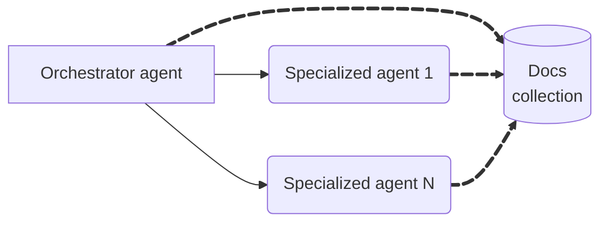

# Short-term Memory

When building the STM (Short-Term Memory) layer for a multi-AI agent system, the
storage engine choice is critical. STM typically serves to persist conversation
history, contextual state, and intermediary data that agents use to manage
context and continuity during workflows.

## Key Requirements

- **Fast Read/Write Performance:** Conversations and agent states change
  quickly, requiring low-latency operations.
- **Flexible Schema:** Messages and state objects may evolve over time,
  especially if you enrich them with metadata, add new message types, or change
  the workflow.
- **Scalability:** As concurrent conversations and active sessions grow, the
  storage must scale horizontally.
- **Simple Data Access Patterns:** Retrieval by conversation/session ID, time
  range, or participant/user.

Given those requirements, document-oriented NoSQL databases are preferable. They
typically offer:

- **Flexible Schema:** Easily accommodates changing or varied agent message
  formats without migrations.
- **Nested/Hierarchical Data:** Supports complex, nested data structures ideal
  for conversation history.
- **Horizontal Scalability:** Designed for high throughput, automatically scales
  as data and sessions increase. partitioning for session cleanup.
- **Efficient Retrieval:** Optimized for access patterns (by keys, IDs,
  timestamps) common in chat and STM use cases.

Below, we explore some design approaches for STM and their trade-offs.

## 1. Shared Memory

All agents—including the orchestrator and specialized agents—read and write
session context to a centralized documents collection, which acts as the single
source of truth.

### **Key Characteristics**

- **Simplicity**: Easy to implement and operate.
- **Unified Traceability**: A complete interaction content in one place, ideal
  for debugging and auditing.
- **Consistent Context**: All agents can access the latest, synchronized session
  data.

### **Data Modeling**

Consider designing the documents to capture:

- **Session ID:** Unique ID that groups all messages within the same
  conversation.
- **Message ID:** Unique ID for each individual message.
- **User ID**: Tracks the end-user (if applicable).
- **Source:** Identifies which agent generated the message.
- **Message:** Includes messages from different authors (such as users,
  assistants, tools, or system/developer) and the actual message payload. If
  authored by the orchestrator, include planning steps and which agents were
  invoked.
- **Session Metadata:** Additional data relevant for the session (e.g.
  communication channel, tags).
- **Timestamp:** When the message was written.

### **Trade-offs**

- **Scale Limitations**: One store can become a bottleneck with high throughput.
- **Security and Privacy limitations:** Harder to restrict message visibility
  between agents.
- **Potential Data Pollution**: An agent may write irrelevant data for the other
  agents, lowering context quality.

---
