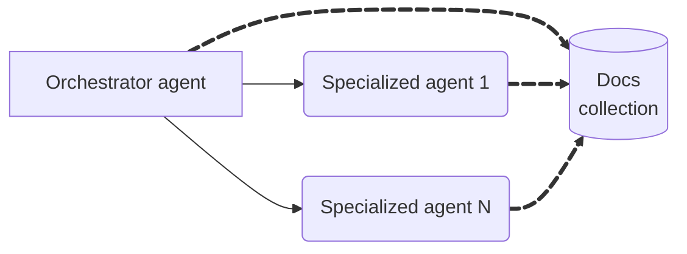
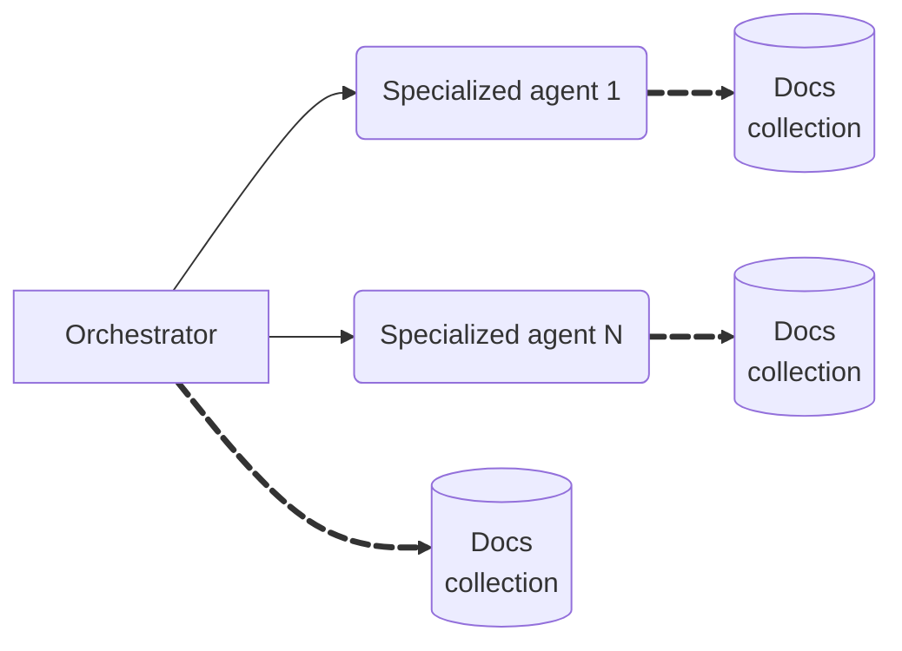
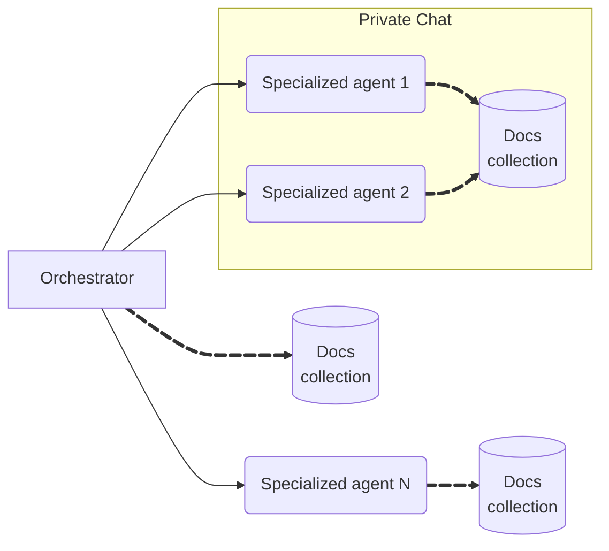
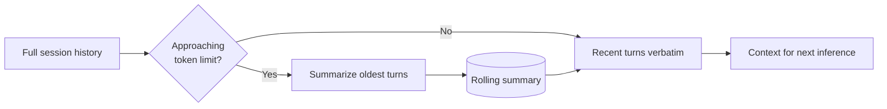

<!-- markdownlint-disable MD024 -->

# Short-term Memory

_Last updated: 2026-08-04_

When building the STM (Short-Term Memory) layer for a multi-agent system, the
storage engine choice is critical. STM typically serves to persist conversation
history, contextual state, and intermediary data that agents use to manage
context and continuity during workflows.

STM is **session-scoped** and **token-limited**: it lives for as long as the
session is active, and only a subset of it ever reaches the model. Everything
that must survive the session belongs in
[Long-term memory](./Long-Term-Memory.md).

This topic covers:

- [Key requirements](#key-requirements)
- [Design approaches](#design-approaches)
  - [Shared memory](#1-shared-memory)
  - [Distributed memory](#2-distributed-memory)
  - [Hybrid memory](#3-hybrid-memory)
- [Recommended practices](#recommended-practices)
- [Context window management](#context-window-management)
- [Working memory assembly](#working-memory-assembly)
- [Session end](#session-end)
- [Multi-channel considerations](#multi-channel-considerations)
- [Data retention](#data-retention)

---

## Key Requirements

- **Fast Read/Write Performance:** Conversations and agent states change
  quickly, requiring low-latency operations.
- **Flexible Schema:** Messages and state objects may evolve over time,
  especially if you enrich them with metadata, add new message types, or change
  the workflow.
- **Scalability:** As concurrent conversations and active sessions grow, the
  storage must scale horizontally.
- **Simple Data Access Patterns:** Retrieval by conversation/session ID, time
  range, or participant/user.

Given those requirements, document-oriented NoSQL databases are preferable. They
typically offer:

- **Flexible Schema:** Easily accommodates changing or varied agent message
  formats without migrations.
- **Nested/Hierarchical Data:** Supports complex, nested data structures ideal
  for conversation history.
- **Horizontal Scalability:** Designed for high throughput, automatically scales
  as data and sessions increase, and supports partitioning for session cleanup.
- **Efficient Retrieval:** Optimized for access patterns (by keys, IDs,
  timestamps) common in chat and STM use cases.

> As a reference, see
> [How Microsoft Copilot scales to millions of users with Azure Cosmos DB](https://devblogs.microsoft.com/cosmosdb/how-microsoft-copilot-scales-to-millions-of-users-with-azure-cosmos-db/)

---

## Design approaches

### 1. Shared Memory

All participating agents read and write session context to a centralized
documents collection, which acts as the single source of truth.

```mermaid
flowchart LR
    Orchestrator[Orchestrator agent]
    SpecializedAgent1(Specialized agent 1)
    SpecializedAgentN(Specialized agent N)
    OrchestratorStore[(Docs <br/>collection)]

    Orchestrator --> SpecializedAgent1
    Orchestrator --> SpecializedAgentN
    Orchestrator a1@==>OrchestratorStore
    SpecializedAgent1 a2@==>OrchestratorStore
    SpecializedAgentN a3@==>OrchestratorStore
  a1@{ animate: true }
  a2@{ animate: true }
  a3@{ animate: true }
```

#### Key Characteristics

- **Simplicity**: Easy to implement and operate.
- **Unified Traceability**: A complete interaction content in one place, ideal
  for debugging and auditing.
- **Consistent Context**: All agents can access the latest, synchronized session
  data.

#### Data Modeling

Consider designing the documents to capture:

- **Session ID:** Unique ID that groups all messages within the same
  conversation.
- **Message ID:** Unique ID for each individual message.
- **User ID**: Tracks the end-user (if applicable).
- **Source:** Identifies which agent generated the message.
- **Message:** Includes messages from different authors (such as users,
  assistants, tools, or system/developer) and the actual message payload. If
  authored by the orchestrator, include planning steps and which agents were
  invoked.
- **Session Metadata:** Additional data relevant for the session (e.g.
  communication channel, tags).
- **Timestamp:** When the message was written.

Additionally, consider the fields consumed by the downstream memory pipelines:

- **Session Status:** Whether the session is active, idle, closed, or expired.
  The session end event that triggers summarization and extraction is derived
  from this transition.
- **Summary:** The rolling summary of older turns, so it does not have to be
  recomputed on every request.
- **Token Count:** Tokens per message and accumulated per session, used to
  enforce the context budget and decide when to summarize.
- **Promotion State:** Whether the session has already been processed by the
  [session end](#session-end) and
  [promotion](./Memory-Pipelines.md#stm-to-ltm-promotion-pipeline) pipelines.
  This makes both pipelines idempotent and safely retryable.

> **Leverage chat history message objects from agentic frameworks rather than
> normalizing data when possible**. Frameworks such as Semantic Kernel and
> LangChain already provide rich, extensible and tested chat history objects.
> Storing the full object as message helps on troubleshooting scenarios (e.g.
> more detailed information available and the ability to reconstruct the exact
> conversation history).

#### Trade-offs

- **Scale Limitations**: One store can become a bottleneck with high throughput.
- **Security and Privacy limitations:** Harder to restrict message visibility
  between agents.
- **Potential Data Pollution**: An agent may write irrelevant data for the other
  agents, lowering context quality.

> To prevent data pollution, one effective strategy is to isolate each agent's
> documents within the same collection by incorporating agent-specific data into
> the message ID (e.g., `<session_id>-<agent_id>`). This structure can then be
> used to reliably query memory information for individual agents

---

### 2. Distributed Memory

Each participating agent maintains its own documents collection, storing only
the context and messages relevant to its domain. Correlation between messages
produced by all agents is achieved through a session ID.

```mermaid
flowchart LR
    SpecializedAgent1(Specialized agent 1)
    SpecializedAgentN(Specialized agent N)
    OrchestratorStore[(Docs <br/>collection)]
    Agent1Store[(Docs <br/>collection)]
    AgentNStore[(Docs <br/>collection)]
    Orchestrator --> SpecializedAgent1
    Orchestrator --> SpecializedAgentN
    Orchestrator a1@==>OrchestratorStore
    SpecializedAgent1 a2@==>Agent1Store
    SpecializedAgentN a3@==>AgentNStore
  a1@{ animate: true }
  a2@{ animate: true }
  a3@{ animate: true }
```

### Key Characteristics

- **Scalability**: Agents can scale storage independently.
- **Isolation and Privacy:** Avoids cross-agent context leakage; enables
  agent-specific retention policies.
- **Flexibility:** Agents can optimize memory data modeling for their use case.

#### Data Modeling

The same recommendations from [Shared memory data modeling](#data-modeling)
design applies to distributed memory except the `source` data that is not
needed, given the documents for each agent are logically and physically
isolated.

### **Trade-offs**

- **Auditing complexity:** Reconstructing the full session context requires
  aggregating queries from multiple collections.
- **Synchronization:** Requires tight coordination on session/message IDs, or
  risk losing context.
- **Management overhead:** Extra complexity for maintaining multiple
  collections.

### **When it's a best fit**

- Large-scale, cross-team/department applications.
- When privacy, isolation, or different data retention policies per agent are
  critical.
- Where agents are implemented in different deployment boundaries (e.g.
  multi-cloud).

---

### 3. Hybrid Memory

In this approach, memory is shared only within explicit subgroups of agents. For
example, a "private chat" is scoped to a working group of specialized agents
collaborating on a task, invisible to others.

```mermaid
flowchart LR
    SpecializedAgent1(Specialized agent 1)
    SpecializedAgent2(Specialized agent 2)
    SpecializedAgentN(Specialized agent N)
    PrivateChatStore[(Docs <br/>collection)]
    AgentNChatStore[(Docs <br/>collection)]
    OrchestratorStore[(Docs <br/>collection)]
    Orchestrator --> SpecializedAgent1
    Orchestrator --> SpecializedAgent2
    Orchestrator --> SpecializedAgentN
    subgraph Private Chat
      SpecializedAgent1 a1@==>PrivateChatStore
      SpecializedAgent2 a2@==>PrivateChatStore
    end
    SpecializedAgentN a3@==>AgentNChatStore
    Orchestrator a4@==>OrchestratorStore
  a1@{ animate: true }
  a2@{ animate: true }
  a3@{ animate: true }
  a4@{ animate: true }
```

### Key Characteristics

- **Customizable context sharing**: Only selected agents have access to the
  memory group.
- **Fine-grained access control:** Supports privacy requirements; only a subset
  of agents see the context.
- **Natural sharding:** Splits load by team/task force.

### Data modeling

The same recommendations from [Shared memory data modeling](#data-modeling)
design applies to distributed memory, except the `source` data is not needed for
the isolated collections.

### Trade-offs

- **Management overhead:** Extra complexity for group membership, permissions,
  and context boundaries.
- **Fragmentation:** Auditing and reconstructing sessions across overlapping
  groups is more complex.
- **Consistency challenges:** Context splits and reconciliation logic may be
  required.

### **When it's a best fit**

- Multi-domain collaboration (e.g., escalation, hand-off, cross-expert panels).
- Compliance-focused, privacy-sensitive workflows.

---

## Recommended Practices

- **Always include traceability fields:** `session_id`, originating agent, user,
  or system, and timestamps.
- **Store the agent/tool/origin for each message.** Critical for audit and
  debugging, especially when using shared or group memory.
- **Session Metadata Matters:** Record context like session status, involved
  users, communication channel, and group membership for each session.
- **Implement unique identifiers for correlation:** When using distributed or
  selective memory, always correlate on `session_id`.
- **Record orchestrator reasoning:** Orchestrator STM should capture its
  internal planning, delegation choices, invoked agents/tools, and their
  responses, not just its final responses.
- **Security and Privacy:** Apply access control on memory access based on agent
  roles, group memberships, and message sensitivity.

---

## Context Window Management

Storage keeps the whole session; the model does not. The context window is a
fixed token budget shared by the system prompt, the injected user profile, the
retrieved long-term facts, and the recent turns. A **token-limit mechanism is
mandatory** — without it, sessions fail abruptly once they outgrow the model
context size.

### Sliding Window

The simplest mechanism keeps the last _N_ turns verbatim and drops everything
older. It is cheap and predictable, but it discards decisions and constraints
agreed earlier in the session, which is exactly the context users assume the
agent still has.

### Progressive Summarization

As the session approaches the context limit, older turns are compressed into a
rolling summary that is carried forward while recent turns stay verbatim.

```mermaid
flowchart LR
    Turns[Full session history] --> Check{Approaching<br/>token limit?}
    Check -- No --> Window[Recent turns verbatim]
    Check -- Yes --> Summarize[Summarize oldest turns]
    Summarize --> Summary[(Rolling summary)]
    Summary --> Window
    Window --> Context[Context for next inference]
```

Recommendations:

- **Trigger on a threshold, not on the hard limit** (for example, at 70-80% of
  the budget), so summarization never competes with the current request.
- **Persist the summary in the session document** and update it incrementally,
  rather than re-summarizing the entire history each time.
- **Preserve decisions, constraints, identifiers, and open items verbatim.**
  Summaries lose exactly the details that later turns depend on, and
  over-compression is a common source of fabricated context.
- **Keep the raw history in STM storage** even when it is no longer sent to the
  model — it is required for auditing and for the session end pipeline.

### Thread Resumption

When a user returns to an existing conversation thread after a gap, the session
context no longer exists in the process memory. Before inferencing, the thread
must be reconstructed: load the session document, produce (or reuse) a thread
summary, and send that summary plus the most recent turns to the model.

For long-lived threads, treat resumption as a first-class path: it is where
context loss is most visible to the user, and where a stale or missing summary
turns into an obvious regression.

---

## Working Memory Assembly

Working memory is what the model actually sees for a single request. It is
assembled per turn from four sources, each with its own share of the token
budget:

| Section                | Source                           | Typical budget behavior                  |
| ---------------------- | -------------------------------- | ---------------------------------------- |
| System prompt          | Static configuration             | Fixed, reserved first                    |
| Semantic profile       | Long-term memory (auto-injected) | Small and capped; curated, not unbounded |
| Retrieved memories     | Long-term memory (on demand)     | Variable, filled by relevance ranking    |
| Recent turns + summary | Short-term memory                | Remainder of the budget                  |

Guidelines:

- **Reserve the budget in priority order** — instructions first, then durable
  profile, then retrieved memories, then recent history — and let the lowest
  priority section absorb the truncation.
- **Cap each section explicitly.** An uncapped profile or an uncapped retrieval
  result set will silently starve the conversation history.
- **Label the provenance of each block** in the prompt (profile, retrieved
  memory, conversation) so the model can weigh them differently and so the
  assembled context stays debuggable.
- **Leave headroom for the response.** The output tokens come out of the same
  window.

The full read path, including ranking and budget allocation across both memory
tiers, is described in
[Memory pipelines](./Memory-Pipelines.md#memory-retrieval-pipeline).

---

## Session End

When a session closes, expires, or goes idle beyond a threshold, three distinct
decisions must be made about its content:

1. **Discard** transient working state that has no value beyond the session
   (intermediate tool payloads, retry scaffolding, partial plans).
2. **Archive** the raw conversation to cold storage for cost, analytics, and
   compliance — see [Data retention](#data-retention).
3. **Promote** the durable signal (preferences, decisions, entities, outcomes)
   toward long-term memory.

> Archiving and promotion are different paths and must not be conflated.
> Archiving moves the _transcript_ to cheaper storage for later human or
> analytical use. Promotion extracts _facts_ that the agent will actively recall
> in future sessions. A conversation can be archived and never promoted.

The session end event triggers summarization, fact extraction, embedding
generation, and conflict resolution against existing entries. That flow is
described in detail in
[Memory pipelines](./Memory-Pipelines.md#stm-session-end-pipeline), and the
subsequent promotion into long-term memory in
[STM to LTM promotion](./Memory-Pipelines.md#stm-to-ltm-promotion-pipeline).

Because sessions may never be explicitly closed, define an **inactivity
timeout** that emits the same event, and make the downstream processing
idempotent using the `promotion_state` field.

---

## Multi-Channel Considerations

Session boundaries are channel-specific, and getting them wrong is a frequent
source of both context loss and context leakage.

| Channel                    | Session characteristics                     | Implications                                                            |
| -------------------------- | ------------------------------------------- | ----------------------------------------------------------------------- |
| **Asynchronous messaging** | Long gaps between messages, no explicit end | Long inactivity timeouts, thread summaries, resumption path is the norm |
| **Web chat**               | Synchronous, short, explicit start and end  | Short timeouts, simple sliding window is often enough                   |
| **Internal tools**         | Persistent project or ticket context        | Session bound to the work item rather than to time                      |

Recommendations:

- **Share the durable profile across channels**, so a user is recognized
  everywhere.
- **Do not leak raw conversation history across channels.** Keep episodic STM
  channel-scoped unless there is an explicit reason to share it.
- **Record the channel on every session** so retention, summarization, and
  promotion policies can differ per channel.

---

## Data Retention

While STM is suitable for hot, fast-access storage, it is recommended to archive
conversation data after a defined period—such as when a session expires or after
a set number of days. This practice serves several key purposes:

- **Cost Optimization:** Cold storage (e.g. blob storage or data lake) is
  significantly cheaper than high-performance databases, reducing costs for
  long-term historical data retention.
- **Analytics & Insights:** Archived conversations can drive analytics,
  back-office dashboards, and system improvement efforts. The archived data is a
  rich resource for both business and technical analysis.

### Recommendations

1. **Retention Policy:** Define policies for how long data remains in hot
   storage before being archived or deleted.
2. **ETL/Archiving Job:** Design a job that periodically move expired session
   documents from STM to a cold storage.
3. **Indexing for Analytics:** Optionally, batch-load archived data into an
   analytics warehouse for reporting and custom queries.
4. **Promote Before Archiving:** Ensure the session end and promotion pipelines
   have processed a session (check `promotion_state`) before its documents leave
   hot storage, otherwise durable facts are lost with the transcript.

---

{{ #include ../../components/discuss-button.hbs }}
