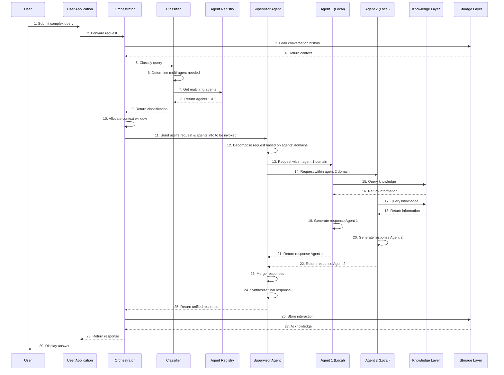

# A Conversational Sequence Diagram

_Last updated: 2025-05-16_

---

<a class="github-button" href="https://github.com/microsoft/multi-agent-reference-architecture/discussions/new?category=q-a&body=Source: [Conversational Sequencediagram](https://github.com/microsoft/multi-agent-reference-architecture/blob/main/docs/reference-architecture/Conversational-SequenceDiagram.md)" data-icon="octicon-comment-discussion" target="_blank" data-size="large" aria-label="Discuss buttons/github-buttons on GitHub">Discuss this page</a>

