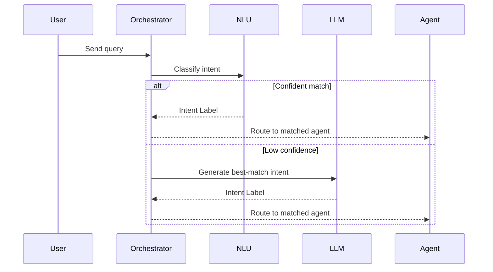
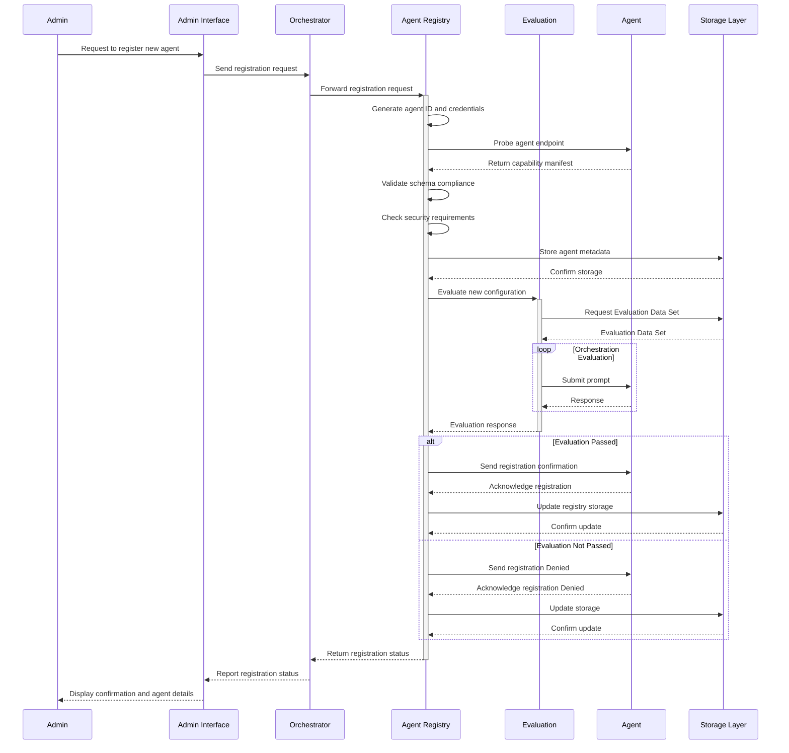
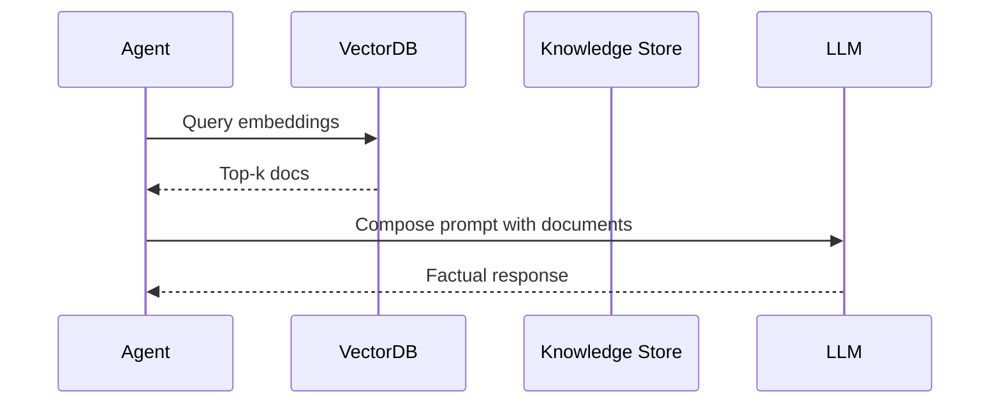
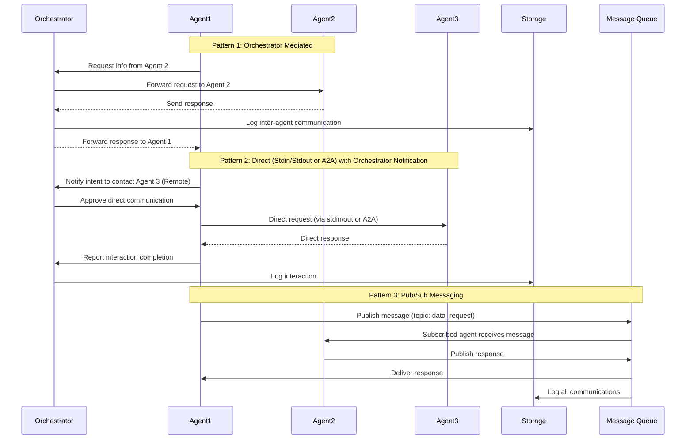
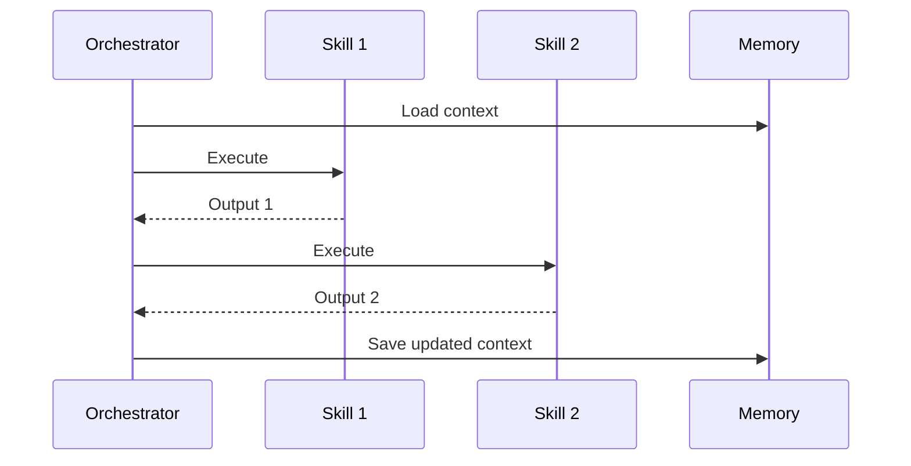

# Multi-Agent Patterns Reference

_Last updated: 2025-05-14_

This document catalogs key design patterns used in the Multi-Agent Reference
Architecture. Each pattern contributes to the system's modularity, scalability,
governance, or performance.

## 1. Semantic Router with LLM Fallback

**Intent-based routing optimized for cost and performance.**

- Use a lightweight NLU or SLM classifier for initial routing.
- If classifier confidence is low, escalate to a more expensive LLM.
- Benefit: Reduces LLM usage while maintaining accuracy.

## 2. Dynamic Agent Registry (Service Mesh for Agents)

**Agent discovery based on capabilities and metadata.**

- Agents register with descriptors (capabilities, tags, embeddings).
- Registry supports runtime resolution by orchestrator.
- Benefit: Supports plug-and-play extensibility and self-healing behavior.

## 3. Semantic Kernel Orchestration with Skills

**Composable orchestration using reusable agent capabilities.**

- Each "skill" encapsulates an agent function.
- Orchestrator chains skills with memory, planning, and goals.
- Benefit: Encourages modular and context-aware execution.

## 4. Local & Remote Agent Execution

**Federated agent model with supervisor coordination.**

- Local supervisor delegates tasks to local or remote agents.
- Secure channels maintain observability and traceability.
- Benefit: Enables scalability across networks or geographies.

## 5. Layered (Onion) Architecture

**Separation of concerns by functional domain.**

- Layers include Orchestration, Agent, Knowledge, Storage, Integration.
- Each layer has bounded responsibilities and APIs.
- Benefit: Improves maintainability, scalability, and testability.

## 6. MCP Integration Layer

**Decoupled agent-to-tool invocation with governance.**

- MCP server abstracts tool APIs from agents.
- Policies control access, parameters, and invocation flow.
- Benefit: Adds auditability, policy enforcement, and centralized logic.

## 7. RAG (Retrieval-Augmented Generation)

**Enhancing responses with contextual data from vector stores.**

- Pre-indexed content stored in vector DBs.
- Orchestrator and agents query for grounding facts.
- Benefit: Improves factual accuracy and reduces hallucination.

## 8. Conversation-Aware Orchestration

**Adaptive behavior based on memory and context.**

- Conversation history is stored and retrieved by orchestrator.
- Agents can use long-term and short-term memory cues.
- Benefit: Supports personalization, continuity, and context-awareness.

## 9. Agent-to-Agent Communication

**Cooperative task delegation between agents.**

- Agents interact via orchestrator or directly through scoped protocols.
- Registry tracks active agents and routing preferences.
- Benefit: Supports delegation, specialization, and parallelization.

## 10. Skill Chaining with Planning Support

**Goal-oriented execution via automatic chaining of capabilities.**

- Planner creates execution path from available skills.
- Each skill is stateless, composable, and memory-aware.
- Benefit: Unlocks complex multi-step interactions.

---

<a class="github-button" href="https://github.com/microsoft/multi-agent-reference-architecture/discussions/new?category=q-a&body=Source: [Patterns](https://github.com/microsoft/multi-agent-reference-architecture/blob/main/{{selfpath}})" data-icon="octicon-comment-discussion" target="_blank" data-size="large" aria-label="Discuss buttons/github-buttons on GitHub">Discuss this page</a>

