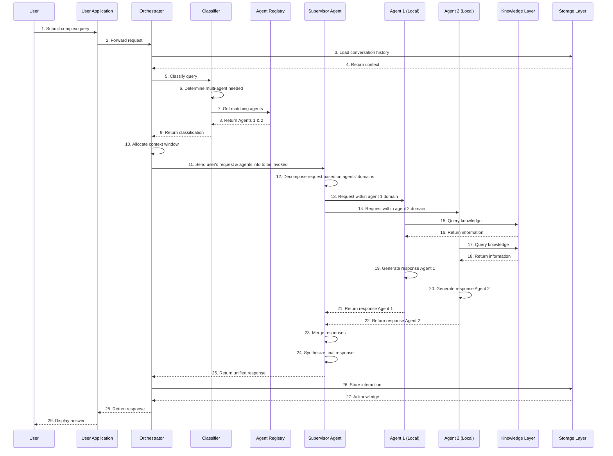

# Reference Architecture

_Last updated: 2025-08-18_

The architecture below illustrates a modular and governed multi-agent system,
supporting both local and remote agents through a central orchestration layer.
At its core, the Orchestrator (e.g., Semantic Kernel) coordinates agent
interactions, consults a classifier for intent routing, and uses a registry for
agent discovery and lifecycle management. The system integrates with knowledge
bases and vector databases, and maintains context and state through a persistent
storage layer. Integration with external tools is supported through an MCP
(Model Context Protocol) server. This design ensures flexibility, extensibility,
and strong control boundaries between components, allowing seamless onboarding
of new models, tools, and communication patterns.

## Components' breakdown

### User Application

- The interface layer that facilitates user interaction with the multi-agent
  system.
- It abstracts the complexity of the underlying architecture and provides a
  consistent, user-friendly experience.

**How it works**: Typically implemented as web applications, mobile apps, chat
interfaces, APIs, or embedded widgets in other applications. It handles:

- User authentication and session management
- Input formatting and validation
- Response rendering and formatting
- Error handling and user feedback
- User preference management

### Orchestrator (Semantic Kernel)

The central coordination component that manages the flow of requests and
responses throughout the system. It provides unified management, ensuring
appropriate routing, maintaining context, and handling the lifecycle of
requests.

**How it works**: The orchestrator receives requests from the User Application,
determines how to process them, coordinates with the appropriate components,
maintains state, and eventually returns responses.

#### Implementation

Often structured as a core orchestration service with:

- Request/response lifecycle management
- Context preservation across interactions
- It determines the appropriate functions, plugins, or agents to invoke using
  planners or semantic functions.
- Fallback and error recovery mechanisms

Semantic Kernel provides:

- Semantic function orchestration (organizing and sequencing AI functions)
- Memory and context management
- Plugin architecture for extensibility
- Planners that can decompose complex tasks into simpler steps
- Integration with various AI models and services
- Native support for multi-agent scenarios
- Cross-platform compatibility (multiple programming languages, check the
  features compatibility)

### Classifier (NLU, SLM, LLM)

The component responsible for understanding user inputs and determining the
appropriate routing within the system. It ensures that user requests are
properly understood and directed to the most suitable agent, improving response
quality and system efficiency.

**How it works**: Analyzes the content, context, and intent of user inputs to
categorize them and determine appropriate handling.

> The approach involves using options ranging from less to more expensive ones,
> NLU -> SLM -> LLM | SML based on certainty to determine the use of intent or
> continuation. If no intent is detected by the end of the process, return "IDK"
> (I Don’t Know).

**Implementation:**

It can be implemented using a variety of technologies, including but not limited
to:

- NLU (Natural Language Understanding): Extracts intent and entities
- SLM (Statistical Language Models): Used for pattern recognition and
  classification
- LLM | SLM (Large Language Models | Small Language Models): Provide
  sophisticated understanding of complex inputs

### Agent Registry

See [Agent Registry Page](../agent-registry/Agent-Registry.md) for more detail

### Knowledge Layer

Repositories of structured and semi-structured knowledge that agents can
reference. They provide domain-specific information that enhances agent
capabilities beyond what's possible with generic AI models alone.

**How it works**: Organizes knowledge into accessible formats, often including
taxonomies, ontologies, and semantic relationships.

**Implementation:**

- Document databases
- Knowledge graphs
- Content management systems with APIs
- Specialized domain knowledge bases
- FAQ systems and support documentation
- Expert-curated information repositories

> Recommended practices: Knowledge should be properly structured, tagged,
> versioned, and regularly updated to maintain accuracy and relevance.

### Supervisor Agent

A specialized agent responsible for coordinating the activities of other agents
to solve complex tasks. It enables decomposition of complex tasks into subtasks
that can be handled by specialized agents, then synthesizes their outputs into
coherent responses.

**How it works**: Receives high-level tasks, breaks them down, delegates to
appropriate specialized agents, monitors progress, aggregates results, and
ensures overall task completion.

**Implementation:**

- Task planning algorithms
- Dependency tracking systems
- Agent selection and routing logic
- Result aggregation and synthesis capabilities
- Error handling and retry mechanisms
- Conflict resolution for contradictory inputs
- High-level reasoning models (usually LLMs or SLMs)

#### Recommended practices

- Monitor agent overlap in terms of knowledge domain and action scope to prevent
  redundancy and confusion.
- Avoid keeping highly similar agents separate, as this can degrade the
  performance of the orchestrator or intent classifier.
- Refactor or group similar agents under a shared interface or capability to
  streamline classification and routing.
- Introduce agent supervisors as the architecture scales across domains—these
  components help manage and abstract groups of related agents.
- Use hierarchical organization (e.g., supervisor → agent group) to maintain
  clarity, scalability, and ease of intent resolution.

### Agent #1, #2, #3, #4 (with MCP Client)

Specialized AI agents designed to handle specific domains, tasks, or
capabilities. Domain specialization allows for deeper expertise and better
performance in specific areas compared to general-purpose agents.

**How it works**: Each agent focuses on a particular domain (e.g., finance,
healthcare, coding) or function (e.g., summarization, research, creative
writing), applying specialized knowledge, models, or techniques to user
requests.

**Implementation:**

- Domain-specific LLM fine-tuning
- RAG (Retrieval-Augmented Generation) with domain knowledge
- Specialized algorithms for domain-specific tasks
- Local or remote execution depending on resource requirements
- Self-assessment of capability and confidence levels

#### MCP Client Component

- Enables standardized communication with external tools via MCP
- Manages discovery of available tools and capabilities
- Handles authentication and authorization for tool access
- Maintains connection state and manages re-connections
- Formats requests and responses according to MCP specification
- Provides tool usage analytics and error handling

#### Differences between Local and Remote Agents

- Local agents run within the same environment as the orchestrator
- Remote agents operate across network boundaries
- Remote agents require additional security and reliability considerations
- Communication patterns differ (in-memory vs. network protocols)
- Deployment and scaling strategies vary significantly
- Resource management approaches differ substantially

### Conversation History

A persistent store of user-agent interactions and conversation flows. It enables
context-aware responses, supports learning from past interactions, and provides
an audit trail of system behavior.

**How it works**: Records each turn in a conversation, maintaining user inputs,
agent responses, and associated metadata in a structured, queryable format.

**Implementation:**

- Specialized conversation stores or time-series databases
- Hierarchical data models (user → session → conversation → turn)
- Indexing for efficient context retrieval
- Compression and archiving strategies for older data
- Query optimization for contextual lookups
- Privacy controls and data retention policies

#### Agent State

Persistent storage of agent operational status, configuration, and runtime
state. It enables continuity across sessions, recovery from failures, and
adaptation based on past experiences.

**How it works**: Maintains both static configuration and dynamic runtime state
for each agent, allowing them to resume operations and maintain learned
behaviors.

**Implementation:**

- Key-value stores for fast state access
- State versioning for consistency
- Snapshot mechanisms for point-in-time recovery
- Caching strategies for performance optimization
- Conflict resolution for concurrent updates
- State migration for version compatibility

### Registry Storage

Specialized storage for the Agent Registry, maintaining agent metadata,
capabilities, and operational history. It provides the persistent data layer for
the Agent Registry, ensuring consistent agent information across system restarts
and updates.

**How it works**: Stores comprehensive information about each agent, including
capabilities, endpoints, security credentials, performance metrics, and version
history.

**Implementation:**

- Structured database (relational or document)
- Query-optimized schema for capability lookups
- Transaction support for consistent updates
- Versioning for agent evolution tracking
- Audit logging for security compliance
- Backup and recovery mechanisms

> Best practices: Implementing appropriate access controls, regular backup
> procedures, and efficient querying patterns for agent discovery

### Integration Layer & MCP Server

A standardized interface layer that connects agents to external tools, services,
and data sources. It provides a consistent way for agents to access external
capabilities without needing to implement custom integrations for each tool.

**How it works**: Implements the Model Context Protocol (MCP) to expose tools as
a standardized service that agents can discover and invoke.

**Implementation:**

- MCP server implementation exposing tool APIs
- Authentication and authorization controls
- Request validation and error handling
- Tool discovery and capability description
- Usage monitoring and rate limiting
- Versioning and backward compatibility

#### Key sub components

1. Tool Adapters: Convert native tool APIs to MCP-compatible formats
2. Security Gateway: Manages authentication and authorization
3. Request Router: Directs requests to appropriate tools
4. Response Formatter: Ensures consistent response formats
5. Monitoring System: Tracks usage, performance, and errors

> Best practices: Implementing robust security controls, comprehensive
> monitoring, and maintaining clear documentation of exposed tool capabilities.

## Sequence diagram

## Patterns

Below are the most foundational patterns that shaped this architecture. For a
complete catalog of design patterns used across scenarios, visit the
[Full Pattern Reference](./Patterns.md).

List of patterns that guided the proposed architecture.

1. Semantic Router + LLM Fallback
2. Dynamic Agent Registry (Service Mesh for Agents)
3. Semantic Kernel Orchestrator with Skills
4. Local & Remote Agent Execution
5. Separation of Concerns Across Layers (Onion Architecture for Agent Systems)
6. MCP Integration for Agent-Tool Communication
7. RAG (Retrieval-Augmented Generation) Pipeline
8. Conversation-Aware Agent Orchestration (Contextual state + history memory)
9. Agent to Agent communication
   [Agent to Agent Communication Patterns](./docs/Multi-Agent-Patterns.md#9-agent-to-agent-communication)

---

{{ #include ../../components/discuss-button.hbs }}
